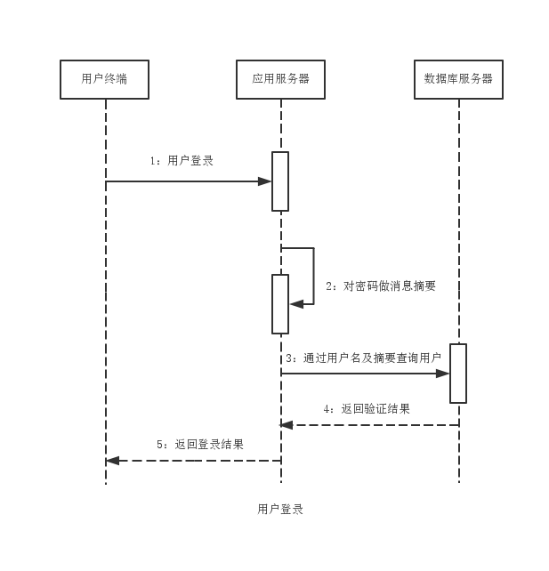

消息摘要算法
===

消息摘要算法主要包括MD，SHA，MAC三大系列，常用于验证数据的完整性，是数字签名算法的核心算法。
任何消息经过散列函数处理后都会获得一个唯一的散列值，这一过程称为“消息摘要”，其散列值称为“数字指纹”，该算法即“消息摘要算法”。
一些软件厂商提供的不同的消息摘要算法的数字指纹，如MD5，SHA，CRC32算法等，数字指纹常以十六进制字符串形式出现。

消息摘要算法一直是非对称加密算法中举足轻重的关键性算法。

### MD算法家族

MD5是典型的消息摘要算法，其前身有MD2，MD3，MD4算法。MD算法都需要获得一个随机长度的信息并产生一个128位的信息摘要。
如果将该128位的二进制摘要信息换算成十六进制，可得到一个32位的字符串（每四位二进制数转为一位十六进制数）。
常见的MD5算法的数字指纹都是32位的十六进制字符串。

##### 模型分析

以Web中注册登录为例，分析MD5算法在其中的应用，当然SHA算法也完全适用，且有更高的安全性。
设计用户登录注册模块时，一般需要考虑如下几个问题：

- 密码如何传递

1. 以Get方式明文传递，不安全。任何人均可通过链接分析得到。
2. 以Post方式编码传递，也不安全。编码算法是公开的，任何人都可解码。

- 密码如何存储

1. 明文存储，不安全。用于数据库查询权限的人就有可能泄露用户密码。
2. 密文存储，安全。对密码做摘要处理，任何人都难以破解。

- 密码如何校验

1. 明文校验，不安全。同明文存储。
2. 密文校验，安全。同密文存储。

很明显应加入消息摘要机制：
1. 用户注册时，需对密码做摘要处理，以摘要信息存入数据库。
2. 用户登录时，需对密码做摘要处理，通过数据库查询。
3. 明文与密文存在对应关系，但仅限于明文到密文的转换，即便是消息摘要算法泄露也无法反推出密码。

为了提高安全性，常加入一些不可变信息，如用户名，邮件地址串入原始密码中，使得密码破译难度加大。其中都不可变信息称为“盐”，这种处理方式即为“加盐处理”。

##### 算法实现

MD系列算法的实现是通过MessageDigest类实现，若需要以流的处理方式完成消息摘要，需使用DigestInputStream和DigestOutputStream，具体代码见源码目录。

MD算法有三种实现方式，比较如下：
- Sun

Sun提供的MD算法实现较为底层，仅支持MD2和MD5，缺少相应的进制转换实现，不能将其字节数组形式的摘要信息转为十六进制字符串。

- Bouncy Castle

在Sun的基础上弥补了对MD4算法的支持，也提供了Base64算法的支持。支持多种形式的参数，支持十六进制字符串形式的摘要信息。

- Commons Codec

在Sun的基础上实现了Base64算法，还提供了用于消息摘要的工具类DigestUtils类。支持多种形式的参数，支持十六进制字符串形式的摘要信息。

综上所述，如果只要求MD5算法支持，首选Commons Codec，若要支持MD2或MD4选择Sun或Bouncy Castle。
