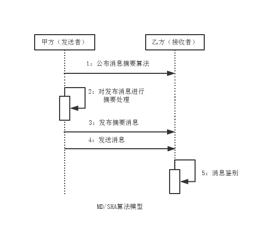

SHA算法
===

SHA算法基于MD4，远离相同，但是摘要长度更长，安全性更好，被广泛认可为MD5的替代者。SHA同样能获得一个固定长度的摘要信息。与MD算法区别在于
输入的消息不同，与其对应的摘要信息的差异概率很高。

### 模型分析

假设软件发布商（甲方）与用户（乙方）分别作为消息发送者与接收者，甲方向乙方发送消息需经过以下几个步骤：
1. 甲方公布消息摘要算法。这个算法可以被其他人获取，包括监听者。
2. 甲方对待发送的消息做摘要处理，并获得摘要信息。
3. 甲方向乙方发送摘要信息。该数字指纹可以被他人获取，包括监听者。
4. 甲方向乙方发送消息，该消息可以是明文，有可能被监听者篡改。
5. 乙方获得消息后，使用甲方提供的消息摘要算法进行摘要处理，获取数字指纹并对比甲方传过来的数字指纹是否匹配。

### 几种实现方式

- Sun

Sun提供了较为底层的SHA算法实现，如SHA-1，SHA-256，SHA-384，SHA-512。但缺少了对应的进制转换实现。

- Bouncy Castle
在Sun的基础上提供了SHA-224的支持，支持十六进制字符串形式的摘要信息，相当方便。

- Commons Codec
在Sun的基础上支持多重形式的参数，支持十六进制字符串形式的摘要信息，更方便。

综上所述，若在应用中使用SHA算法，但不要求对SHA-224算法提供支持，Commons Codec更合适，
如果只是需要在Sun原有SHA系列算法支持的基础上加入十六进制编码转换，Bouncy Castle和Commons Codec均可。
