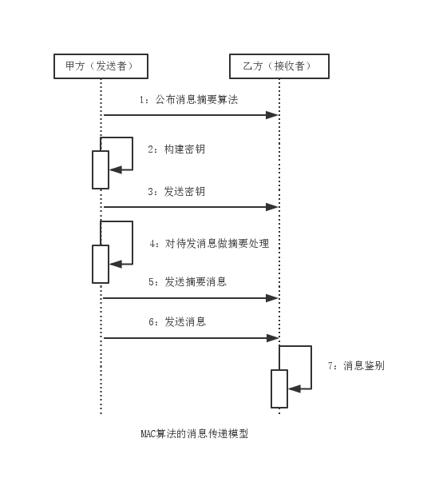

循环冗余校验算法--CRC算法
===

CRC（Cyclic Redundancy Check，循环冗余校验）可以根据数据产生剪短固定位数的散列函数，主要用来检测或检验数据传输或保存后出现的错误，广泛应用于通信领域中，实现差错控制。。
生成的散列值在传输或存储之前计算出来并附加到数据后面。传输到目的地之后，使用数据前对数据的完整性进行校验。一般循环冗余校验的值都是32位的二进制数，
以8位十六进制字符串形式表示。

CRC算法并不属于加密算法范畴，但与消息摘要算法同属散列函数，是最为古老的数据完整性验证算法。
MD，SHA，MAC都是加密算法领域的消息摘要算法，可验证数据完整性，是数字签名算法的基础。
消息摘要算法源于CRC冗余校验算法，派生出MD和SHA两大系列消息算法，并在此基础上又衍生出基于密钥的散列函数算法，MAC算法。

### CRC分类

- CRC-1

主要用于硬件，即常说的奇偶校验码。

- CRC-32-IEEE 802.3

主要用于通信领域实现差错控制，也就是我们今天常说的CRC-32，IEEE 802.3只是一种标准。

- CRC-32-Adler

CRC-32的一个变种，又称Adler-32，与CRC-32一样可靠，但速度更快。

- CRC-128

演变为今天的MD算法，MD算法摘要值为128位二进制数。

- CRC-160

演变为今天的SHA算法，SHA-1算法摘要值为160位二进制数。

### 模型分析

### 摘要算法比较

- CRC32等

CRC（Cyclic Redundancy Check，循环冗余校验）算法出现时间较长，应用也十分广泛，尤其是通讯领域，现在应用最多的就是 CRC32 算法，它产生一个4字节（32位）的校验值，一般是以8位十六进制数，如FA 12 CD 45等。CRC算法的优点在于简便、速度快，严格的来说，CRC更应该被称为数据校验算法，但其功能与数据摘要算法类似，因此也作为测试的可选算法。
在 WinRAR、WinZIP 等软件中，也是以 CRC32 作为文件校验算法的。一般常见的简单文件校验（Simple File Verify – SFV）也是以 CRC32算法为基础，它通过生成一个后缀名为 .SFV 的文本文件，这样可以任何时候可以将文件内容 CRC32运算的结果与 .SFV 文件中的值对比来确定此文件的完整性。
与 SFV 相关工具软件有很多，如MagicSFV、MooSFV等。

- MD2 、MD4、MD5

这是应用非常广泛的一个算法家族，尤其是 MD5（Message-Digest Algorithm 5，消息摘要算法版本5），它由MD2、MD3、MD4发展而来，由Ron Rivest（RSA公司）在1992年提出，目前被广泛应用于数据完整性校验、数据（消息）摘要、数据加密等。MD2、MD4、MD5 都产生16字节（128位）的校验值，一般用32位十六进制数表示。MD2的算法较慢但相对安全，MD4速度很快，但安全性下降，MD5比MD4更安全、速度更快。
目前在互联网上进行大文件传输时，都要得用MD5算法产生一个与文件匹配的、存储MD5值的文本文件（后缀名为 .md5或.md5sum），这样接收者在接收到文件后，就可以利用与 SFV 类似的方法来检查文件完整性，目前绝大多数大型软件公司或开源组织都是以这种方式来校验数据完整性，而且部分操作系统也使用此算法来对用户密码进行加密，另外，它也是目前计算机犯罪中数据取证的最常用算法。
与MD5 相关的工具有很多，如 WinMD5等。

- SHA1、SHA256、SHA384、SHA512

SHA（Secure Hash Algorithm）是由美国专门制定密码算法的标准机构—— 美国国家标准技术研究院（NIST）制定的，SHA系列算法的摘要长度分别为：SHA为20字节（160位）、SHA256为32字节（256位）、 SHA384为48字节（384位）、SHA512为64字节（512位），由于它产生的数据摘要的长度更长，因此更难以发生碰撞，因此也更为安全，它是未来数据摘要算法的发展方向。由于SHA系列算法的数据摘要长度较长，因此其运算速度与MD5相比，也相对较慢。
目前SHA1的应用较为广泛，主要应用于CA和数字证书中，另外在目前互联网中流行的BT软件中，也是使用SHA1来进行文件校验的。

- RIPEMD、PANAMA、TIGER、ADLER32 等
RIPEMD是Hans Dobbertin等3人在对MD4，MD5缺陷分析基础上，于1996年提出来的，有4个标准128、160、256和320，其对应输出长度分别为16字节、20字节、32字节和40字节。
TIGER由Ross在1995年提出。Tiger号称是最快的Hash算法，专门为64位机器做了优化。
