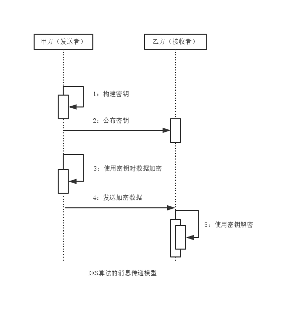
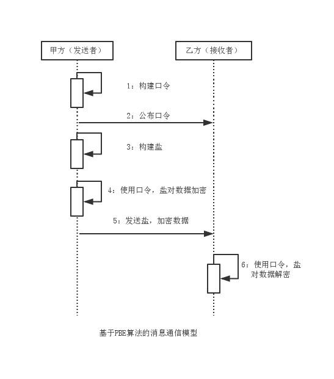

对称加密算法
===

### 一、DES

DES（Data Encryption Standard，数据加密标准）算法是现代密码学领域第一个官方授权的加密算法，其密钥偏短，仅有56位，安全性较低。
DES算法是对称加密算法中的典型算法，衍生出DESede，AES，IDEA算法。

##### 模型分析

1. 由消息双方约定密钥，这里由甲方构建密钥。
2. 由密钥构建者公布密钥，这里由甲方将密钥公布给乙方。
3. 由消息发送方使用密钥加密数据，这里由甲方对数据进行加密。
4. 由消息发送方将加密数据发送给消息接收者，这里由甲方将加密数据发送给乙方。
5. 由消息接收方使用密钥对加密数据解密，这里由乙方完成数据解密。

##### 算法实现

Java 6仅支持56位密钥长度，Bouncy Castle提供64位密钥长度支持。此外不同的填充方式可提高加密的安全性。
DES算法的Java 6实现与Bouncy Castle实现对比

|      算法   |  密钥长度 | 默认密钥长度 |          工作模式             | 填充方式 |
| :--------: | :---------- | :--------- | :--------------------------  | :------ |
| java 6        |    56    | 56         |ECB，CBC，PCBC，CTR，CTS，CFB等 | NoPadding, PKCS5Padding等 |
| Bouncy Castle |    64    | 56         |              同上            | PKCS7Padding，X932Padding等 |

虽然Bouncy Castle可将密钥长度增至64位，但DES算法设计上的漏洞已经无法通过单纯的增加密钥长度来弥补，现在在安全性高的场合已经不用DES，用DESede，AES等。

##### 算法缺点

密钥太短，迭代偏少，半公开性。

### 二、3DES

3DES又称为Triple DES或DESede。作为DES算法的改进，其与DES主要区别在于算法及密钥长度。Java 6提供的3DES算法所支持的密钥长度为112位和168位，
Bouncy Castle支持128位和192位。

### 三、AES

AES（Advanced Encryption Standard，高级数据加密标准）算法可有效抵御已知的针对DES算法的所有攻击方法，如部分差分攻击，相关密钥攻击等，至今还没有AES破解的官方报道。
AES算法密钥建立时间短，灵敏性好，内存占用低，在各个领域得到广泛的应用。

|      算法   |  密钥长度 | 默认密钥长度 |          工作模式             | 填充方式 |
| :--------: | :---------- | :--------- | :--------------------------  | :------ |
| java 6 | 128，192，256 | 128 | ECB，CBC，PCBC，CTR，CTS，CFB等 | NoPadding, PKCS5Padding，ISO10126Padding |
| Bouncy Castle |    同上    | 同上    |   同上   | PKCS7Padding，ZeroBytePadding |

### 四、IDEA

IDEA（International Data Encryption Algorithm，国际数据加密标准）算法早于AES算法作为DES算法的替代算法，其不是基于DES算法改进而来。
IDEA使用长度为128位的密钥，数据块大小为64位，目前常用于电子邮件的加密。
Java 6没有提供对IDEA算法的支持，而Bouncy Castle支持IDEA。

|      算法   |  密钥长度 | 默认密钥长度 |          工作模式             | 填充方式 |
| :--------: | :---------- | :--------- | :--------------------------  | :------ |
| Bouncy Castle  | 128，192，256 | 128 | ECB | PKCS5Padding, PKCS7Padding，ISO10126Padding, ZeroBytePadding |

### 五、PBE

PBE（Password Based Encryption，基于口令加密）算法是一种基于口令的加密算法，其特点在于口令由用户自己掌管，采用随机数（即盐）杂凑多重加密等算法保证数据的安全性。
盐本身是一个随机的不可预测的信息，相同的随机信息极不可能使用两次，将盐附加在口令上，通过消息摘要算法经过迭代计算，使得破解难度加大。

##### 模型分析

1. 由消息双方约定口令，这里由甲方构建口令。
2. 由口令构建者公布口令，这里由甲方将口令公布给乙方。
3. 由口令构建者构建本次消息传递使用的盐，这里由甲方构建盐。
4. 由消息发送方使用口令，盐对数据加密，这里由甲方对数据加密。
5. 由消息发送方将盐，加密数据发送给消息接收者，这里由甲方将盐，加密数据发送给乙方。
6. 由消息接收方使用盐，口令对加密数据解密，这里由乙方完成数据解密。
