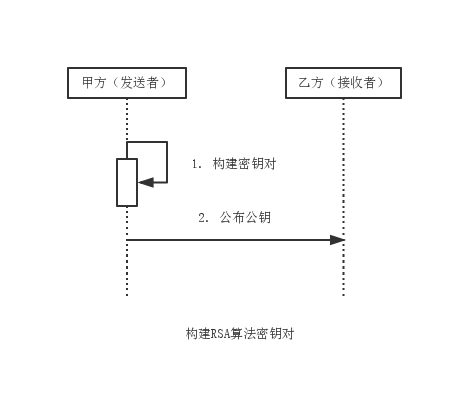
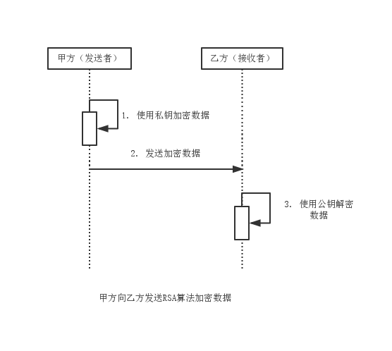
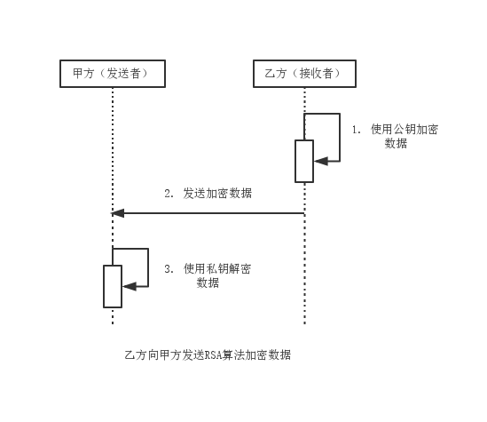

RSA
===

RSA算法基于大数因子分解难题，是目前唯一被广泛接受并实现的通用公开加密算法。RSA算法即可用于数据加密也可用于数字签名。
RSA比DES及其他对称加密算法要慢。

### 模型分析

RSA算法构建密钥对比DH简单：

1. 由消息发送方构建密钥对，这里由甲方完成。
2. 由消息发送方公布公钥至消息接收方，这里由甲方将公钥公布给乙方。

3. 甲方使用私钥加密数据，乙方使用公钥解密数据。

非对称加密算法中，一般是私钥加密，公钥解密。而RSA也可公钥加密，私钥解密。如乙方用接收到的公钥加密数据发送给甲方：

但由于公钥在传递过程中可能被截获，因此该方式有一定的安全隐患。
如果要建立更安全的加密消息传递模型，需要甲乙双方分别构建密钥对，遵循私钥加密，公钥解密原则。
