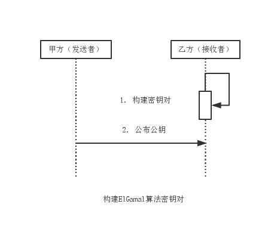
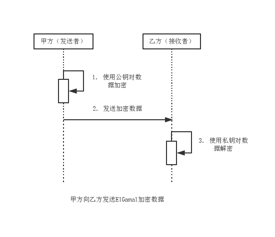

ElGamal
===

RSA算法基于大数因子分解数学难题，而ElGamal算法基于离散对数问题，即可用于加密，也可用于数字签名。ElGamal的缺点是密文会成倍扩张。

### 模型分析

1. 由消息接收方构建密钥对，这里由乙方完成。
2. 由消息接收方公布公钥至消息发送方，这里由乙方将公钥公布给甲方。

3. 甲方使用公钥加密数据，乙方使用私钥解密数据。

非对称加密算法中，一般是私钥加密，公钥解密。而ElGamal是公钥加密，私钥解密。
由于公钥在传递过程中可能被截获，因此该方式有一定的安全隐患。

Java 6不支持ElGamal，而第三方包BouncyCastle支持。
