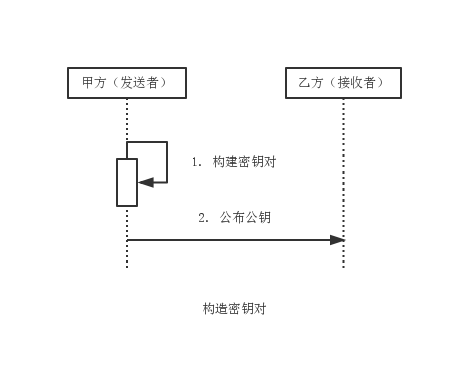
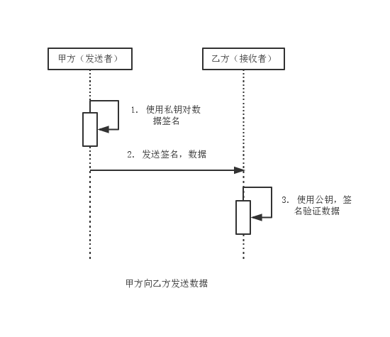

RSA
===

数字签名算法可以看做是一种带有密钥的消息摘要算法，且该密钥包括公钥和私钥。可见数字签名算法是非对称加密算法和消息摘要算法的结合体。

消息摘要算法要求能够验证数据完整性，认证数据来源，并起到抗否认的作用。
消息摘要算法是验证数据完整性的最佳算法。
鉴别数据来源表示签名操作必须由发送方完成，因此必然是基于发送方的私有信息完成的操作。
验证签名操作则由乙方完成，而用于验证操作的信息由发送放公布给接收方。
用于签名的相关信息私有，用于验证的相关信息公有，且这两种信息必须成对出现。非对称加密算法中的公私钥满足该关系。

数字签名算法包括签名和验证两项操作，遵循私钥签名，公钥验证的签名/验证方式。签名时需要使用私钥和待签名数据，验证时则需要公钥，签名值和待签名数据，其核心算法主要是消息摘要算法。因此数字签名算法可认为是附加了公钥和私钥的消息摘要算法。

与摘要值的表示方式相同，签名值也常以十六进制字符串的形式表示。签名算法在实际运用时，通常是先使用消息摘要算法对原始消息做摘要处理，然后再使用私钥对摘要值做签名处理；验证签名时，则使用公钥验证消息的摘要值。

常见的数字签名算法包括RSA，DSA，ECDSA三种。RSA基于整数因子分解问题，DSA和ECDSA基于离散对数问题。

### 数字签名算法消息传递模型

1. 由消息发送方构建密钥对，这里由甲方完成。
2. 由消息发送方公布公钥至消息接收方，这里由甲方将公钥公布给乙方。

3. 注意如加密算法区别，这里甲方使用私钥对数据签名，数据与签名形成一则消息发送给乙方，私钥仅用于签名，公钥仅用于验证。

### RSA

RSA数字签名算法源于RSA公钥密码算法的思想，将RSA公钥密码算法按照数字签名的方式运用。RSA数字签名算法是迄今为止应用最为广泛的数字签名算法。
RSA数字签名算法的实现如RSA加密算法一致。RSA数字签名算法主要可分为MD系列和SHA系列。

1. MD系列主要包括：MD2withRSA和MD5withRSA。
2. SHA系列主要包括：SHA1withRSA，SHA224withRSA，SHA256withRSA，SHA384withRSA，SHA512withRSA。

Java 6提供了MD2withRSA，MD5withRSA，SHA1withRSA支持，其他四中SHA算法第三方加密组建包Bouncy Castle提供支持。
