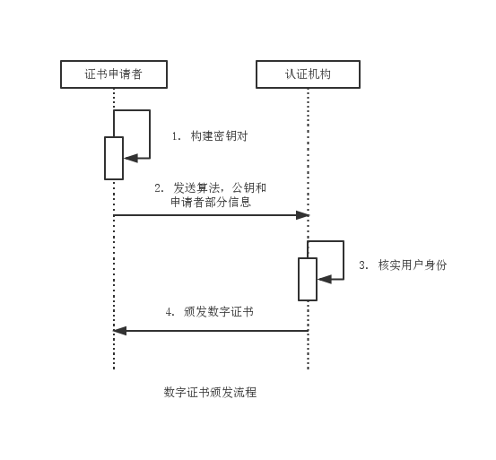
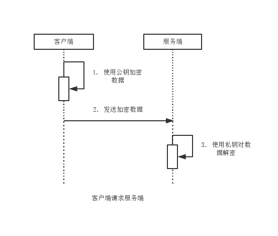
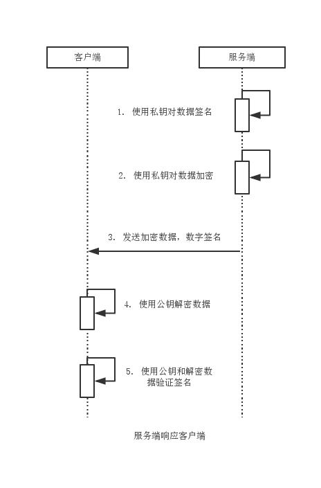

数字证书
===

数字证书便集合了多种密码学算法，从而有更高的安全强度：

- 消息摘要算法用于对数字证书本身做摘要处理，确保数字证书完整性。
- 非对称算法用于对数据进行加密/解密操作，确保数据的机密性。
- 数字签名算法用于对数据进行签名/验证操作，确保数据的来源和抗否认性。

目前数字证书中最常用的非对称加密算法是RSA算法，与之配套使用的签名算法是SHA1withRSA算法，最为常用的消息摘要算法是SHA1算法。

数字证书有多重文件编码格式，又有证书都符合公钥基础设施（PKI）制定的ITU-T X509国际标准：

- CER（Canonical Encoding Rules，规范编码格式），BER的变种，使用变长模式。
- DER（Distinguished Encoding Rule，卓越编码格式），BER的变种，使用定长模式。
- PKCS（Public-Key Cryptography Standards，公钥加密标准），常用标准有PKS#7，PKS#10，PKS#12。

数字证书文件的存储格式通常为Base64。实际应用中，很多数字证书都属于自签名证书，即证书申请者为自己的证书签名。这类证书通常应用于软件厂商内部发放的产品中，或约定使用该证书的数据交互双方。数字证书完全充当加密算法的载体，为必要数据做加密/解密和签名/验证等操作。自签名的证书虽然可以使用，但未经CA（Certificate Authority，数字证书颁发认证机构）认证，无法律效力。

### 证书签发

1. 数字证书需求方产生自己的密钥对。
2. 数字证书需求方将算法，公钥，身份信息传送给认证机构。
3. 认证机构核实用户身份。
4. 认证机构颁发数字证书。

### 加密交互

1. 客户端使用公钥对数据加密。
2. 客户端向服务端发送加密数据。
3. 服务端使用私钥解密数据。

1. 服务端使用私钥对数据签名。
2. 服务端使用私钥对数据加密。
3. 服务端向客户端发送加密数据和数字签名。
4. 客户端使用公钥对数据解密。
5. 客户端使用公钥和解密的数据验证签名。

### 证书管理

要获取证书，需要使用数字证书管理工具构建CSR（Certificate Signing Request，数字证书签发申请），交由CA（Certificate Authority，数字证书颁发认证机构）签发，形成最终的数字证书。

常用数字证书管理工具：

- KeyTool，Java中的数字证书管理工具，KeyTool与本地密钥库相关联，将私钥存入密钥库，公钥则以数字证书输出。
- OpenSSL，开源数字证书管理工具，功能远胜于KeyTool，可用于根证书，服务器证书和客户端证书的管理。
