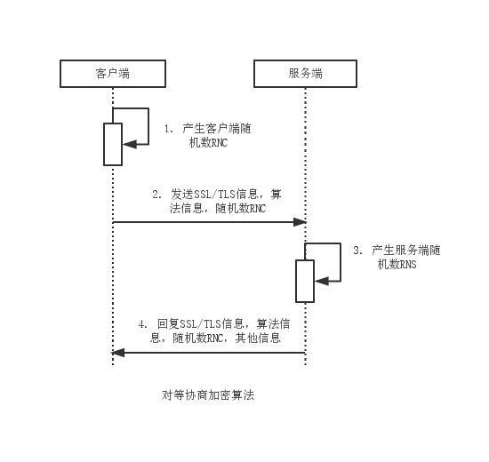
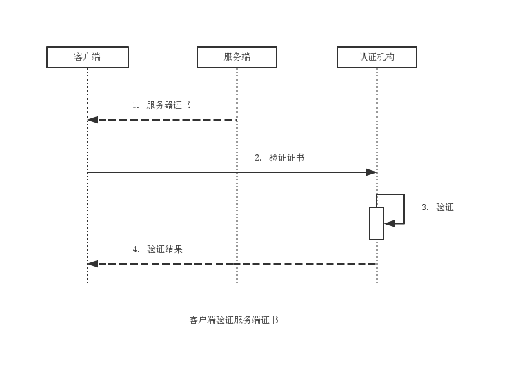
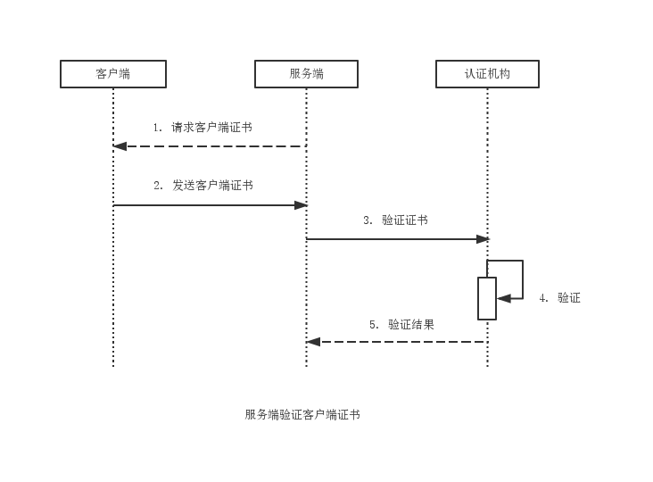
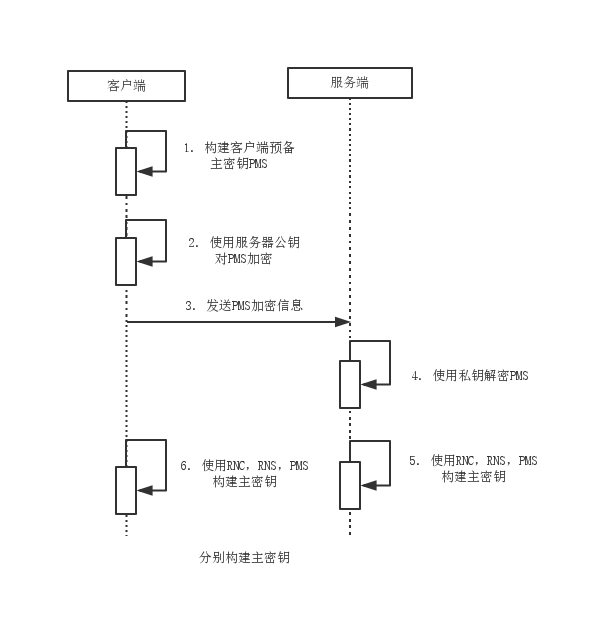
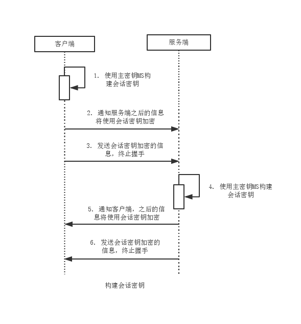
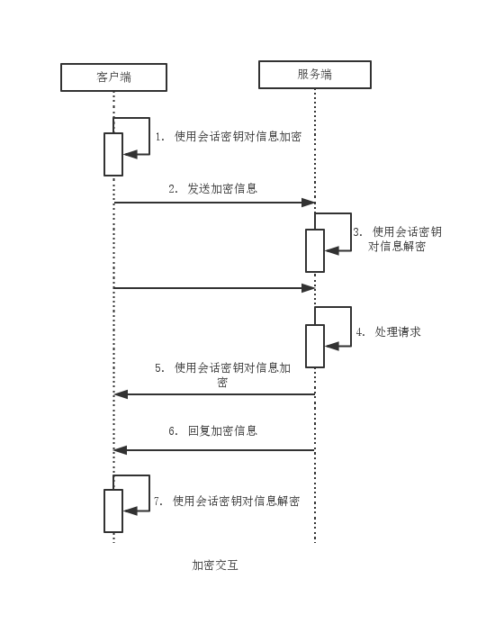

HTTPS
===

HTTPS是基于SSL/TLS的HTTP协议。HTTPS协议和SSL/TLS协议分属TCP/IP参考模型中的应用层和传输层。
HTTPS协议为数字证书提供了最佳的应用环境。

SSL/TLS协议包含两个协议：SSL（Secure Socket Layer，安全套接字层）和TLS（Transport Layer Security，传输层安全）协议。TLS协议基于SSL协议。作为下一代安全协议，TLS1.0与SSL3.0兼容。通常意义上的SSL/TLS即指TLS1.0与SSL3.0。

SSL/TLS分为两层：

1. 记录协议（Record Protocol），建立在可靠的传输协议（如TCP）之上，为高层协议提供数据封装，压缩，加密等基本功能的支持。
2. 握手协议（Handshake Protocol），在实际数据传输前，通信双方进行身份认证，协商加密算法，交换加密密钥等。

SSL/TLS涉及多重加密算法：

1. 消息摘要算法：MD5，SHA1
2. 对称加密算法：RC2，RC4，IDEA，DES，Triple DES，AES
3. 非对称加密算法：RSA，DH
4. 数字签名算法：RSA，DSA

### 模型分析

- 协商算法

服务器端和客户端在进行握手协议第一阶段时主要是商榷加密算法，主要包含以下几个步骤：

1. 客户端产生随机数RNC(Random Number Client)，这个随机数将为后续构建密钥做准备。
2. 客户端将自身支持的SSL信息（版本和种类）、算法信息和随机数RNC发送到服务器端。
3. 服务器端得到客户端请求后，产生相应的随机数RNS(Random Number Server)，这个随机数为后续构建密钥做准备。
4. 服务器端将自身支持的SSL信息（版本和种类）、算法信息、随机数RNS和其他信息回应到客户端。其他信息包括服务器证书，甚至包含获取客户端证书的请求。

这时，服务器端和客户端已经确认两方交互时所使用的加密算法。

- 验证证书

如果服务器端回复客户端时带有其他信息，则进人数字证书验证阶段。服务器端下发服务器证书给客户端后，由客户端验证该证书，主要包含以下几个步骤:

1. 服务器回复客户端响应时带有服务器证书。
2. 客户端将该证书发送至认证机构。
3. 认证机构鉴别该证书。
4. 认证机构回应客户端验证结果，如果验证失败将同时得到警告信息。

这时，服务器端身份得以认证，客户端和服务器端可以进行以服务器端单向认证为基础的加密交互。
如果服务器端对于客户端身份有要求，下发服务器证书的同时要求客户端提供证书，即双向认证：

可见服务器端验证客户端证书，主要包含以下几个步骤：
1. 服务器端请求客户证书。
2. 客户端发送客户证书。
3. 服务器将客户证书发送至认证机构验证。
4. 认证机构验证证书。
5. 认证机构返回验证结果。

客户端证书认证非必需。如果客户端和服务器端两方都可以确认，就可进行以双向认证为基础的加密交互。双向认证是电子商务确保安全的必要环节。

- 构建密钥

服务器端和客户端要先建立主密钥为构建会话密钥做准备，主要包含以下几个步骤：
1. 客户端产生随机数，作为预备主密钥(Pre-MasLer Secret, PMS)。
2. 客户端使用服务器证书中的公钥对随机数PMS加密。
3. 客户端将PMS加密信息发送到服务器端。
4. 服务器使用私钥对信息解密获得PMS信息。
5. 客户端使用随机数RNC. RNS和PMS构建主密钥(Master Secrel, MS)。
6. 服务器端使用随机数RNC, RNS和PMS构建主密钥MS。

上述步骤5, 6不存在次序关系，实际操作中异步完成。完成主密钥构建操作后，服务器端和客户端将建立会话密钥，即将完成握手协议。

服务器端和客户端分别构建主密钥后将构建会话密钥，并终止握手协议交互，主要步骤包括；
1. 客户端使用主密钥构建会话密钥。会话密钥即对称加密算法中的秘钥。
2. 客户端通知服务器端以后的信息将使用会话密钥加密。
3. 客户端发送使用会话密钥加密的信息，终止握手。
4. 服务器端使用主密钥构建会话密钥。
5. 服务器端通知客户端之后的信息将使用会话密钥加密。
6. 服务器发送使用会话密钥加密的信息，终止握手。

至此，服务器端和客户端完成了握手协议，开始进人正式会话阶段。如果上述一系列操作中有任何一端受到外界因素干扰发生异常，则重新进人协商算法阶段。

- 加密交互

正式会话阶段的加密交互实际上是基于对称加密算法信息交互，会话密钥即秘密密钥，主要步骤如下：

1. 客户端使用会话密钥对信息加密。
2. 客户端向服务器端发送加密信息。
3. 服务器使用会话密钥对请求信息解密。
4. 服务器处理请求。
5. 服务器完成请求处理，使用会话密钥对回复信息加密。
6. 服务器回复加密信急。
7. 客户端使用会话密钥对信息解密。

### 认证服务分类

1. 单向认证服务：仅需要服务端提供证书，验证服务端身份。
2. 双向认证服务：需要服务端提供证书的前提下，要求客户端提供客户证书，同事验证服务器可客户端身份。
