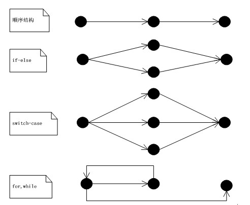
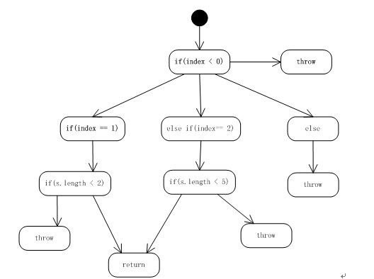

圈复杂度
===

圈复杂度(Cyclomatic Complexity)是一种代码复杂度的衡量标准。
其用于衡量一个模块判定结构的复杂程度，数量上表现为独立现行路径条数，也可理解为覆盖所有的可能情况最少使用的测试用例数。
圈复杂度大说明程序代码的判断逻辑复杂，可能质量低且难于测试和维护。程序的可能错误和高的圈复杂度有着很大关系。

圈复杂度给定流图G的圈复杂度为V(G)，计算公式：

1. 定义为V(G)=E-N+2，E是流图中边的数量，N是流图中`所有结点`的数量，包括起点和终点（多个终点只算一次）。
3. 给定流图G的圈复杂度V(G)，定义为V(G)=P+1，P是流图G中`判定结点`的数量。


### 常见控制流图




### 示例

```java
public String case2(int index, String string) {
    String returnString = null;
    if (index < 0) {
        throw new IndexOutOfBoundsException("exception < 0 ");
    }
    if (index == 1) {
        if (string.length() < 2) {
            return string;
        }
        returnString = "String1";
    } else if (index == 2) {
        if (string.length() < 5) {
            return string;
        }
        returnString = "String2";
    } else {
        throw new IndexOutOfBoundsException("exception > 2 ");
    }
    return returnString;
}
```

程序控制流图如下：





根据公式 `V(G) = e – n + 2 = 12 – 8 + 2 = 6` 。
虽然图上的真正节点有12个，但是其中有5个节点为throw、return，这样的节点为end节点，只能记一次，因此n = 8。
