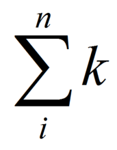

复杂度
===

### 算法时间复杂度的基本概念

##### 1.1 算法的执行时间和语句频度

算法的优劣体现在主要是算法在时间和空间上性能的优劣。一个算法的执行时间，就是算法中每条语句的执行时间的总和。但是在算法实际运行过程中，每次执行所耗费的时间会受到诸如问题规模、输入特性和具体硬件环境等各种外界因素的影响，想得到一个绝对准确的执行时间是几乎不可能的。为此，在进行算法执行时间的计算时一般都忽略硬件及环境因素，假设每条语句执行一次所需的时间均相同，为一个单位时间。

算法中一条语句的执行时间取决于该语句的执行次数和执行一次所需的时间。语句执行次数被称为语句频度，执行一次的时间被假设为单位时间，因此算法的执行时间就可以看作是该算法中所有语句的语句频度之和。

##### 1.2 算法时间复杂度和渐进时间复杂度

算法时间复杂度的本质是算法的执行时间，也就是算法中所有语句的频度之和。语句频度就是语句的执行次数。假设问题规模为n，则语句频度可以表示成一个关于问题规模的函数T(n)，那么算法时间复杂度也就可以用T(n)表示，其含义是算法在输入规模为n时的运行时间。

当问题规模很大时，很难精确的计算出T(n)，也是没有必要的。对于算法时间性能的分析无需非要得到时间复杂度T(n)的精确值，它的变化趋势和规律也能清楚地反映算法的时间耗费。基于此，引入了渐进时间复杂度作为时间性能分析的依据，它的含义就是：在问题规模n趋于无穷大时算法时间复杂度T(n)的渐进上界，即函数T(n)的数量级(阶)。

算法时间复杂度和渐进算法时间复杂度在实际的算法分析过程中是不予区分的，渐进时间复杂度可以简称为时间复杂度，记为T(n)=O(f(n))。其中， “O”表示取数量级(阶)；
函数f(n)是T(n)的同数量级(阶)函数，即:


(注：C为不为零的常数)

它一般是算法中最大的语句频度，是最内层循环语句 的执行次数。 按数量级递增排列，


常见的时间复杂度有：
常数阶O(1)，对数阶O(log2n)，线性阶O(n)，线性对数阶O(nlog2n),平方阶O(n2)，立方阶 O(n3)，…，k次方阶O(nk)，指数阶O(2n)。
随着问题规模n的不断增大，上述时间复杂度不断增大，算法的执行效率越低。

### 算法时间复杂度的计算方法

在算法时间复杂度的计算中，最关键的是得出算法中最多的执行次数。很容易看出，算法中最内层循环体语句往往具有最大的语句频度，在计算过程中主要对它们进行分析和计算。 目前，常用的时间复杂度计算方法可以归纳为如下几种。

##### 2.1 求和法

当算法中语句的执行次数与某一变量有直接关系，而该变量的变化起止范围又较为明确，则可以利用求和公式得出最大的语句频度f(n)，再对其取数量级(阶)即可。

【例1】，有算法如下：

```java
for(i = 1; i <= n; i++) {            // 语句1
    for(j = 1; j <= n; j++) {        // 语句2
        ++x;                         // 语句3
    }
}
```
解：以上算法中频度最大的是语句3，它的执行次数跟循环变量i和j有直接关系，因此其频度可以通过求和公式求得：


所以，该算法的时间复杂度为平方阶，记作：


【例2】，有一算法如下：

```java
for(i = 1; i <= n; i++) {               // 语句1
    for(j = 1; j <= i; j++) {           // 语句2
        for(k = 1; k <= j; k++) {       // 语句3
            ++x;                        // 语句4
        }
    }
}
```
解：以上算法中频度最大的是语句4，其频度可以通过求和公式求得：


所以，该算法的时间复杂度为立方阶，记作：


【例3】，有如下算法：

```java
y = 0;                            // 语句1
while(((y+1) * 2) <= n) {         // 语句2
    x++;                          // 语句3
}
```

解：算法中频度最大的应该是语句③，它的执行次数与y有关，已知y初值为0，当(y+1)2>n时循环终止，则y的最大取值应该为
(根号n)-1。所以语句③的频度可以通过求和公式得到：


所以，该算法的时间复杂度记作：


##### 2.2 假设法

在某些较为复杂的算法中，循环结构的循环次数很难直接看出，特别是当循环次数与循环体中的某些语句执行有联系时，语句频度的计算变得比较困难。此时，可以先假设循环执行次数为k次，再对算法进行分析，根据循环终止条件求出语句频度f(n)，最后求出T(n)。

【例4】有一算法如下：
```java
x = 91;
y = 100;
while (y > 0) {
    if (x > 100) {
        x -= 10;
        y--;
    } else {
        x++;
    }
}

```

解：假设 while 循环的循环体执行k次，可以发现：

```
k=1时，x=92，y=100
k=2时，x=93，y=100
k=3时，x=94，y=100
...
k=10时，x=101，y=100
k=11时，x=91，y=99
...
k=22时，x=91，y=98
```

可见每循环11次，y的值发生一次变化，y需共变化100次。
所以，f(n) = 100 * 11 =1100。则该算法的执行时间是一个与问题规模n无关的常数，它不随着问题规模n的增加而增长，即使算法中有上千条语句，其执行时间也不过是一个较大的常数。因此，该算法的时间复杂度为常数阶，记作T(n)=O(1)。

【例5】有如下算法：
```java
i = 0;
s = 0;
while (s < n) {
    i++;
    s = s + i;
}
```

解：假设循环执行k次，则有：

```
k=1时，i=1，s=0+1
k=2时，i=2，s=0+1+2
k=3时，i=3，s=0+1+2+3
...
```

执行到k次时：


而 s < n，即：


因此：


该算法时间复杂度为：


##### 2.3 迭代法
当算法中包含递归函数时，其时间复杂度也会被转化为一个递归方程，上述两种方法此时不再适用。递归方程的形式多种多样，其求解方法也是不一而足，比较常用是迭代法。其基本步骤是迭代地展开递归方程的右端，使之成为一个非递归的和式，然后通过对和式的估计来得到时间复杂度T(n)。

【例6】有如下算法：
```java
void fun(int a[], int n, int k) {
    int i = 0;
    if (k == n-1) {
        for (i=0; i < n; i++) {
            printf("%d",a[i]);
        }
    } else {
        for( i = k; i < n; i++) {
            a[i] = a[i] + i;
        }
        fun(a, n, k + 1);
    }
}
```
解：设fun(a, n, k)的执行时间为T(k)，由算法可以得到时间复杂度的递归关系如下：


时间复杂度如下：


### 附录
- [LaTex-CodeCogs](http://latex.codecogs.com/)
- [sciweavers](http://www.sciweavers.org/free-online-latex-equation-editor)
- [online draw formula](http://webdemo.myscript.com/#/demo/equation)
- [addr](http://wenku.baidu.com/link?url=89bvzgOuUgSNmoaDxlr44zl8VYiK1Cw4bgGLNK7LBpxc-bxBPXnbFf97C8cTtj1e4sPoYIGHTBmbUf5SwCgGW3jzh9TViQM0aQf40u_5kdO)



∑符号数学中的求和符号，读音为sigma，其中i表示下界，n表示上界， k从i开始取数，一直取到n,全部加起来。
∑ i 这样表达也可以，表示对i求和，i是变数
