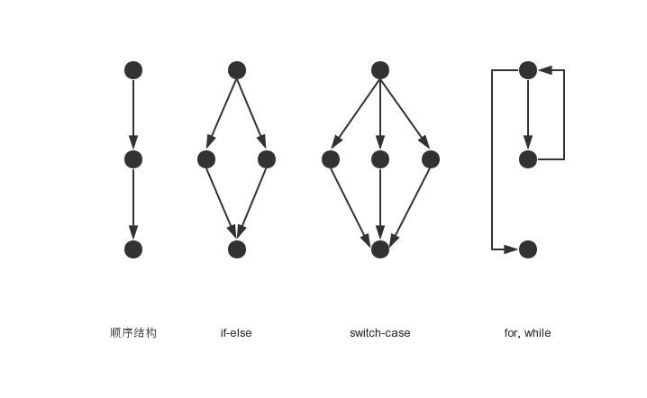
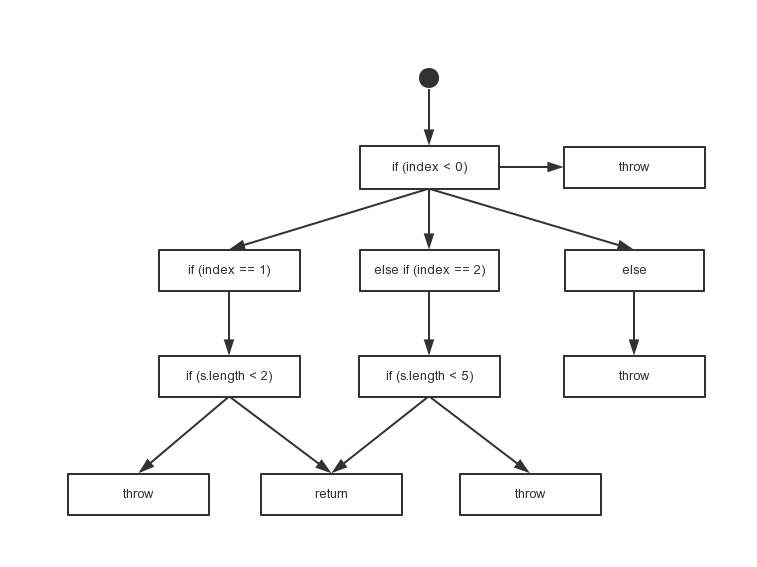

圈复杂度
===

圈复杂度(Cyclomatic Complexity)用于衡量一个模块判定结构的复杂程度，与分支语句（if、else、，switch 等）个数正相关，数量上表现为独立线性路径条数。圈复杂度
也可理解为覆盖所有的可能情况最少使用的测试用例数。圈复杂度大说明程序代码的判断逻辑复杂，可能质量低且难于测试和维护。

圈复杂度V(G)的计算公式：

1. V(G) = E - N + 2，E是流图G中边的数量，N是流图中`所有结点`的数量，包括起始节点和最终节点（多个最终节点只会计算一次）。
2. V(G) = P + 1，P是流图G中`判定结点`的数量。判定节点包括：if，elseif，case


### 1. 控制流图度量




### 示例

```java
public String test(int index, String string) {
    String str = null;
    if (index < 0) {
        throw new IndexOutOfBoundsException("exception < 0 ");
    }
    if (index == 1) {
        if (string.length() < 2) {
            return string;
        }
        str = "String1";
    } else if (index == 2) {
        if (string.length() < 5) {
            return string;
        }
        str = "String2";
    } else {
        throw new IndexOutOfBoundsException("exception > 2 ");
    }
    return str;
}
```

程序控制流图如下：





1. 根据公式 `V(G) = E – N + 2 = 12 – 8 + 2 = 6` 。
虽然图上的真正节点有12个，但是其中有5个节点为throw、return，为最终节点，只记一次，因此n = 8。
2. 根据公式 `V(G) = P + 1 = 5 + 1 = 6`。
判定节点有5个。

### 2. 代码度量

1. 从1开始
2. 遇到以下关键字或者同类的词就加1：if, while, repeat, for, and, or
3. 给case语句中的每一种情况都加1

```java
if (((status = success) and done) or (not done and (numLines >= maxLines))) then ...
```
从1算起，遇到if，and，or，and，即1 + 4 = 5
