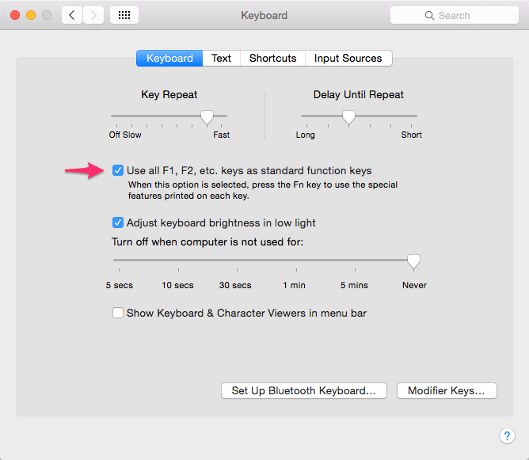
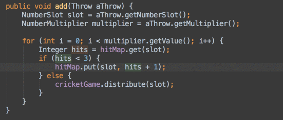
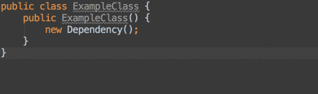
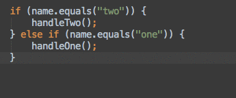
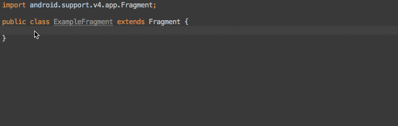
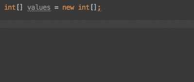
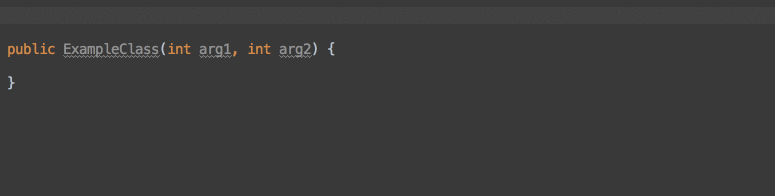

Android Studio  Shortcuts in Mac
===

Mac 上的快捷键用的是 Android Studio 默认设置，且禁用了Mac上的`F*`键.




### 基本快捷键

```
Compile java sources: SHF+CMD+F9
Build the project: CMD+F9
Run the current configuration: CTR+R
Run in debugger: CTR+D
Open project properties: CMD+;
Open Android Studio preferences: CMD+,
Find any command: SHF+CMD+A
Auto-format code: OPT+CMD+L
Delete line: CMD+DELETE
Duplicate line/selection: CMD+D
Copy line: CMD+C (with nothing selected)
Select next occurance(s): CTR+G
```

### 域选中快捷键

```
Select next higher scope: OPT+UP
Select next lower scope: OPT+DOWN
```




### 重构 refactor

```
Rename: SHF+F6
Extract Field: OPT+CMD+F
Extract Variable: OPT+CMD+V
Extract Parameter: OPT+CMD+P
Extract Constant: OPT+CMD+C
Extract Method: OPT+CMD+M
```




### 快速导航

```
Open class: CMD+O
Open file: SHF+CMD+O
Find symbol: OPT+CMD+O
View implementation of symbol: CMD+B
View implementation (if interface or abstract): OPT+CMD+B
Find all usages of a symbol: OPT+F7
Navigate back to last position: CMD+[
Navigate forward to previous position: CMD+]
Switch to recently used files: CRT+TAB
```

### 智能提示 OPT+RETURN

##### 1. If Switch 转换



###### 2. 创建方法


### 自动补全 override 方法




### Live Templates

##### 1. Loops

```
For each loop: “[variable name].for”+TAB
For i loop: “[variable name].fori”+TAB
For i loop (reversed): “[variable name].forr”+TAB
```




##### 2. Logs

```
Generate debug log statement: “logd”+TAB
Generate error log statement: “loge”+TAB
Generate info log statement: “logi”+TAB
Generate TAG declaration: “logt”+TAB
Generate parameter logging: “logm”+TAB
Generate method return log: “logr”+TAB
```



##### 3. 其他

```
Creating newInstance() method with arguments: “newInstance”+TAB
Create a Toast statement: “Toast”+TAB
Add layout_height=”wrap_content” to xml widget: “lhw”+TAB
```


##### 4. 载入自定义 templates

各平台 android studio templates 路径

```
Windows:
<your home directory>\.<product name><version number>\config\templates

Linux:
~\.<product name><version number>\config\templates

MacOS:
~/Library/Preferences/<product name><version number>/templates
```
如果没有 templates 目录，可创建一个，放入 templates 文件，重启 android studio 即可，如下：

[live templates](https://github.com/keyboardsurfer/idea-live-templates)
