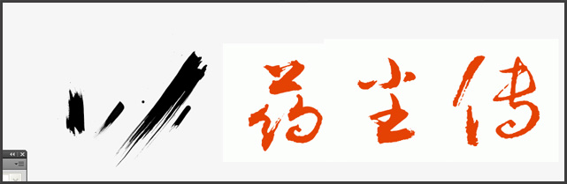
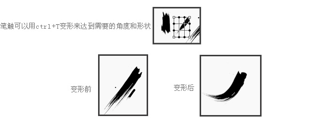
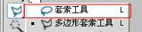

毛笔字标题
===

### 一 生成字体

1. PS 导入指定字库生成
2. 在线生成，”毛笔字体在线生成“ 或者”在线书法大师“

### 二 笔触处理

在 PSD 里面打开后，下载毛笔笔触：[下载地址](http://www.zcool.com.cn/gfx/ZMjcxOTY0.html)。

用套索工具来再次修改调整字体细节：

需要注意的是要把握好字体的节奏，要有大有小，保持字与字之间的连贯性和统一性。

### 三 特效处理

字形设计好后，接下来就是做字效了，可以根据需求、网站风格和文字本身的涵义来定 。（小建议：毛笔字体描边得慎用）

