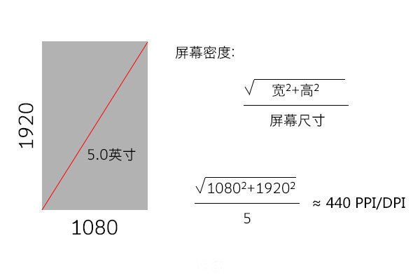
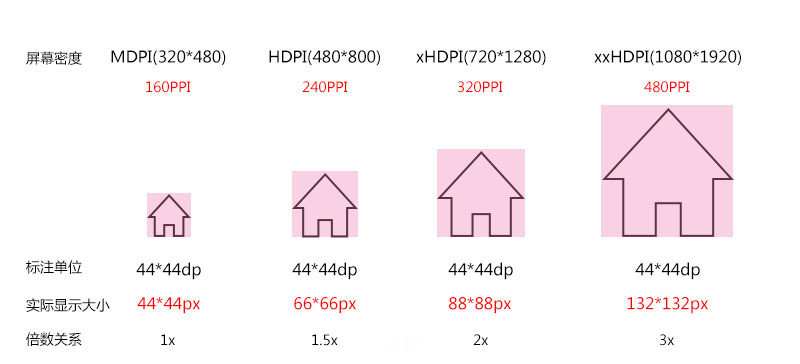
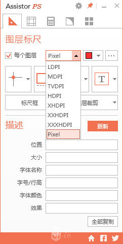
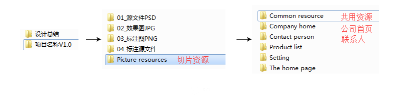

Android 从设计稿到切图
===

### Part 1 基础概念


- 手机分辨率：分辨率就是手机屏幕的像素点数，如 `480*800`、`720*1280`
- 手机屏幕尺寸：手机对角线的物理尺寸，单位是英寸；IPhone 6 的尺寸就是 4.7 英寸
- 手机屏幕密度：DPI 或 PPI，每英寸的像素点数，数值越高显示的越逼真细腻

##### 三者对应关系：




 ##### Android 密度划分以及分辨率：

| 密度     | LDPI      | MDPI   | HDPI    | xHDPI   | xxHDPI     | xxxHDPI        |
|:--------:|:--------:|:-------:|:-------:|:--------:|:---------:|:--------------:|
| 密度数    | 120dpi   | 160dpi  | 240dpi  | 320dpi   | 480dpi    | 640dpi         |
| 对应分辨率 | 240*320  | 320*480 | 480*800 | 720*1280 | 1080*1920 | 3840*2160（4K）|


### Part2 标注切图

标注 Android 设计稿时，推荐使用 dp 和 sp 进行标注，保证资源在不同密度的屏幕上显示相同的效果，他们与 px 换算如下：

```
px = (屏幕密度DPI / 160) * dp
当屏幕密度为 MDPI（160PPI）时，1dp = 1px

px = (屏幕密度DPI / 160) * sp
当屏幕密度为 MDPI（160PPI）时，1sp = 1px
```



推荐使用 `720 *  1280` 尺寸做设计稿，在密度为 xHDPI 下，倍数关系为 2，即使标注的是 px，工程师也可以换算的比较方便。


Iphone 屏幕密度为 xHDPI，通常用 `750 * 1334` 尺寸做设计稿；
把 IP 6的设计稿更改尺寸到720尺寸下，对各个控件进行微调，重新提供标注即可适配 Android。


##### 提供几套切图资源？

理论状态下，如果你想兼顾到目前还存在的各个机型，应该为不同的密度提供不同尺寸大小的切图。

通常选取最大尺寸提供一套切片资源，交给工程师处理，缩放到各个屏幕密度。
注意，这个“最大尺寸”，指的并不是目前市面上Android手机出现过的最大尺寸，而是指目前流行的主流机型中的最大尺寸，这样可节省很大的资源控件。

可通过 Assistor PS 输出不同屏幕密度的切片。



安卓最小可操作尺寸

48dp：这和IOS的最小点击区域性质是一样的，都是考虑到手指点击的灵敏性的问题，设计可点击控件的时候要考虑到这一点，关于这个设计文档里已经明确解释了，更多的内容可以去下载设计文档查看。


##### 安卓设计使用的字体：

- 方正兰亭黑简体
- 西文字体：Roboto

在 Android 5.0 之后，使用的是思源黑体，字体文件有 2 个名称，“source han sans” 和 “noto sans CJK”。

[下载地址](http://pan.baidu.com/s/1mhqlYpa)

### Part3  切片目录


