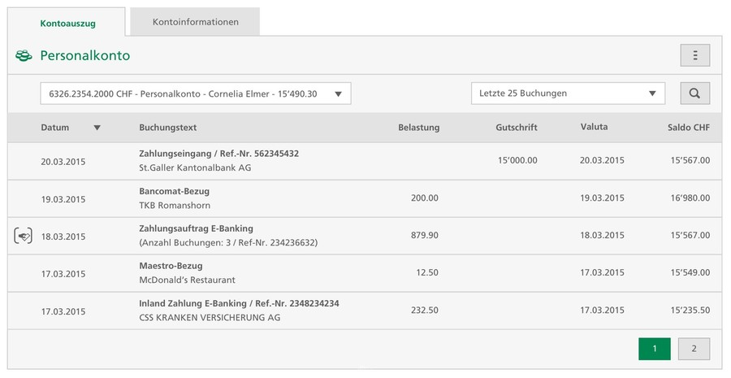
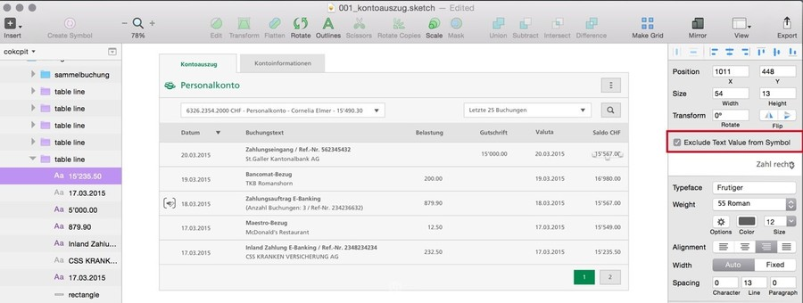
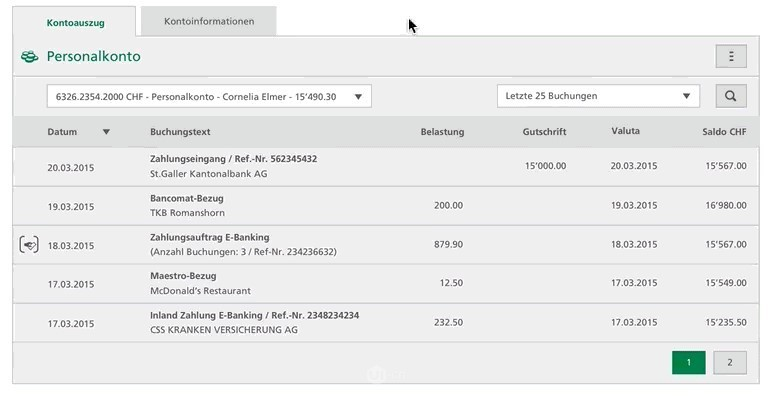
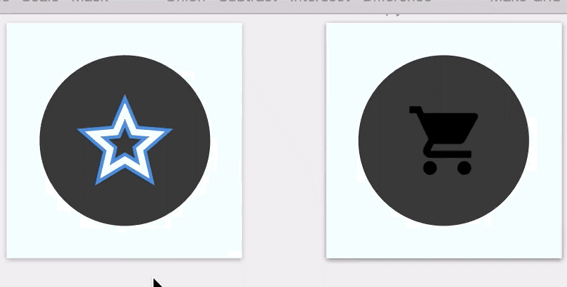
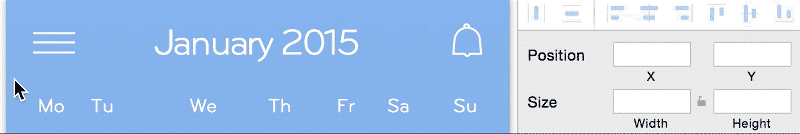
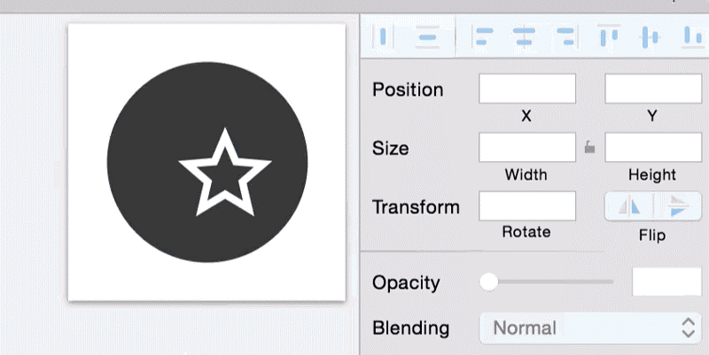
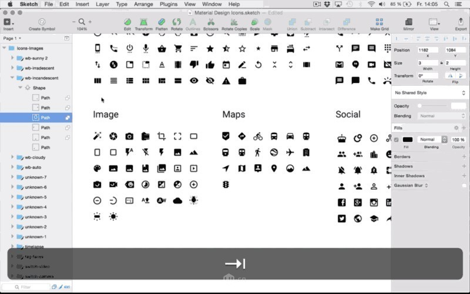
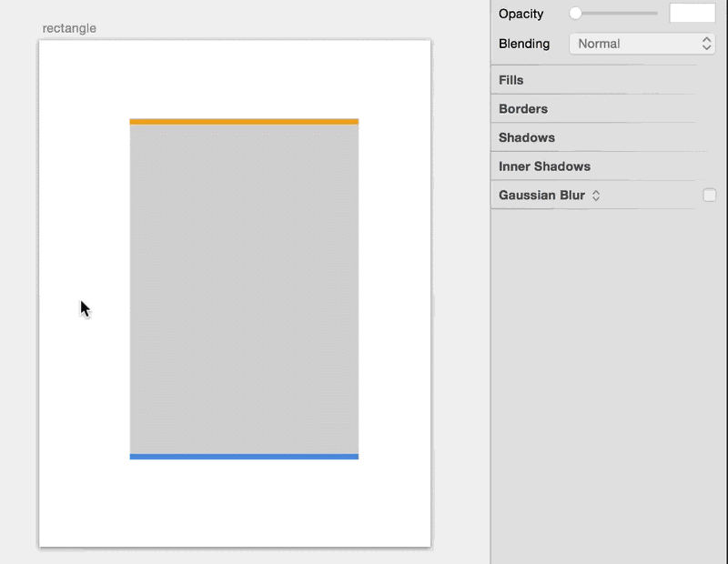

Sketch 技巧
===

### 一 元件设置-排除文本值

这个是我最想分享给大家的秘诀！在各位大侠的设计生活中，难免不遇到许多重复无聊的表格…

一般的做法是选中所有的数字文本，然后移动，移动，移动，移动。但…这样做，真的好吗？

Duang,元件上场！（该功能类似PS智能对象，但又优于PS）

当你设计表格的时候，可以把做好的一行变成元件。注意：元件的参数设置记得取消勾选“排除文本值”（该功能是为了避免表格内容都一样，无法修改）。

通过多次复制，再借助插件自行填充内容，一个完整的表格完成了。

老板让你调整，没问题，单独调整一行，其它的行就跟着变了。

### 二 快速选择图层

推荐快捷键：command+悬停/点击

这种操作比双击图层更好，它能直接点中你想要的图层，免去了一层一层点击，多次点击才能选中嵌套图层的麻烦。

与他接近的方法是，点击选项面板的右侧列表，也可直接进入你想要的图层

### 三 复制图层样式

option+command+ C

这个功能同比photoshop的复制图层样式，粘贴图层样式。

快捷键为“option +command+ C“复制图层样式，“option +command+ V“粘贴图层样式。

### 四 修改默认样式

Sketch默认的样式是灰色背景，图形形状带带灰色描边。可是，当咱们画UI的时候，并不需要到处都有灰边。但是在每次创建的时候，又不得不每次去都调整…

优狐哥告诉你个小办法。

创建一个新的图层，把你的视觉风格都放上去（先做一个灰色背景为例）。选中对应的图层，在菜单中依次选择“编辑”→“设定为默认样式”。再重新创建，是不是默认样式被修改了

### 五 等分间距

f

类似于photoshop的功能

### 六 与其它元素的对齐

通过按住shift键，点选2个及以上图形，即可使用啦。功能与PHOTOSHOP对齐工具一样

### 七 用图层列表快速选择

使用Tab键（⇥）浏览到文件夹，Shift + Tab键（⇧+⇥）浏览到层。点击回车（↩）进入图层文件夹。点击退出（ESC）回到上一级文件夹。

### 八 重命名图层和文件夹

你可能想在浏览你的图层面板想重新命名。敲command+ R，就好了。

### 九 像CSS一样定义圆角

按照html的写法，你可以依次设定每个圆角的角度，书写顺序依次为：
左上/右上/右/左下。

### 十 快速绘制单侧边界

有时候，咱们设计只需要一个方向描边边。借助内阴影和外阴影，在一个图形中就可完成绘制。方法是设置阴影的渐变都为零，只需要一边的方向为负数即可。

此方法，PHOTOSHOP也可通用。

