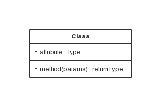
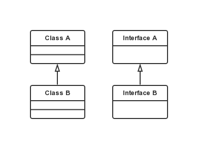
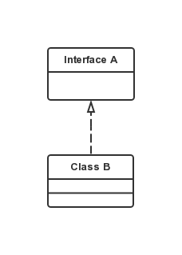
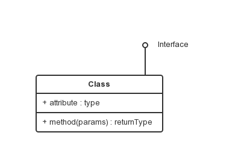
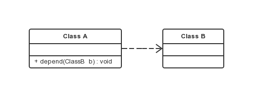
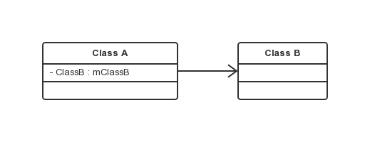
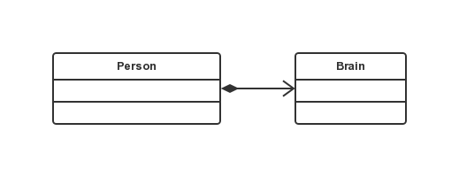

UML 类图
===

### 类

- `+` 表示 public，`-` 表示 private，`#` 表示 protected。
- 抽象类用斜体表示。

### 接口

### 继承（泛化） Generalization

指子类继承父类，或子接口继承父接口的行为。

### 实现 Realization

指一个类实现 interface 接口。

实现还有一种表示方法：棒棒糖表示法，下图即为一个类实现了某个接口，圆圈旁就是实现的接口名。

### 依赖 Dependence

Class A 的某个方法中引用了 Class B 作为参数。这种关系是临时性的，较弱的。

### 关联 Association

Class A 中引用了 Class B 作为成员变量或全局变量。
是两个类、或者类与接口之间语义级别的关系，这种关系一般是长期性的，比依赖强。

### 聚合 Aggregation

聚合是关联关系的一种特例，体现的是整体与部分、拥有的关系，即 has-a 的关系。
整体与部分之间是可分离的，可以具有各自的生命周期，部分可以属于多个整体对象，也可以为多个整体对象共享。
如计算机与 CPU 、公司与员工的关系等。在代码层面和关联关系是一致的，只能从语义级别来区分。

### 组合 Composition

组合也是关联关系的一种特例，体现的是 contains-a 的关系，这种关系比聚合更强，也称为强聚合。
他同样体现整体与部分间的关系，但此时整体与部分是不可分的，整体的生命周期结束也就意味着部分的生命周期结束。
如一个人和他的大脑。在代码层面和关联关系是一致的，只能从语义级别来区分。

##### 总的来说，后几种关系所表现的强弱程度依次为：组合 > 聚合 > 关联 > 依赖。
