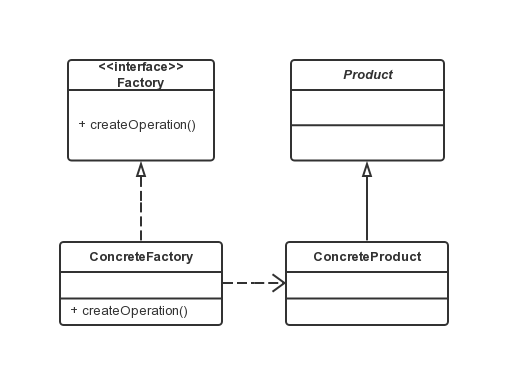

工厂方法模式
===

### 模式定义
定义一个用于创建对象的接口，让子类决定实例化哪一个类。工厂方法使一个类的实例化延迟到其子类。

### UML 类图



### 与简单工厂区别

简单工厂模式的最大优点在于工厂类中包含了必要的逻辑判断，根据客户端的选择条件动态实例化相关的类，对于客户端来说，去除了与具体产品的依赖。如计算器示例，让客户端不用管该用哪个类的实例，只需要把 `+` 给工厂，工厂自动就给出了相应的实例，客户端只要去做运算即可，不同的实例会实现不同的运算。但如果要加一个“求 M 数的 N 次方”的功能，需要给运算工厂类的方法里增加分支条件的，扩展性不佳。其不但对扩展开放，也对修改也开放，这样就违背违背了开放-封闭原则。

而工厂方法可解决该问题。

### 实例讲解

修改简单工厂代码中的 factory包下的内容，声明一个 IFactory 接口。

```java
public interface IFactory {
    Operation createOperation();
}
```

增加具体的工厂类。

```java
public class FactoryAdd implements IFactory {
    public Operation createOperation() {
        return new OperationAdd();
    }
}
```

测试类。

```java
public class Client {
    public static void main(String[] args) {
        IFactory operFactory = new FactoryAdd();
        Operation oper = operFactory.createOperation();

        oper.setNumberA(1);
        oper.setNumberB(2);

        try {
            double result = oper.getResult();
            System.out.println("Result is: " + result);
        } catch (Exception e) {
            e.printStackTrace();
        }
    }
}
```

工厂方法模式克服了简单工厂违背开放-封闭原则的缺点，又保留了封闭对象创建过程的优点。
