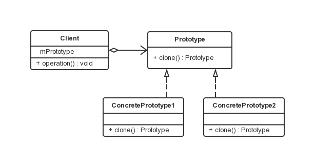

原型模式
===

### 模式定义

原型模式属于对象的创建模式。通过给出一个原型对象来指明所有创建的对象的类型，然后用复制这个原型对象的办法创建出更多同类型的对象。

### UML 类图



### 模型角色

- 抽象原型类(abstract prototype)

java中所有类都继承自 Object，且 Object 实现了 clone() 方法，所以所有的对象都可以通过实现 clone() 接口实现具体原型。

- 具体原型类(concrete prototype)

具体原型类如果实现了 clone() 方法，需要实现 clonable 接口，否则会抛出 CloneNotSupported 异常。

- 客户类(client)

用来测试模式。

### clone 方法需要满足的几个原则：

- x.clone() != x，两个对象不是一个；
- x.clone().getClass() == x.getClass()，两个对象的class是同一个；
- x.clone().equals(x)，两个应该满足equals()方法条件；

注意：

Object 类的 clone 方法只会拷贝对象中的基本的数据类型。对于数组、容器对象、引用对象等都不会拷贝，这就是浅拷贝。如果要实现深拷贝，必须将原型模式中的数组、容器对象、引用对象等另行拷贝。java 提供的大部分的容器类都实现了 Cloneable 接口。所以实现深拷贝也比较方便。

### 浅复制/浅拷贝 shallow copy

被复制对象的所有变量都含有与原来的对象相同的值(仅对于简单的值类型数据)，而所有的对其他对象的引用都仍然指向原来的对象。换言之，浅复制仅仅复制所考虑的对象，而不复制它所引用的对象。

### 深复制/深拷贝 deep copy

被复制对象的所有的变量都含有与原来的对象相同的值，除去那些引用其他对象的变量。那些引用其他对象的变量将指向被复制过的新对象，而不再是原有的那些被引用的对象。换言之，深复制把重复的对象所引用的对象都复制一遍，而这种对被引用到的对象的复制叫做间接复制。

### 实例讲解

以简历为例，原型类：

```java
public class Resume implements Cloneable {
    private String mName;
    private String mSex;
    private String mAge;
    private Experience work = new Experience();

    public Resume(String name) {
        this.mName = name;
    }

    public void setInfo(String sex, String age) {
        this.mSex = sex;
        this.mAge = age;
    }

    public void setExperience(String workDate, String company) {
        work.setWorkDate(workDate);
        work.setCompany(company);
    }

    public void display() {
        System.out.println(mName + " " + mSex + " " + mAge);
        System.out.println("Experience：" + work.getWorkDate() + " " +
        work.getCompany());
    }

    public Resume clone() throws CloneNotSupportedException {
        return (Resume) super.clone();
    }
}
```
注意 clone() 方法的原理，如果是字段是值类型的，则对该字段执行逐位复制，如果字段是引用类型，则复制引用但不复制引用的对象；因此引用类型需要单独实现 Cloneable 接口。

```java
public class Experience implements Cloneable {
    private String  workDate;
    private String  company;

    public String getWorkDate() {
        return workDate;
    }

    public void setWorkDate(String workDate) {
        this.workDate = workDate;
    }

    public String getCompany() {
        return company;
    }

    public void setCompany(String company) {
        this.company = company;
    }

    public Experience clone() {
        try {
            return (Experience) super.clone();
        } catch (CloneNotSupportedException e) {
            e.printStackTrace();
        }
        return null;
    }
}
```

测试类。

```java
public class Client {
    public static void main(String[] args) {
        Resume resume = new Resume("Jack");
        resume.setInfo("Man", "29");
        resume.setExperience("1998-2000", "Google");

        Resume resumeA = resume.clone();
        resumeA.setExperience("1998-2006", "Facebook");

        Resume resumeB = resume.clone();
        resumeB.setInfo("Man", "24");

        resume.display();
        resumeA.display();
        resumeB.display();
    }
}
```

上面都是
