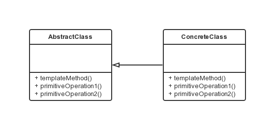

模板方法模式
===

### 模式定义

模板方法模式是类的行为模式。准备一个抽象类，将部分逻辑以具体方法以及具体构造函数的形式实现，然后声明一些抽象方法来迫使子类实现剩余的逻辑。不同的子类可以以不同的方式实现这些抽象方法，从而对剩余的逻辑有不同的实现。这就是模板方法模式的用意。

### UML 类图



```java
// 抽象模板，实现一个具体的模板方法，而逻辑步骤在抽象方法中
public abstract class AbstractClass {
    public abstract void primitiveOperation1();

    public abstract void primitiveOperation2();

    public void templateMethod() {
        primitiveOperation1();
        primitiveOperation2();
    }
}
// 实现父灰所定义的一个或多个抽象方法
public class ConcreteClassA extends AbstractClass {
    @Override
    public void primitiveOperation1() {
        System.out.println("具体类 A 方法 1 实现");
    }

    @Override
    public void primitiveOperation2()
    {
        System.out.println("具体类 A 方法 2 实现");
    }
}
public class ConcreteClassB extends AbstractClass {
    @Override
    public void primitiveOperation1() {
        System.out.println("具体类 B 方法 1 实现");
    }

    @Override
    public void primitiveOperation2() {
        System.out.println("具体类 B 方法 2 实现");
    }
}

// 客户端代码
public class Client {
    public static void main(String[] args) {
        AbstractClass c;

        c = new ConcreteClassA();
        c.templateMethod();

        c = new ConcreteClassB();
        c.templateMethod();
    }
}

```
