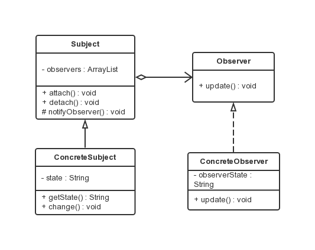

观察者模式
===

### 模式定义
定义了一种一对多的依赖关系，让多个观察者对象同时监听某一个主题对象。该主题对象状态改变时，它的所有观察者都会收到通知并自动更新。

### UML 类图



观察者模式所涉及的角色有：

- 抽象主题(Subject)角色：
抽象主题角色把所有对观察者对象的引用保存在一个聚集（如 ArrayList 对象）里，每个主题都可以有任何数量的观察者。
抽象主题提供一个接口，可以增加和删除观察者对象，抽象主题角色又叫做抽象被观察者(Observable)角色。

- 具体主题(ConcreteSubject)角色：
将有关状态存入具体观察者对象；在具体主题的内部状态改变时，给所有登记过的观察者发出通知。具体主题角色又叫做具体被观察者(Concrete Observable)角色。

- 抽象观察者(Observer)角色：
为所有的具体观察者定义一个接口，在得到主题的通知时更新自己，即更新接口。

- 具体观察者(ConcreteObserver)角色：
存储与主题的状态自恰的状态。具体观察者角色实现抽象观察者角色所要求的更新接口，以便使本身的状态与主题的状态 像协调。
如果需要，具体观察者角色可以保持一个指向具体主题对象的引用。

### 代码示例

- 抽象主题角色类。

```java
public abstract class Subject {

    /**
     * 用来保存注册的观察者对象
     */
    private    List<Observer> list = new ArrayList<Observer>();

    /**
     * 注册观察者对象
     * @param observer    观察者对象
     */
    public void attach(Observer observer){

        list.add(observer);
        System.out.println("Attached an observer");
    }

    /**
     * 删除观察者对象
     * @param observer 观察者对象
     */
    public void detach(Observer observer){

        list.remove(observer);
    }

    /**
     * 通知所有注册的观察者对象
     */
    public void nodifyObservers(String newState){

        for(Observer observer : list){
            observer.update(newState);
        }
    }
}
```

- 具体主题角色类。

```java
public class ConcreteSubject extends Subject{

    private String state;

    public String getState() {
        return state;
    }

    public void change(String newState){
        state = newState;
        System.out.println("主题状态为：" + state);
        // 状态发生改变，通知各个观察者
        this.nodifyObservers(state);
    }
}
```

- 抽象观察者角色类。

```java
public interface Observer {

    public void update(String state);
}
```

- 具体观察者角色类。

```java
public class ConcreteObserver implements Observer {

    // 观察者状态
    private String observerState;

    @Override
    public void update(String state) {

        // 更新观察者的状态，使其与目标的状态保持一致
        observerState = state;
        System.out.println("状态为："+observerState);
    }

}
```

- 测试类。

```java
public class Client {

    public static void main(String[] args) {
        // 创建主题对象
        ConcreteSubject subject = new ConcreteSubject();
        // 创建观察者对象
        Observer observer = new ConcreteObserver();
        // 将观察者对象登记到主题对象上
        subject.attach(observer);
        // 改变主题对象的状态
        subject.change("new state");
    }

}
```

### 推模型和拉模型

### Java 内置 Observer 接口
