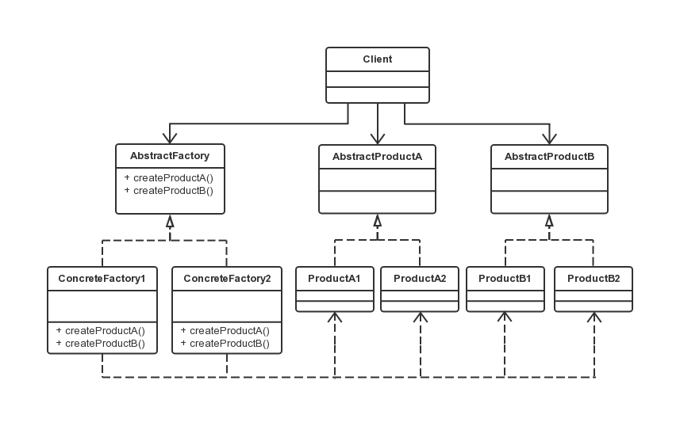

抽象工厂模式
===

### 模式定义

抽象工厂模式（Abstract Factory），提供一个创建一系列相关或相互依赖对象的接口，而无需指定它们具体的类。

### UML 类图

### 代码示例

AbstractProductA 与 AbstractProductB是两个抽象产品，即下例中的 User 与 Department
ProductA1 为 SqlServerUser，而 ProductB1 为 AccessUser。
IFactory 是一个抽象工厂接口，其包含所有的产品创建的抽象方法。
而具体工厂即 SqlServerFactory 和 AccessFactory。
通常在运行时创建一个ConcreteFactory类的实例，该具体工厂再创建具有特定实现的产品对象，即创建不同的产品对象，应使用不同的具体工厂。

### 抽象工厂模式的优缺点

该模式最大优点是易于交换产品系列，由于具体工厂类如 IFactory factory = new AccessFactory()，
在应用中只需初始化一次，使得改变一个应用的具体工厂变得非常容易。

还有一个优点是具体的创建实例过程与客户端分离，客户端是通过它们的抽象接口操纵实例，产品的具体类名也被具体工厂的实现分离，不会出现在客户端代码中。
如上例，Client 类仅需关注 IUser 和 IDepartment，不关心它是用 SQL Server 实现还是用 Access 来实现。

该模式缺点也明显，如抽象工厂模式可以很方便地切换两个数据库访问的代码，但是如果要增加功能，如项目表 Project，需要至少增加三个类，Iproject、SqlServerProject、AccessProject，
还需要更改 IFactory、SqlServerFactory 和 AccessFactory 才可以完全实现。

其次，真实项目中 Client 类不会只有一个，有很多地方都在使用 IUser 或 IDepartment，在每一个类的开始都需要修改 IFactory factory = new SqlServerFactory()。
