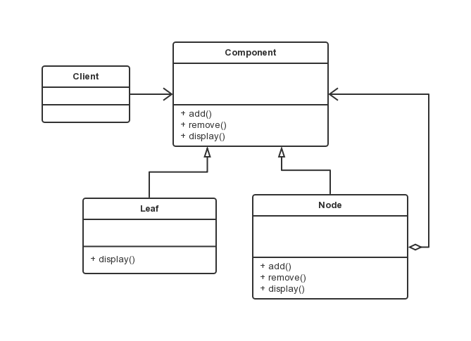

组合模式
===

### 模式定义

将对象组合成树形结构进行表示，使用户对单个对象和组合对象的使用具有一致性。当用户可以忽略组合对象与单个对象的不同，统一的使用组合结构中的所有对象时，可以考虑使用组合模式。

### UML 类图



- Component，组合中的对象声明接口，实现所有类共有接口的默认行为。
- Leaf，在组合中表示叶子节点，其没有子节点。
- Node，枝节点，有字节点。用于存储子部件。

### 代码示例

```java
abstract class Component{
    protected String mName;
    public Component(String name) {
        mName=name;
    }
    public abstract void add(Component c);
    public abstract void remove(Component c);
    public abstract void display(int depth);
}

class Leaf extends Component {
    public Leaf(String name) {
        super(name);
    }

    @Override
    public void add(Component c) {
        // TODO Auto-generated method stub
    }

    @Override
    public void remove(Component c) {
        // TODO Auto-generated method stub
    }

    @Override
    public void display(int depth) {
        for(int i = 0; i< depth; i++) {
            System.out.print("-");
        }
        System.out.println("Leaf:" + mName);
    }

}

class Node extends Component {
    ArrayList<Component> list=new ArrayList();

    public Node(String name) {
        super(name);
    }

    @Override
    public void add(Component c) {
        list.add(c);
    }

    @Override
    public void remove(Component c) {
        list.remove(c);
    }

    @Override
    public void display(int depth) {
        for(int i = 0; i < depth; i++) {
            System.out.print("-");
        }
        System.out.println("Node:"+mName);
        for(Component c : list) {
            c.display(depth+1);
        }
    }
}

public class Client {
    public static void main(String[] args) {
        Node root=new Node("Root");
        root.add(new Leaf("LeafA"));
        root.add(new Leaf("LeafB"));

        Node nodeA=new Node("NodeA");
        nodeA.add(new Leaf("LeafC"));
        nodeA.add(new Leaf("LeafD"));

        root.add(nodeA);
        root.add(new Node("NodeB"));

        root.display(1);
        root.remove(nodeA);
        root.display(1);
    }
}
```
