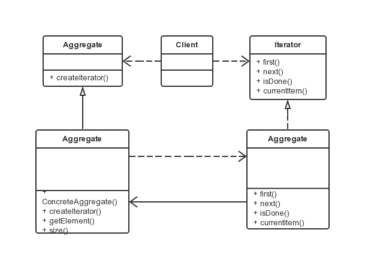

迭代器模式
===

### 模式定义

顺序地访问一个聚集中的元素而不必暴露聚集的内部表象。

### UML 类图



涉及角色：

- 抽象迭代子（Iterator）角色：此抽象角色定义出遍历元素所需的接口。
- 具体迭代子（oncreteIterator）角色：此角色实现了 Iterator 接口，并保持迭代过程中的游标位置。
- 聚集（Aggregate）角色：此抽象角色给出创建迭代子（Iterator）对象的接口。
- 具体聚集（ConcreteAggregate）角色：实现了创建迭代子（Iterator）对象的接口，返回一个合适的具体迭代子实例。
- 客户端（Client）角色：持有对聚集及其迭代子对象的引用，调用迭代子对象的迭代接口，也有可能通过迭代子操作聚集元素的增加和删除。


### 代码示例

```java
public abstract class Aggregate {
    /**
     * 工厂方法，创建相应迭代子对象的接口
     */
    public abstract Iterator createIterator();
}

public class ConcreteAggregate extends Aggregate {

    private Object[] objArray = null;
    /**
     * 构造方法，传入聚合对象的具体内容
     */
    public ConcreteAggregate(Object[] objArray){
        this.objArray = objArray;
    }

    @Override
    public Iterator createIterator() {

        return new ConcreteIterator(this);
    }
    /**
     * 取值方法：向外界提供聚集元素
     */
    public Object getElement(int index) {

        if(index < objArray.length) {
            return objArray[index];
        }else{
            return null;
        }
    }
    /**
     * 取值方法：向外界提供聚集的大小
     */
    public int size() {
        return objArray.length;
    }
}

public interface Iterator {
    /**
     * 迭代方法：移动到第一个元素
     */
    public void first();
    /**
     * 迭代方法：移动到下一个元素
     */
    public void next();
    /**
     * 迭代方法：是否为最后一个元素
     */
    public boolean isDone();
    /**
     * 迭代方法：返还当前元素
     */
    public Object currentItem();
}

public class ConcreteIterator implements Iterator {
    // 持有被迭代的具体的聚合对象
    private ConcreteAggregate agg;
    // 内部索引，记录当前迭代到的索引位置
    private int index = 0;
    // 记录当前聚集对象的大小
    private int size = 0;

    public ConcreteIterator(ConcreteAggregate agg) {
        this.agg = agg;
        this.size = agg.size();
        index = 0;
    }

    @Override
    public Object currentItem() {
        return agg.getElement(index);
    }

    @Override
    public void first() {

        index = 0;
    }

    @Override
    public boolean isDone() {
        return (index >= size);
    }

    @Override
    public void next() {

        if(index < size) {
            index ++;
        }
    }

}

public class Client {

    public void operation() {
        Object[] objArray = {"One","Two","Three","Four","Five","Six"};
        Aggregate agg = new ConcreteAggregate(objArray);
        Iterator it = agg.createIterator();
        while(!it.isDone()) {
            System.out.println(it.currentItem());
            it.next();
        }
    }

    public static void main(String[] args) {
        Client client = new Client();
        client.operation();
    }

}
```
