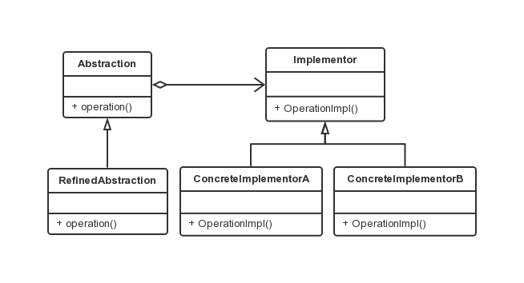

桥接模式
===

### 模式定义

将抽象部分与它的实现部分分开，使它们都可以独立地变化。这不是让抽象类与其派生类分开，而是抽象类和它的派生类用来实现自己的对象。

### UML 类图



### 代码示例

```java
abstract class Implementor {
    public abstract void operation();
}

class ConcreteImplementorA extends Implementor {

    @Override
    public void operation() {
        System.out.println("具体实现 A 的方法");
    }
}

class ConcreteImplementorB extends Implementor {

    @Override
    public void operation() {
        System.out.println("具体实现 B 的方法");
    }
}

class Abstraction {
    protected Implementor implementor;

    public Implementor setImplementor(Implementor imp) {
        this.implementor = imp;
    }

    public void operation() {
        implementor.operation();
    }
}

class RefinedAbstraction extends Abstraction {

    @Override
    public void operation() {
        super.operation();
    }

}

public class Client {

    public static void main(String[] args) {
        Abstraction mAbstraction = new RefinedAbstraction();

        mAbstraction.setImplementor(new ConcreteImplementorA());
        mAbstraction.operation();

        mAbstraction.setImplementor(new ConcreteImplementorB());
        mAbstraction.operation();
    }

}
```
