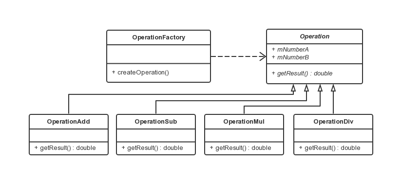

简单工厂模式
===

### 模式定义
简单工厂并不是一种设计模式，更确切的说是一种编程习惯。

### UML 类图


### 实例讲解
实现一个简易加减乘除计算器，要求输入两个数字及运算符，并得出结果。

### 初步封装

```java
public class Operation {

    private static final String OPERATE_ADD = "+";
    private static final String OPERATE_SUB = "-";
    private static final String OPERATE_MUL = "*";
    private static final String OPERATE_DIV = "/";
    private static final double NUMBER_ZERO = 0d;

    public static double getResult(double numberA, double numberB, String operate) {
        double result = 0d;

        do {
            if (OPERATE_ADD.equals(operate)) {
                result = numberA + numberB;
                break;
            }

            if (OPERATE_SUB.equals(operate)) {
                result = numberA - numberB;
                break;
            }

            if (OPERATE_MUL.equals(operate)) {
                result = numberA * numberB;
                break;
            }

            if (OPERATE_DIV.equals(operate)) {
                if (numberB == NUMBER_ZERO) {
                    System.out.println("wrong params.");
                    System.exit(0);
                }
                result = numberA / numberB;
                break;
            }

            System.out.println("no matched operate.");

        } while (false);

        return result;
    }
}

public class Test {

    public static void main(String[] args) {
        Scanner scanner = new Scanner(System.in);

        System.out.println("Please input number A:");
        String strNumberA = scanner.next();

        System.out.println("Please input number B:");
        String strNumberB = scanner.next();

        System.out.println("Please input operate character:");
        String operate = scanner.next();

        try {
            Double numberA = Double.parseDouble(strNumberA);
            Double numberB = Double.parseDouble(strNumberB);
            Double result = Operation.getResult(numberA, numberB, operate);
            System.out.println("Result is:" + result);
        } catch(NumberFormatException e) {
            System.out.println("Format exception: " + e.toString());
        } finally {
            scanner.close();
        }
    }
}
```

上述代码虽然做到了业务与界面分离，但分离的不彻底，也不易扩展，如增加一个开根（sqrt）运算，加减乘除运算也需要参与编译。

### 简单工厂

- 简单运算工厂类

```java
public class OperationFactory {

    private static final String OPERATE_ADD = "+";
    private static final String OPERATE_SUB = "-";
    private static final String OPERATE_MUL = "*";
    private static final String OPERATE_DIV = "/";

    public static Operation createOperation(String operate) {
        Operation operation = null;
        do {
            if (OPERATE_ADD.equals(operate)) {
                operation = new OperationAdd();
                break;
            }

            if (OPERATE_SUB.equals(operate)) {
                operation = new OperationSub();
                break;
            }

            if (OPERATE_MUL.equals(operate)) {
                operation = new OperationMul();
                break;
            }

            if (OPERATE_DIV.equals(operate)) {
                operation = new OperationDiv();
                break;
            }
            System.out.println("no matched operation");
        } while (false);

        return operation;
    }
}
```

- 测试类

```java
    public static void main(String[] args) {
        Scanner scanner = new Scanner(System.in);

        System.out.println("Please input number A:");
        String strNumberA = scanner.next();

        System.out.println("Please input number B:");
        String strNumberB = scanner.next();

        System.out.println("Please input operate character:");
        String operate = scanner.next();

        try {
            Double numberA = Double.parseDouble(strNumberA);
            Double numberB = Double.parseDouble(strNumberB);
            Operation operation = OperationFactory.createOperation(operate);
            if (operation == null) {
                System.out.println("operation is null.");
                return;
            }
            operation.setNumberA(numberA);
            operation.setNumberB(numberB);
            double result = operation.getResult();
            System.out.println("Result is:" + result);
        } catch(NumberFormatException e) {
            System.out.println("Format exception: " + e.toString());
        } catch (Exception e) {
            System.out.println("Divisor exception: " + e.toString());
        } finally {
            scanner.close();
        }
    }
```
