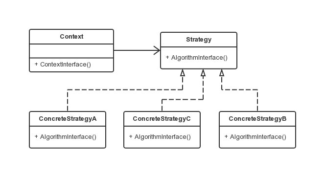

策略模式
===

### 模式定义

策略模式就是定义一系列的算法，把每一个算法封装起来，并且使它们可相互替换。本模式使得算法可独立于使用它的客户而变化。

### 使用场景

- 许多相关的类仅仅是行为有异。"策略"提供了一种用多个行为中的一个行为来配置一个类的方法。即一个系统需要动态地在几种算法中选择一种。
- 需要使用一个算法的不同变体。例如，你可能会定义一些反映不同的空间/时间权衡的算法。当这些变体实现为一个算法的类层次时,可以使用策略模式。
- 算法使用客户不应该知道的数据。可使用策略模式以避免暴露复杂的、与算法相关的数据结构。
- 一个类定义了多种行为, 并且这些行为在这个类的操作中以多个条件语句的形式出现。将相关的条件分支移入它们各自的Strategy类中以代替这些条件语句。

### UML 类图




```java
// Strategy 类定义了算法的公共接口
public interface Strategy
{
    public void algorithmInterface();
}
// ConcreteStrategy 实现 Strategy 接口，封装了具体的算法
public class ConcreteStrategyA implements Strategy
{
    public void algorithmInterface()
    {
        System.out.println("算法 A 实现");
    }
}
public class ConcreteStrategyB implements Strategy
{
    public void algorithmInterface()
    {
        System.out.println("算法 B 实现");
    }
}
public class ConcreteStrategyC implements Strategy
{
    public void algorithmInterface()
    {
        System.out.println("算法 C 实现");
    }
}
// Context 用一个 ConcreteStrategy 配置，维护一个 Strategy 对象的引用
public class Context
{
    private Strategy    strategy;

    public Context(Strategy strategy)
    {
        this.strategy = strategy;
    }

    public void contextInterface()
    {
        strategy.algorithmInterface();
    }
}
// 客户端代码
public class Client
{
    public static void main(String[] args)
    {
        Context context;
        context = new Context(new ConcreteStrategyA());
        context.contextInterface();

        context = new Context(new ConcreteStrategyB());
        context.contextInterface();

        context = new Context(new ConcreteStrategyC());
        context.contextInterface();
    }
}

```

### 实例讲解

一个商场收银程序，根据客户购买商品的单价和数量即对应的活动，计算出总费用。

```java
// Context 类
public class CashContext
{
    CashSuper    cashSuper;

    public CashContext(CashSuper cashSuper)
    {
        this.cashSuper = cashSuper;
    }

    public double acceptCash(double money)
    {
        return cashSuper.acceptCash(money);
    }
}

// 客户端代码
public class Client {
    private static final String CASH_NORMAL = "正常收费";
    private static final String CASH_DEBATE = "满300返100";
    private static final String CASH_RETURN = "打8折";

    public static void main(String[] args) {

        double total = 0d;
        total = consume(CASH_NORMAL, 1, 1000);
        total += consume(CASH_DEBATE, 1, 1000);
        total += consume(CASH_RETURN, 1, 1000);

        System.out.println("total:" + (int) total);
    }

    public static double consume(String type, int num, double price) {
        CashContext cashContext = null;

        do {
            if (CASH_NORMAL.equals(type)) {
                cashContext = new CashContext(new CashNormal());
                break;
            }
            if (CASH_DEBATE.equals(type)) {
                cashContext = new CashContext(new CashReturn(300, 100));
                break;
            }
            if (CASH_RETURN.equals(type)) {
                cashContext = new CashContext(new CashRebate(0.8));
                break;
            }
        } while (false);

        double total = cashContext.acceptCash(num * price);

        System.out.println("price:" + price + " number:" + num + "sum:" + total);
        return total;
    }
}
```

上述代码在客户端判断哪一种算法，可见并不是最优方案，可采用策略模式与简单工厂结合，仅需要改动 CashContext 即可。

```java
public class CashContext {
    CashSuper mCashSuper;
    private static final String CASH_NORMAL = "正常收费";
    private static final String CASH_DEBATE = "满300返100";
    private static final String CASH_RETURN = "打8折";

    public CashContext(CashSuper cashSuper) {
        this.mCashSuper = cashSuper;
    }

    public CashContext(String type) {
        do {
            if (CASH_NORMAL.equals(type)) {
                mCashSuper = new CashNormal();
                break;
            }
            if (CASH_DEBATE.equals(type)) {
                mCashSuper = new CashReturn(300, 100)
                break;
            }
            if (CASH_RETURN.equals(type)) {
                mCashSuper = new CashRebate(0.8);
                break;
            }
        } while (false);
    }

    public double acceptCash(double money) {
        return mCashSuper.acceptCash(money);
    }
}

// 客户端代码
public class Client {

    public static void main(String[] args) {

        double total = 0d;
        total = consume(CASH_NORMAL, 1, 1000);
        total += consume(CASH_DEBATE, 1, 1000);
        total += consume(CASH_RETURN, 1, 1000);

        System.out.println("total:" + (int) total);
    }

    public static double consume(String type, int num, double price) {
        CashContext cashContext = new CashConetxt(type);

        double total = cashContext.acceptCash(num * price);

        System.out.println("price:" + price + " number:" + num + "sum:" + total);
        return total;
    }
}
```

### 策略模式本质:

- 通过继承实现行为的重用，易导致代码维护问题。  -> 继承, is a
- 将行为剥离成接口，按需实现并组合。          -> 组合, has a
