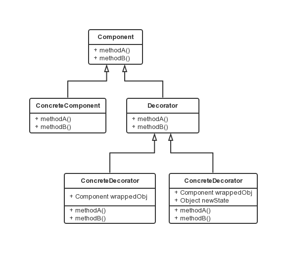

装饰器模式
===

### 模式定义

动态地将责任附加到对象上，若要扩展功能，装饰器提供了比继承更有弹性的替代方案。

### 装饰器特点

- 不改变原类文件。
- 不使用继承。
- 动态扩展。

装饰器装饰的是一个接口的任何实现类，而这些实现类也包括了装饰器本身，装饰器本身也可以再被装饰。



装饰器与被装饰类(组件)必须是同一类型，因此有共同的超类，每一个装饰器都有一个 Component 的引用，也可以添加新的方法。此外
- Component 通常是抽象类，也可是接口。
- 装饰器的抽象父类 Decorator 非必须。

### 代码示例

- 抽象父类。

```java
public abstract class Beverage {
    protected String mDescription = "Unknown Beverage";

    public String getDescription() {
        return mDescription;
    }

    public abstract double cost();
}
```

- 具体组件。

```java
public class Decaf extends Beverage {
    public Decaf() {
        mDescription = "Decaf Coffee";
    }

    public double cost() {
        return 1.05;
    }
}
```

- 抽象装饰器，继承于 Beverage，但不是必须。

```java
public abstract class CondimentDecorator extends Beverage {
    public abstract String getDescription();
}
```

- 具体装饰器。

```java
public class Milk extends CondimentDecorator {
    Beverage mBeverage;

    public Milk(Beverage beverage) {
        this.mBeverage = beverage;
    }

    public String getDescription() {
        return mBeverage.getDescription() + ", Milk";
    }

    public double cost() {
        return .10 + mBeverage.cost();
    }
}

```

- 测试类。

```java
public class StarbuzzCoffee {

    public static void main(String args[]) {
        Beverage beverage = new Espresso();
        System.out.println(beverage.getDescription()
                + " $" + beverage.cost());

        Beverage beverage2 = new DarkRoast();
        beverage2 = new Mocha(beverage2);
        beverage2 = new Mocha(beverage2);
        beverage2 = new Whip(beverage2);
        System.out.println(beverage2.getDescription()
                + " $" + beverage2.cost());

        Beverage beverage3 = new HouseBlend();
        beverage3 = new Soy(beverage3);
        beverage3 = new Mocha(beverage3);
        beverage3 = new Whip(beverage3);
        System.out.println(beverage3.getDescription()
                + " $" + beverage3.cost());
    }
}
```
