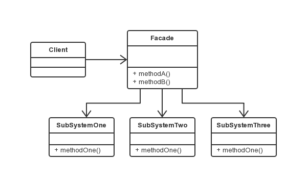

外观模式
===

### 模式定义

为子系统中的一组接口提供一个一致的界面，此模式定义了一个高层接口，增加了子系统的易用性。

### UML 类图




### 应用场景

1. 在设计初期阶段，应将不同的两个层分离，比如经典的三层架构，就需要考虑在数据访问层和业务逻辑层、业务逻辑层和表示层的层与层之间建立外观 Facade，这样可以为复杂的子系统提供一个简单的接口，使得耦合度大大降低。

2. 在开发阶段，子系统往往因为不断的重构演化而变得越来越复杂，大多数的模式使用时也都会产生很多很小的类，这本是好事，但也给外部调用它们的用户程序带来了使用上的困难，增加外观Facade可以提供一个简单的接口，减少它们之间的依赖。

3. 在维护一个遗留的大型系统时，可能这个系统已经非常难以维护和扩展，但因为它包含非常重要的功能，新的需求开发必须要依赖于它。此时，用外观模式Facade也是非常合适。为新系统开发一个外观Facade类，给设计粗糙或高度复杂的遗留代码一个比较清晰的接口，让新系统与Facade对象交互，Facade与遗留代码交互所有复杂的工作。

### 代码示例

```java
// 子系统
public class SubSystemOne {
    public void methodOne() {
        System.out.println("子系统方法1");
    }
}
public class SubSystemTwo {
    public void methodTwo() {
        System.out.println("子系统方法2");
    }
}
public class SubSystemThree {
    public void methodThree() {
        System.out.println("子系统方法3");
    }
}


// 外观类
public class Facade {
    SubSystemOne one;
    SubSystemTwo two;
    SubSystemThree three;

    public Facade() {
        one = new SubSystemOne();
        two = new SubSystemTwo();
        three = new SubSystemThree();
    }

    public void methodA() {
        System.out.println("方法组A");
        one.methodOne();
        two.methodTwo();
    }

    public void methodB() {
        System.out.println("方法组B");
        two.methodTwo();
        three.methodThree();
    }
}

// 客户端代码
public class Client {
    public static void main(String[] args) {
        Facade facade = new Facade();
        facade.methodA();
        facade.methodB();
    }
}

```
