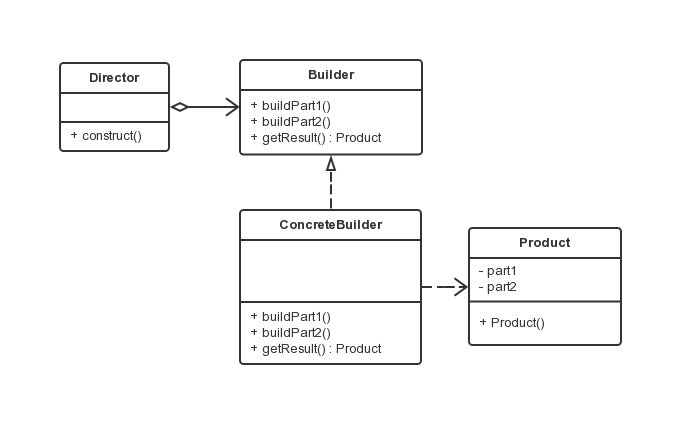

建造者模式
===

### 模式定义


建造模式是对象的创建模式。建造模式可以将一个产品的内部表象（internal representation）与产品的生产过程分割开来，从而可以使一个建造过程生成具有不同的内部表象的产品对象。

### UML 类图



- 抽象建造者（Builder）：
给出一个抽象接口，以规范产品对象的各个组成成分的建造。一般而言，此接口独立于应用程序的商业逻辑。模式中直接创建产品对象的是具体建造者。

- 具体建造者（ConcreteBuilder）：
担任这个角色的是与应用程序紧密相关的一些类，它们在应用程序调用下创建产品的实例。这个角色要完成的任务包括：1.实现抽象建造者Builder所声明的接口，给出一步一步地完成创建产品实例的操作。2.在建造过程完成后，提供产品的实例。

- 导演者（Director）：
担任这个角色的类调用具体建造者角色以创建产品对象。导演者角色并没有产品类的具体知识，真正拥有产品类的具体知识的是具体建造者角色。

- 产品（Product）：
产品便是建造中的复杂对象。一般来说，一个系统中会有多于一个的产品类，而且这些产品类并不一定有共同的接口，甚至相互之间并无关联。


### 应用场景

主要用于创建一些复杂对象，这些对象建造顺序非常稳定，但对象内部的构建比较复杂。
其优点就是建造代码与表示代码分离，由于建造者隐藏了该产品是如何组装的，所以若需要改变一个产品的内部表示，只需要再定义一个具体的建造者即可。

### 代码示例

- 产品类。

```java
public class Product {

    private String part1;
    private String part2;

    public String getPart1() {
        return part1;
    }
    public void setPart1(String part1) {
        this.part1 = part1;
    }
    public String getPart2() {
        return part2;
    }
    public void setPart2(String part2) {
        this.part2 = part2;
    }
}
```

- 抽象建造者类。

```java
public interface Builder {
    public void buildPart1();
    public void buildPart2();
    public Product getResult();
}
```

- 具体建造者类。

```java
public class ConcreteBuilder implements Builder {

    private Product product = new Product();

    @Override
    public void buildPart1() {
        // 构建产品的第一个零件
 　　　　product.setPart1("number：9527");
    }

    @Override
    public void buildPart2() {
        // 构建产品的第二个零件
 　　　　product.setPart2("name：XXX");
    }

    @Override
    public Product getResult() {
        return product;
    }

}
```

- 导演类。

```java
public class Director {

    private Builder builder;

    public Director(Builder builder) {
        this.builder = builder;
    }

    public void construct() {
        builder.buildPart1();
        builder.buildPart2();
    }
}
```

- 客户端类。

```java
public class Client {
    public static void main(String[] args) {
        Builder builder = new ConcreteBuilder();
        Director director = new Director(builder);
        director.construct();
        Product product = builder.getResult();
        System.out.println(product.getPart1());
        System.out.println(product.getPart2());
    }
}
```
