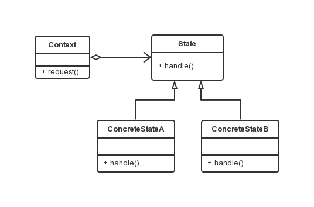

状态模式
===

### 模式定义

当一个对象的内在状态改变时允许改变其行为，这个对象看起来像是改变了其类。

状态模式主要解决的是当控制一个对象状态转换的条件表达式过于复杂时的情况。
把状态的判断逻辑转移到表示不同状态的一系列类当中，可以把复杂的判断逻辑简化。

### UML 类图



涉及角色：

- 环境角色(Context)，也成上下文：定义客户端所感兴趣的接口，并且保留一个具体状态类的实例。这个具体状态类的实例给出此环境对象的现有状态。
- 抽象状态角色(State)：定义一个接口，以封装 Context 特定状态所对应的行为。
- 具体状态角色(ConcreteState)：每一个具体状态类都实现了环境（Context）的一个状态所对应的行为。

```java
// State类，抽象状态类，定义一个接口以封装与 Context 的一个特定状态相关的行为
public interface State {
    public void handle(Context context);
}

// ConcreteState 类
public class ConcreteStateA implements State {
    public void handle(Context context) {
        context.setState(new ConcreteStateB());
    }
}
public class ConcreteStateB implements State {
    public void handle(Context context) {
        context.setState(new ConcreteStateA());
    }
}
// Context 类，维护一个 ConcreteState 子类的实例，这个实例定义当前的状态
public class Context {
    private State state;

    public Context(State state) {
        this.state = state;
    }

    public void request() {
        state.handle(this);
    }

    public State getState() {
        return state;
    }

    public void setState(State state) {
        this.state = state;
        System.out.println("当前状态：" + state.getClass().getName());
    }
}

// Client
public class Client {
    public static void main(String[] args) {
        Context context = new Context(new ConcreteStateA());

        context.request();
        context.request();
        context.request();
        context.request();
    }
}
```

在状态模式中，Context 类是持有状态的对象，但是自身并不处理跟状态相关的行为，而是把处理状态的功能委托给了状态对应的状态处理类来处理。
在具体的状态处理类中经常需要获取 Context 自身的数据，甚至在必要的时候会回调 Context 的方法，因此，通常将 Context 当作一个参数传递给具体的状态处理类。
客户端一般只和 Context 交互。客户端可以用状态对象来配置一个 Context，一旦配置完毕就不再需要和状态对象打交道。
客户端通常不负责运行期间状态的维护，也不负责决定后续到底使用哪一个具体的状态处理对象。
