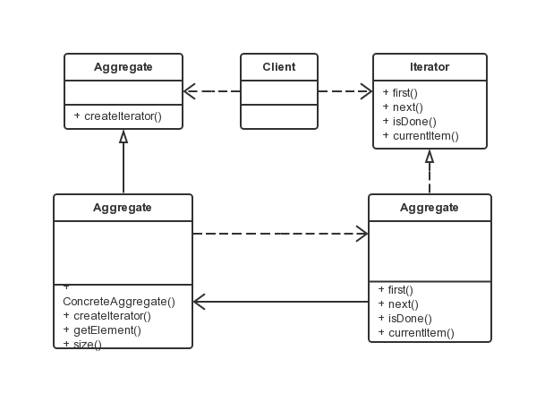

迭代器模式
===

### 模式定义

顺序地访问一个聚集中的元素而不必暴露聚集的内部表象。

### UML 类图



涉及角色：

- 抽象迭代子（Iterator）角色：此抽象角色定义出遍历元素所需的接口。
- 具体迭代子（oncreteIterator）角色：此角色实现了 Iterator 接口，并保持迭代过程中的游标位置。
- 聚集（Aggregate）角色：此抽象角色给出创建迭代子（Iterator）对象的接口。
- 具体聚集（ConcreteAggregate）角色：实现了创建迭代子（Iterator）对象的接口，返回一个合适的具体迭代子实例。
- 客户端（Client）角色：持有对聚集及其迭代子对象的引用，调用迭代子对象的迭代接口，也有可能通过迭代子操作聚集元素的增加和删除。


### 代码示例

- 白箱实现方案

如果一个聚集的接口提供了可以用来修改聚集元素的方法，这个接口就是所谓的宽接口。
如果聚集对象为所有对象提供同一个接口，也就是宽接口的话，当然会满足迭代子模式对迭代子对象的要求。但是，这样会破坏对聚集对象的封装。
这种提供宽接口的聚集叫做白箱聚集。聚集对象向外界提供同样的宽接口


```java
public abstract class Aggregate {
    /**
     * 工厂方法，创建相应迭代子对象的接口
     */
    public abstract Iterator createIterator();
}

public class ConcreteAggregate extends Aggregate {

    private Object[] objArray = null;
    /**
     * 构造方法，传入聚合对象的具体内容
     */
    public ConcreteAggregate(Object[] objArray){
        this.objArray = objArray;
    }

    @Override
    public Iterator createIterator() {

        return new ConcreteIterator(this);
    }
    /**
     * 取值方法：向外界提供聚集元素
     */
    public Object getElement(int index) {

        if(index < objArray.length) {
            return objArray[index];
        }else{
            return null;
        }
    }
    /**
     * 取值方法：向外界提供聚集的大小
     */
    public int size() {
        return objArray.length;
    }
}

public interface Iterator {
    /**
     * 迭代方法：移动到第一个元素
     */
    public void first();
    /**
     * 迭代方法：移动到下一个元素
     */
    public void next();
    /**
     * 迭代方法：是否为最后一个元素
     */
    public boolean isDone();
    /**
     * 迭代方法：返还当前元素
     */
    public Object currentItem();
}

public class ConcreteIterator implements Iterator {
    // 持有被迭代的具体的聚合对象
    private ConcreteAggregate agg;
    // 内部索引，记录当前迭代到的索引位置
    private int index = 0;
    // 记录当前聚集对象的大小
    private int size = 0;

    public ConcreteIterator(ConcreteAggregate agg) {
        this.agg = agg;
        this.size = agg.size();
        index = 0;
    }

    @Override
    public Object currentItem() {
        return agg.getElement(index);
    }

    @Override
    public void first() {

        index = 0;
    }

    @Override
    public boolean isDone() {
        return (index >= size);
    }

    @Override
    public void next() {

        if(index < size) {
            index++;
        }
    }

}

public class Client {

    public void operation() {
        Object[] objArray = {"One","Two","Three","Four","Five","Six"};
        Aggregate agg = new ConcreteAggregate(objArray);
        Iterator it = agg.createIterator();
        while(!it.isDone()) {
            System.out.println(it.currentItem());
            it.next();
        }
    }

    public static void main(String[] args) {
        Client client = new Client();
        client.operation();
    }

}
```

- 黑箱实现方案

如果一个聚集的接口没有提供修改聚集元素的方法，这样的接口就是所谓的窄接口。
将迭代子类设计成聚集类的内部成员类，这样迭代子对象将可以像聚集对象的内部成员一样访问聚集对象的内部结构。
这种同时保证聚集对象的封装和迭代子功能的实现的方案叫做黑箱实现方案。

```java
public class ConcreteAggregate extends Aggregate {

    private Object[] objArray = null;
    /**
     * 构造方法，传入聚合对象的具体内容
     */
    public ConcreteAggregate(Object[] objArray){
        this.objArray = objArray;
    }

    @Override
    public Iterator createIterator() {

        return new ConcreteIterator();
    }
    /**
     * 内部成员类，具体迭代子类
     */
    private class ConcreteIterator implements Iterator {
        private int index = 0;
        private int size = 0;

        public ConcreteIterator() {
            this.size = objArray.length;
            index = 0;
        }

        @Override
        public Object currentItem() {
            return objArray[index];
        }

        @Override
        public void first() {

            index = 0;
        }

        @Override
        public boolean isDone() {
            return (index >= size);
        }

        @Override
        public void next() {

            if(index < size) {
                index++;
            }
        }
    }
}
```
