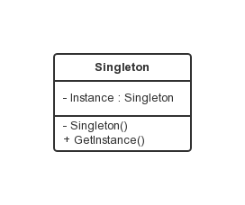

单例模式
===

### 模式定义

保证一个类仅有一个实例，并提供一个访问它的全局访问点。

### UML 类图



### 饿汉式

在类初始化时，已经自行实例化。

```java
public class Singleton {
    private static Singleton instance = new Singleton();

    private Singleton() {
    }

    public static Singleton getInstance() {

        return instance;
    }

}
```

### 懒汉式

在首次调用时实例化。

```java
public class Singleton {
    private static Singleton instance = null;

    private Singleton() {
    }

    public static Singleton getInstance() {
        if (null == instance) {
            instance = new Singleton();
        }
        return instance;
    }

}
```

### initialization on demand holder

```java
public class Singleton {

    private Singleton() {
    }

    public static class Holder{
        static Singleton instance = new Singleton();
    }

    public static Singleton getInstance() {
        return Holder.instance;
    }

}
```

### 双重检查

双重检查锁定在延迟初始化的单例模式中见得比较多，如下里：

```java
public class Singleton {
    private static Singleton instance = null;
    private Singleton(){}

    public static Singleton  getInstance() {
       if(instance == null) {
           instance = new Singleton();
       }
       return instance;
    }
}
```

上述代码问题在于，多线程环境下，可能会产生多个 Singleton 实例，于是有了其同步的版本：

```java
public class Singleton {
    private static Singleton instance = null;
    private Singleton(){}

    public synchronized static Singleton getInstance() {
       if(instance == null) {
           instance = new Singleton();
       }
       return instance;
    }
}
```

在这个版本中，每次调用 getInstance 都需要取得 Singleton.class 上的锁，然而该锁只是在开始构建 Singleton 对象的时候才是必要的，后续的多线程访问，效率会降低，于是有了接下来的版本：

```java
public class Singleton {
    private static Singleton instance = null;
    private Singleton(){}

    public static Singleton getInstance() {
       if(instance == null) {
           synchronized(Singleton.class) {
              if(instance == null) {
                  instance = new Singleton();
              }
           }
       }
       return instance;
    }
}
```

但是该方案也未能解决问题之根本：
原因在于：初始化 Singleton  和 将对象地址写到 instance 字段 的顺序是不确定的。
在某个线程 new Singleton() 时，在构造方法被调用之前，就为该对象分配了内存空间并将对象的字段设置为默认值。
此时就可以将分配的内存地址赋值给 instance 字段了，然而该对象可能还没有初始化；此时若另外一个线程来调用 getInstance，取到的就是状态不正确的对象。

鉴于以上原因，有人可能提出下列解决方案：

```java
public class Singleton {
    private static Singleton instance = null;
    private Singleton(){}

    public static Singleton getInstance() {
       if(instance == null) {
           Singleton temp;
           synchronized(Singleton.class) {
              temp = instance;
              if(temp == null) {
                  synchronized(Singleton.class) {
                     temp = new Singleton();
                  }
                  instance = temp;
              }
           }
       }
       return instance;
    }
}
```

该方案将 Singleton 对象的构造置于最里面的同步块，这种思想是在退出该同步块时设置一个内存屏障，以阻止初始化 Singleton 和将对象地址写到 instance 字段的重新排序。

不幸的是，这种想法也是错误的，同步的规则不是这样的。
退出监视器（退出同步）的规则是：所以在退出监视器前面的动作都必须在释放监视器之前完成。
然而，并没有规定说退出监视器之后的动作不能放到退出监视器之前完成。
也就是说同步块里的代码必须在退出同步时完成，而同步块后面的代码则可以被编译器或运行时环境移到同步块中执行。

编译器可以合法的，也是合理的，将 instance = temp 移动到最里层的同步块内，这样就出现了上个版本同样的问题。

在 `JDK1.5` 及其后续版本中，扩充了 volatile 语义，系统将不允许对写入一个 volatile 变量的操作与其之前的任何读写操作重新排序，也不允许将 读取一个 volatile 变量的操作与其之后的任何读写操作重新排序。

在 `jdk1.5` 及其后的版本中，可以将 instance 设置成 volatile 以让双重检查锁定生效，如下：

```java
public class Singleton {
    private static volatile Singleton instance = null;
    private Singleton(){}

    public static Singleton getInstance() {
       if(instance == null) {
           synchronized(Singleton.class) {
              if(instance == null) {
                  instance = new Singleton();
              }
           }
       }
       return instance;
    }
}
```

注意：在 `JDK1.4` 以及之前的版本中，该方式仍然有问题。
