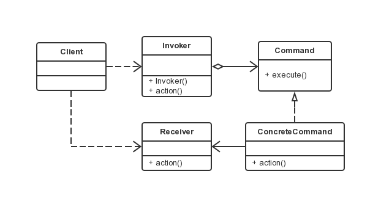

命令模式
===

### 模式定义

把一个请求或者操作封装到一个对象中。命令模式允许系统使用不同的请求把客户端参数化，对请求排队或者记录请求日志，可以提供命令的撤销和恢复功能。

### UML 类图



涉及角色：

- 客户端角色：创建一个具体命令(ConcreteCommand)对象并确定其接收者。
- 命令角色：声明了一个给所有具体命令类的抽象接口。
- 具体命令(ConcreteCommand)角色：定义一个接收者和行为之间的弱耦合；实现 execute() 方法，负责调用接收者的相应操作。
- 请求者(Invoker)角色：负责调用命令对象执行请求，相关的方法叫做行动方法。
- 接收者(Receiver)角色：负责具体实施和执行一个请求。任何一个类都可以成为接收者，实施和执行请求的方法叫做行动方法。

### 代码示例

```java
public class Receiver {
    /**
     * 真正执行命令相应的操作
     */
    public void action(){
        System.out.println("执行操作");
    }
}

public interface Command {
    /**
     * 执行方法
     */
    void execute();
}

public class ConcreteCommand implements Command {
    // 持有相应的接收者对象
    private Receiver receiver = null;
    /**
     * 构造方法
     */
    public ConcreteCommand(Receiver receiver){
        this.receiver = receiver;
    }
    @Override
    public void execute() {
        // 通常会转调接收者对象的相应方法，让接收者来真正执行功能
        receiver.action();
    }

}

public class Invoker {
    /**
     * 持有命令对象
     */
    private Command command = null;
    /**
     * 构造方法
     */
    public Invoker(Command command){
        this.command = command;
    }
    /**
     * 行动方法
     */
    public void action(){

        command.execute();
    }
}

public class Client {

    public static void main(String[] args) {
        // 创建接收者
        Receiver receiver = new Receiver();
        // 创建命令对象，设定它的接收者
        Command command = new ConcreteCommand(receiver);
        // 创建请求者，把命令对象设置进去
        Invoker invoker = new Invoker(command);
        // 执行方法
        invoker.action();
    }

}
```

### 优点

命令模式是对命令的封装。命令模式把发出命令的责任和执行命令的责任分割开，委派给不同的对象。
每一个命令都是一个操作：请求的一方发出请求要求执行一个操作；接收的一方收到请求，并执行操作。
命令模式允许请求的一方和接收的一方独立开来，使得请求的一方不必知道接收请求的一方的接口，
更不必知道请求是怎么被接收，以及操作是否被执行、何时被执行，以及是怎么被执行的。

命令允许请求的一方和接收请求的一方能够独立演化，从而具有以下的优点：

1. 命令模式使新的命令很容易地被加入到系统里。
2. 允许接收请求的一方决定是否要否决请求。
3. 能较容易地设计一个命令队列。
4. 可以容易地实现对请求的撤销和恢复。
5. 在需要的情况下，可以较容易地将命令记入日志。
