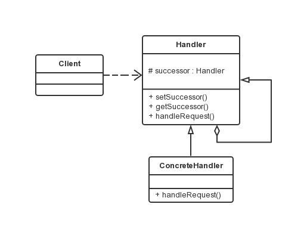

职责链模式
===

### 模式定义

责任链模式是一种对象的行为模式。在责任链模式里，很多对象由每一个对象对其下家的引用而连接起来形成一条链。
请求在这个链上传递，直到链上的某一个对象决定处理此请求。发出这个请求的客户端并不知道链上的哪一个对象最终处理这个请求，
这使得系统可以在不影响客户端的情况下动态地重新组织和分配责任。

### UML 类图



　　责任链模式涉及到的角色如下所示：

- 抽象处理者(Handler)角色：
定义出一个处理请求的接口。如果需要，接口可以定义出一个方法以设定和返回对下家的引用。
这个角色通常由一个Java抽象类或者Java接口实现。上图中Handler类的聚合关系给出了具体子类对下家的引用，抽象方法handleRequest()规范了子类处理请求的操作。

- 具体处理者(ConcreteHandler)角色：
具体处理者接到请求后，可以选择将请求处理掉，或者将请求传给下家。由于具体处理者持有对下家的引用，因此，如果需要，具体处理者可以访问下家。


### 代码示例

```java
public abstract class Handler {

    /**
     * 持有后继的责任对象
     */
    protected Handler successor;

    /**
     * 示意处理请求的方法，虽然这个示意方法是没有传入参数的
     * 但实际是可以传入参数的，根据具体需要来选择是否传递参数
     */
    public abstract void handleRequest();

    public Handler getSuccessor() {
        return successor;
    }

    public void setSuccessor(Handler successor) {
        this.successor = successor;
    }

}

public class ConcreteHandler extends Handler {

    @Override
    public void handleRequest() {
        /**
         * 判断是否有后继的责任对象
         * 如果有，就转发请求给后继的责任对象
         * 如果没有，则处理请求
         */
        if(getSuccessor() != null) {
            System.out.println("放过请求");
            getSuccessor().handleRequest();
        } else {
            System.out.println("处理请求");
        }
    }

}

public class Client {

    public static void main(String[] args) {
        // 组装责任链
        Handler handler1 = new ConcreteHandler();
        Handler handler2 = new ConcreteHandler();
        handler1.setSuccessor(handler2);
        // 提交请求
        handler1.handleRequest();
    }

}

```

### 模式优缺点

接收者与发送者都没有对方的明确信息，且链中的对象自己也并不知道链的结构。结果是职责链可简化对象的相互连接，它们仅需保持一个指向其后继者的引用，
而不需保持它所有的候选接收者的引用，大大降低耦合度。
但是一个请求有可能到了链的末端依然没有得到处理，需要事先考虑全面。

### 使用场景示例

申请聚餐费用的管理。很多公司都是这样的福利，就是项目组或者是部门可以向公司申请一些聚餐费用，用于组织项目组成员或者是部门成员进行聚餐活动。　申请聚餐费用的大致流程一般是：由申请人先填写申请单，然后交给领导审批，如果申请批准下来，领导会通知申请人审批通过，然后申请人去财务领取费用，如果没有批准下来，领导会通知申请人审批未通过，此事也就此作罢。

不同级别的领导，对于审批的额度是不一样的，比如，项目经理只能审批500元以内的申请；部门经理能审批1000元以内的申请；而总经理可以审核任意额度的申请。　也就是说，当某人提出聚餐费用申请的请求后，该请求会经由项目经理、部门经理、总经理之中的某一位领导来进行相应的处理，但是提出申请的人并不知道最终会由谁来处理他的请求，一般申请人是把自己的申请提交给项目经理，或许最后是由总经理来处理他的请求。

可以使用责任链模式来实现上述功能：当某人提出聚餐费用申请的请求后，该请求会在 项目经理—〉部门经理—〉总经理 这样一条领导处理链上进行传递，发出请求的人并不知道谁会来处理他的请求，每个领导会根据自己的职责范围，来判断是处理请求还是把请求交给更高级别的领导，只要有领导处理了，传递就结束了。

需要把每位领导的处理独立出来，实现成单独的职责处理对象，然后为它们提供一个公共的、抽象的父职责对象，这样就可以在客户端来动态地组合职责链，实现不同的功能要求了。
