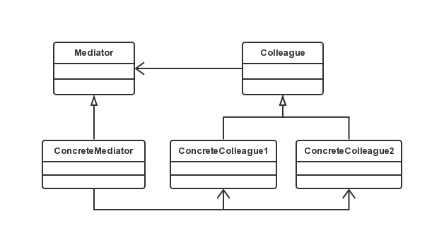

中介者模式
===

### 模式定义

中介者模式：用一个中介对象来封装一系列的对象交互。中介者使各对象不需要显示的相互引用，从而使其耦合松散，而且可以独立地改变它们之间的交互。

### UML 类图



涉及角色：
- 抽象中介者（Mediator）：定义了同事对象到中介者对象的接口。
- 具体中介者对象（ConcreteMediator）：实现抽象类的方法，有所有具体的同事类的引用。
- 抽象同事类（Colleague）：定义了同事类接口。
- 具体同事类（ConcreteColleague）：每个具体同事类只知道自己的行为却不了解其他同事类的情况，但均认识中介者对象。

1 个抽象 Colleague，其派生多个具体 ConcreteColleague，每个具体 ConcreteColleague 都认识一个具体中介者。
他们中介者发送消息。1个中介者，具体中介者认识所有的 ConcreteColleague（即持有所有具体 ConcreteColleague 的引用），
它提供向其他具体 ConcreteColleague 发送消息的接口（这个接口只需要指明发送消息的 ConcreteColleague，
而不要指明接收消息的ConcreteColleague）。

### 代码示例

```java
public abstract class AbstractMediator {
    public abstract void sendMessage(String message, AbstractColleague mColleague);

}

public abstract class AbstractColleague {

    protected AbstractMediator mMediator;

    public AbstractColleague(AbstractMediator mMediator) {
        this.mMediator = mMediator;
    }

    public AbstractMediator getmMediator() {
        return mMediator;
    }

    public void setmMediator(AbstractMediator mMediator) {
        this.mMediator = mMediator;
    }

}

public class ConcreteColleague1 extends AbstractColleague {

    public ConcreteColleague1( AbstractMediator mMediator ) {
        super(mMediator);
    }

    public void sendMessage( String message ) {
        mMediator.sendMessage(message, this);
    }

    public void getMessage(String message) {
        System.out.println("ConcreteColleague1得到消息:" + message);
    }

}

public class ConcreteColleague2 extends AbstractColleague {

    public ConcreteColleague2( AbstractMediator mMediator ) {
        super(mMediator);
    }

    public void sendMessage( String message ) {
        mMediator.sendMessage(message, this);
    }

    public void getMessage(String message) {
        System.out.println("ConcreteColleague2得到消息:" + message);
    }

}

public class Mediator extends AbstractMediator {

    private ConcreteColleague1 mColleague1;
    private ConcreteColleague2 mColleague2;

    public ConcreteColleague1 getmColleague1() {
        return mColleague1;
    }

    public void setmColleague1(ConcreteColleague1 mColleague1) {
        this.mColleague1 = mColleague1;
    }

    public ConcreteColleague2 getmColleague2() {
        return mColleague2;
    }

    public void setmColleague2(ConcreteColleague2 mColleague2) {
        this.mColleague2 = mColleague2;
    }

    @Override
    public void sendMessage(String message, AbstractColleague mColleague) {
        if(mColleague == null) {
            System.out.println("同事不能为空！");
            return;
        }
        if( mColleague == mColleague1 ) {
            mColleague2.getMessage(message);
        } else if( mColleague == mColleague2 ) {
            mColleague1.getMessage(message);
        }
    }

}

public class Client {

    public static void main( String args[] ) {
        Mediator mMediator = new Mediator();
        ConcreteColleague1 mColleague1 = new ConcreteColleague1(mMediator);
        ConcreteColleague2 mColleague2 = new ConcreteColleague2(mMediator);

        mMediator.setmColleague1(mColleague1);
        mMediator.setmColleague2(mColleague2);

        mColleague1.sendMessage("Colleague1 发的消息");
        mColleague2.sendMessage("Colleague2 发的消息");
    }

}
```

### 中介者模式优缺点

- 优点
Mediator 的出现减少了各个 Colleague 的耦合，使得可以独立的改变和复用各个 Colleague 类和 Mediator。
由于把对象如何协作进行了抽象，将中介作为一个独立的概念并将其封装在一个对象中，这样关注的对象就从对象各自本身的行为转移到了它们之间的交互上来，即站在一个更宏观的角度看待系统。

- 缺点
由于 ConcreteMediator 控制了集中化，于是就把交互复杂性变为了中介者的复杂性，使得中介者会变得比任何一个 ConcreteColleague 都复杂。

- 应用场景
中介者模式在系统中很容易应用，也很容易在系统中误用。当系统出现了“多对多”交互复杂的对象群时，不要急于使用中介者模式，而要先反思你的系统在设计上是不是合理。

中介者模式一般应用于一组对象以定义良好但是复杂的方式进行通讯的场合，已经想定制一个分布在多个类中的行为，而又不想生成太多的子类的场合。

注：每个具体 ConcreteColleague 中的行为可以是不一致。
