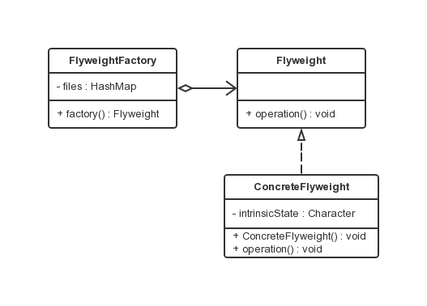
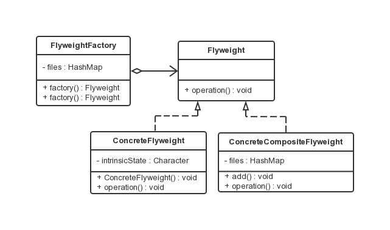

享元模式
===

### 模式定义

Flyweight 在拳击比赛中指最轻量级，即“蝇量级”或“雨量级”，这是“享元模式”的意译。享元模式是对象的结构模式。享元模式以共享的方式高效地支持大量的细粒度对象。

### 享元模式的结构

### 享元模式的结构

享元模式采用一个共享来避免大量拥有相同内容对象的开销。但会带来内存的损耗。享元对象能做到共享的关键是区分内蕴状态（Internal State）和外蕴状态（External State）。

- 一个内蕴状态是存储在享元对象内部的，并且是不会随环境的改变而有所不同。因此，一个享元可以具有内蕴状态并可以共享。
- 一个外蕴状态是随环境的改变而改变的、不可以共享的。享元对象的外蕴状态必须由客户端保存，并在享元对象被创建之后，在需要使用的时候再传入到享元对象内部。
外蕴状态不可以影响享元对象的内蕴状态，它们是相互独立的。

享元模式可以分成单纯享元模式和复合享元模式两种形式。

### 单纯享元模式

在单纯的享元模式中，所有的享元对象都是可以共享的。



单纯享元模式所涉及到的角色如下：

- 抽象享元角色（Flyweight） ：抽象接口，规定出所有具体享元角色需要实现的方法。
- 具体享元角色（ConcreteFlyweight）：实现抽象享元角色所规定出的接口。如果有内蕴状态，负责为内蕴状态提供存储空间。
- 享元工厂角色 （FlyweightFactory）：负责创建和管理享元角色。本角色必须保证享元对象可以被系统适当地共享。
当一个客户端对象调用一个享元对象的时候，享元工厂角色会检查系统中是否已经有一个符合要求的享元对象。如果已经有了，享元工厂角色就应当提供这个已有的享元对象；如果系统中没有一个适当的享元对象的话，享元工厂角色就应当创建一个合适的享元对象。


### 代码示例

```java
public interface Flyweight {
    // 参数 state 为外蕴状态
    public void operation(String state);
}
```
具体享元角色类 ConcreteFlyweight 有一个内蕴状态，在本例为一个 Character 类型的 intrinsicState 属性，它的值应当在享元对象被创建时赋予。
所有的内蕴状态在对象创建之后，就不会再改变。

如果一个享元对象有外蕴状态，所有的外部状态都必须存储在客户端，在使用享元对象时，再由客户端传入享元对象。这里只有一个外蕴状态，operation() 方法的参数 state 就是由外部传入的外蕴状态。

```java
public class ConcreteFlyweight implements Flyweight {
    private Character intrinsicState = null;
    /**
     * 构造函数，内蕴状态作为参数传入
     * @param state
     */
    public ConcreteFlyweight(Character state) {
        this.intrinsicState = state;
    }


    /**
     * 外蕴状态作为参数传入方法中，改变方法的行为，
     * 但是并不改变对象的内蕴状态。
     */
    @Override
    public void operation(String state) {
        System.out.println("Intrinsic State = " + this.intrinsicState);
        System.out.println("Extrinsic State = " + state);
    }
}

// 享元工厂角色类，注意客户端不可直接将具体享元类实例化，必须通过一个工厂对象的 factory() 方法得到享元对象。
// 一般而言，享元工厂对象在整个系统中只有一个，因此也可以使用单例模式。
public class FlyweightFactory {
    private Map<Character,Flyweight> files = new HashMap<Character,Flyweight>();

    public Flyweight factory(Character state){
        // 先从缓存中查找对象
        Flyweight fly = files.get(state);
        if (fly == null) {
            // 如果对象不存在则创建一个新的Flyweight对象
            fly = new ConcreteFlyweight(state);
            // 把这个新的Flyweight对象添加到缓存中
            files.put(state, fly);
        }
        return fly;
    }
}

public class Client {

    public static void main(String[] args) {
        FlyweightFactory factory = new FlyweightFactory();
        Flyweight fly = factory.factory(new Character('a'));
        fly.operation("First Call");

        fly = factory.factory(new Character('b'));
        fly.operation("Second Call");

        fly = factory.factory(new Character('a'));
        fly.operation("Third Call");
    }

}
```

虽然客户端申请了三个享元对象，但是实际创建的享元对象只有两个，这就是共享的含义。

### 复合享元模式

在单纯享元模式中，所有的享元对象都是单纯享元对象，也就是说都是可以直接共享的。还有一种较为复杂的情况，将一些单纯享元使用合成模式加以复合，形成复合享元对象。这样的复合享元对象本身不能共享，但是它们可以分解成单纯享元对象，而后者则可以共享。



涉及角色，相对于单纯享元角色，多了一个复合享元角色：

- 复合享元角色 ：复合享元角色所代表的对象是不可以共享的，但是一个复合享元对象可以分解成为多个本身是单纯享元对象的组合。复合享元角色又称作不可共享的享元对象。

### 代码示例

```java
public interface Flyweight {
    // 参数 state 是外蕴状态
    public void operation(String state);
}

public class ConcreteFlyweight implements Flyweight {
    private Character intrinsicState = null;
    /**
     * 构造函数，内蕴状态作为参数传入
     * @param state
     */
    public ConcreteFlyweight(Character state) {
        this.intrinsicState = state;
    }


    /**
     * 外蕴状态作为参数传入方法中，改变方法的行为，
     * 但是并不改变对象的内蕴状态。
     */
    @Override
    public void operation(String state) {
        System.out.println("Intrinsic State = " + this.intrinsicState);
        System.out.println("Extrinsic State = " + state);
    }

}

// 复合享元对象是由单纯享元对象通过复合而成的，因此其提供了 add() 这样的聚集管理方法。
// 由于一个复合享元对象具有不同的聚集元素，这些聚集元素在复合享元对象被创建之后加入，
// 这就意味着复合享元对象的状态是会改变的，因此复合享元对象不可共享。

// 复合享元角色实现了抽象享元角色所规定的接口，即 operation() 方法，参数 state 代表复合享元对象的外蕴状态。
// 一个复合享元对象的所有单纯享元对象元素的外蕴状态都与复合享元对象的外蕴状态相等；
// 一个复合享元对象所含有的单纯享元对象的内蕴状态一般是不相等的，否则享元模式便没有了意义。
public class ConcreteCompositeFlyweight implements Flyweight {

    private Map<Character,Flyweight> files = new HashMap<Character,Flyweight>();
    /**
     * 增加一个新的单纯享元对象到聚集中
     */
    public void add(Character key , Flyweight fly){
        files.put(key,fly);
    }
    /**
     * 外蕴状态作为参数传入到方法中
     */
    @Override
    public void operation(String state) {
        Flyweight fly = null;
        for(Object o : files.keySet()) {
            fly = files.get(o);
            fly.operation(state);
        }

    }

}

// 享元工厂角色提供两种不同的方法，一种用于提供单纯享元对象，另一种用于提供复合享元对象
public class FlyweightFactory {
    private Map<Character,Flyweight> files = new HashMap<Character,Flyweight>();
    /**
     * 复合享元工厂方法
     */
    public Flyweight factory(List<Character> compositeState) {
        ConcreteCompositeFlyweight compositeFly = new ConcreteCompositeFlyweight();

        for(Character state : compositeState) {
            compositeFly.add(state,this.factory(state));
        }

        return compositeFly;
    }
    /**
     * 单纯享元工厂方法
     */
    public Flyweight factory(Character state) {
        //先从缓存中查找对象
        Flyweight fly = files.get(state);
        if(fly == null){
            //如果对象不存在则创建一个新的Flyweight对象
            fly = new ConcreteFlyweight(state);
            //把这个新的Flyweight对象添加到缓存中
            files.put(state, fly);
        }
        return fly;
    }
}

public class Client {

    public static void main(String[] args) {
        List<Character> compositeState = new ArrayList<Character>();
        compositeState.add('a');
        compositeState.add('b');
        compositeState.add('c');
        compositeState.add('a');
        compositeState.add('b');

        FlyweightFactory flyFactory = new FlyweightFactory();
        Flyweight compositeFly1 = flyFactory.factory(compositeState);
        Flyweight compositeFly2 = flyFactory.factory(compositeState);
        compositeFly1.operation("Composite Call");

        System.out.println("---------------------------------");
        System.out.println("复合享元模式是否可以共享对象：" + (compositeFly1 == compositeFly2));

        Character state = 'a';
        Flyweight fly1 = flyFactory.factory(state);
        Flyweight fly2 = flyFactory.factory(state);
        System.out.println("单纯享元模式是否可以共享对象：" + (fly1 == fly2));
    }
}

```
