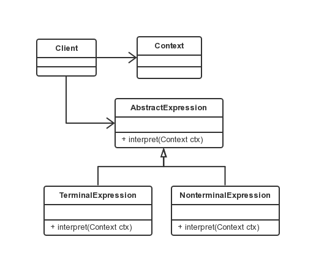

解释器模式
===

### 模式定义

解释器模式是类的行为模式。给定一个语言之后，解释器模式可以定义出其文法的一种表示，并同时提供一个解释器。客户端可以使用这个解释器来解释这个语言中的句子。

### UML 类图



涉及角色：

- 抽象表达式角色（Expression）：
声明一个所有的具体表达式角色都需要实现的抽象接口。这个接口主要是一个 interpret() 方法，称做解释操作。
- 终结符表达式角色（Terminal Expression）：
实现了抽象表达式角色的接口；文法中的每一个终结符都有一个具体终结表达式与之相对应。比如有一个简单的公式 `R = R1 + R2`，在里面 R1 和 R2 就是终结符，对应的解析 R1 和 R2 的解释器就是终结符表达式。
- 非终结符表达式角色（Nonterminal Expression）：
文法中的每一条规则都需要一个具体的非终结符表达式，非终结符表达式一般是文法中的运算符或者其他关键字，比如公式 `R = R1 + R2` 中，`+` 就是非终结符，解析 `+` 的解释器就是一个非终结符表达式。
- 环境角色（Context）：
包含解释器之外的一些全局信息。一般用来存放文法中各个终结符所对应的具体值，如 `R = R1 + R2`，给 R1 赋值 100，给 R2 赋值 200。这些信息便放到环境角色中，一般情况下使用 Map 充当环境角色即可。

### 代码示例

```java
public abstract class AbstractExpression {
    public abstract void interpret(Context context);
}

clss TerminalExpression extends AbstractExpression {
    @Override
    public void interpret(Context context) {
        System.out.println("Terminal Expression.");
    }
}

clss NonterminalExpression extends AbstractExpression {
    @Override
    public void interpret(Context context) {
        System.out.println("Nonterminal Expression.");
    }
}

public class Context {
    private String input;
    private String output;

    public String getInput() {
        return input;
    }

    public void setInput(String in) {
        this.input = in;
    }

    public String getOutput() {
        return output;
    }

    public void setOutput(String out) {
        this.output = out;
    }
}

public class Client {
    Context context = new Context();
    List<AbstractExpression> list = new ArrayList<AbstractExpression>();
    list.add(new TerminalExpression());
    list.add(new NonterminalExpression());
    list.add(new TerminalExpression());
    list.add(new TerminalExpression());

    for (AbstractExpression exp : list) {
        exp.interpret(context);
    }
}
```

### 使用场景及优缺点

当有一个语言需要解释执行，且可将该语言的句子表示为一个抽象语法树时，可使用解释器模式。

优点在于可方便地改变和扩展文法，因为该模式使用类来表示文法规则，可以继承来改变或扩展该文法。也比较容易实现文法，
因为定义抽象文法树中各个节点的类的实现大体类似，这些类都易于直接编写。

缺点在于解释器模式为文法中的每一条规则至少定义了一个类，因此包含许多规则的文法可能难以管理和维护。
建议当文法非常复杂时，使用其他的技术如语法分析程序或编译器生成器来处理。
