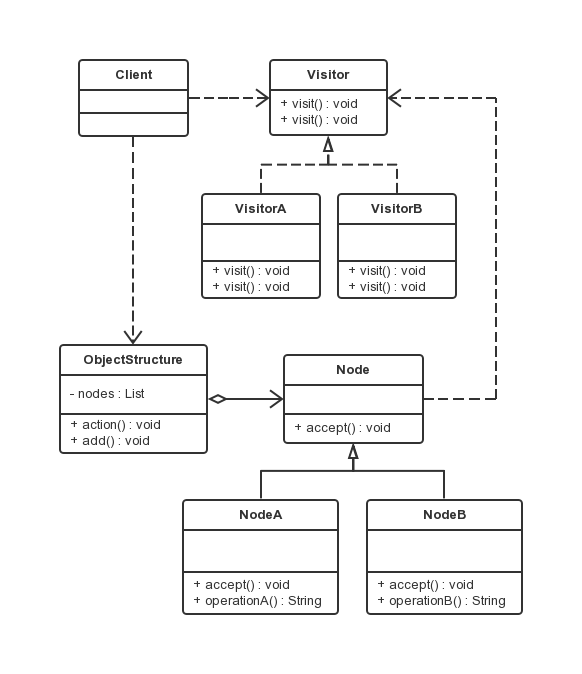

访问者模式
===

### 模式定义

访问者模式是对象的行为模式。访问者模式的目的是封装一些施加于某种数据结构元素之上的操作。一旦这些操作需要修改的话，接受这个操作的数据结构则可以保持不变。

### UML 类图



涉及角色：

- 抽象访问者角色（Visitor）：
声明了一个或者多个方法。

- 具体访问者角色（ConcreteVisitor）：
实现抽象访问者所声明的接口。

- 抽象节点角色（Node）：
声明一个接受操作，接受一个访问者对象作为一个参数。

- 具体节点角色（ConcreteNode）：
实现了抽象节点所规定的接受操作。

- 结构对象角色（ObjectStructure）：
可以遍历结构中的所有元素；可设计为一个高层次的接口让访问者对象可以访问每一个元素；也可设计成一个复合对象或者一个聚集，如 List 或 Set。

### 代码示例

```java
public interface Visitor {
    /**
     * 对应于 NodeA 的访问操作
     */
    public void visit(NodeA node);
    /**
     * 对应于 NodeB 的访问操作
     */
    public void visit(NodeB node);
}

public class VisitorA implements Visitor {

    @Override
    public void visit(NodeA node) {
        System.out.println(node.operationA());
    }

    @Override
    public void visit(NodeB node) {
        System.out.println(node.operationB());
    }

}

public class VisitorB implements Visitor {

    @Override
    public void visit(NodeA node) {
        System.out.println(node.operationA());
    }

    @Override
    public void visit(NodeB node) {
        System.out.println(node.operationB());
    }

}

public abstract class Node {
    /**
     * 接受操作
     */
    public abstract void accept(Visitor visitor);
}

public class NodeA extends Node{

    @Override
    public void accept(Visitor visitor) {
        visitor.visit(this);
    }
    /**
     * NodeA 特有的方法
     */
    public String operationA() {
        return "NodeA";
    }

}

public class NodeB extends Node {

    @Override
    public void accept(Visitor visitor) {
        visitor.visit(this);
    }
    /**
     * NodeB 特有的方法
     */
    public String operationB() {
        return "NodeB";
    }
}

// 结构对象角色类，该结构对象角色持有一个聚集，并向外界提供 add() 方法动态增加节点
public class ObjectStructure {

    private List<Node> nodes = new ArrayList<Node>();

    /**
     * 执行方法操作
     */
    public void action(Visitor visitor) {

        for (Node node : nodes) {
            node.accept(visitor);
        }

    }
    /**
     * 添加新元素
     */
    public void add(Node node) {
        nodes.add(node);
    }
}

public class Client {

    public static void main(String[] args) {
        // 创建一个结构对象
        ObjectStructure os = new ObjectStructure();
        // 增加一个节点 A
        os.add(new NodeA());
        // 增加一个节点 B
        os.add(new NodeB());
        // 创建一个访问者
        Visitor visitor = new VisitorA();
        os.action(visitor);
    }

}

```

### 使用场景及优缺点

- 使用场景

适用于数据结构相对稳定的系统，通常很少遇到数据结构不变化的场景，因此访问者模式使用较少。

- 优点

扩展性好；能够在不修改对象结构中的元素的情况下，为对象结构中的元素添加新的功能。

复用性好：可以通过访问者来定义整个对象结构通用的功能，从而提高复用程度。

分离无关行为：可以通过访问者来分离无关的行为，把相关的行为封装在一起，构成一个访问者，这样每一个访问者的功能都比较单一。

- 缺点

对象结构变化很困难：不适用于对象结构中的类经常变化的情况，因为对象结构发生了改变，访问者的接口和访问者的实现都要发生相应的改变，代价太高。

破坏封装：访问者模式通常需要对象结构开放内部数据给访问者和ObjectStructrue，这破坏了对象的封装性。
