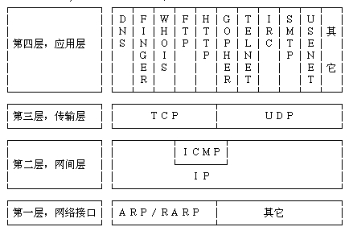
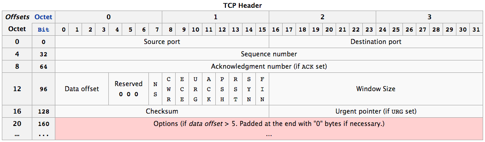
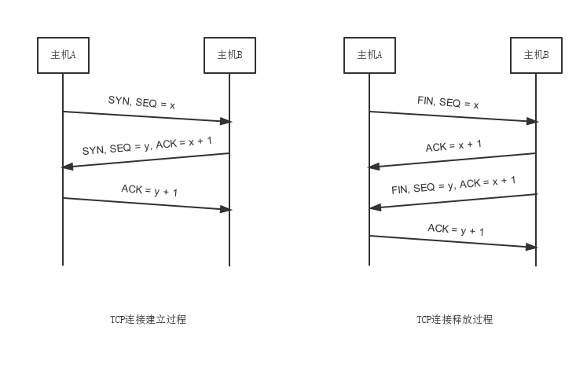

TCP
===

### TCPIP 网络模型 与 OSI 参考模型

##### TCPIP 网络模型

##### OSI 网络模型

###### 两者比较

##### 1. 共同点

- OSI 参考模型和 TCP/IP 参考模型都采用了层次结构的概念。
- 都能够提供面向连接和无连接两种通信服务机制。

##### 2. 不同点

- OSI 采用的七层模型，而 TCP/IP 是四层结构。
- TCP/IP 参考模型的网络接口层实际上并没有真正的定义，只是一些概念性的描述。而 OSI 参考模型不仅分了两层，而且每一层的功能都很详尽，甚至在数据链路层又分出一个介质访问子层，专门解决局域网的共享介质问题。
- OSI 模型是在协议开发前设计的，具有通用性。TCP/IP 是先有协议集然后建立模型，不适用于非 TCP/IP 网络。
- OSI 参考模型与 TCP/IP 参考模型的传输层功能基本相似，都是负责为用户提供真正的端对端的通信服务，也对高层屏蔽了底层网络的实现细节。
所不同的是 TCP/IP 参考模型的传输层是建立在网络互联层基础之上的，而网络互联层只提供无连接的网络服务，所以面向连接的功能完全在 TCP 协议中实现，
当然 TCP/IP 的传输层还提供无连接的服务，如 UDP；相反 OSI 参考模型的传输层是建立在网络层基础之上的，网络层既提供面向连接的服务，又提供无连接的服务，但传输层只提供面向连接的服务。
- OSI 参考模型的抽象能力高，适合与描述各种网络；而 TCP/IP 是先有了协议，才制定 TCP/IP 模型的。
- OSI 参考模型的概念划分清晰，但过于复杂；而 TCP/IP 参考模型在服务、接口和协议的 区别上不清楚，功能描述和实现细节混在一起。
- TCP/IP 参考模型的网络接口层并不是真正的一层；OSI 参考模型的缺点是层次过多，划分意义不大但增加了复杂性。
- OSI 参考模型虽然被看好，由于没把握好时机，技术不成熟，实现困难；相反，TCP/IP 参考模型虽然有许多不尽人意的地方，但还是比较成功的。

### TCP Header

1. Source port (16 bits)源端口号：数据发起者的端口号，16bit
2. Destination port (16 bits)目的端口号：数据接收者的端口号，16bit
3. Sequence number (32 bits)序号：32bit的序列号，由发送方使用
4. Acknowledgment number (32 bits)确认序号：32bit的确认号，是接收数据方期望收到发送方的下一个报文段的序号，因此确认序号应当是上次已成功收到数据字节序号加 1。
5. Data offset (4 bits)首部长度：首部中32bit字的数目，可表示15*32bit=60字节的首部。一般首部长度为20字节。
6. Reserved (3 bits)保留：3 bit, 均为 0
7. 紧急URG：当URG=1时，表示报文段中有紧急数据，应尽快传送。
8. 确认比特ACK：ACK = 1时代表这是一个确认的TCP包，取值0则不是确认包。
9. 推送比特PSH：当发送端PSH=1时，接收端尽快的交付给应用进程。
10. 复位比特（RST）：当RST=1时，表明TCP连接中出现严重差错，必须释放连接，再重新建立连接。
11. 同步比特SYN：在建立连接是用来同步序号。SYN=1， ACK=0表示一个连接请求报文段。SYN=1，ACK=1表示同意建立连接。
12. 终止比特FIN：FIN=1时，表明此报文段的发送端的数据已经发送完毕，并要求释放传输连接。
13. 窗口：用来控制对方发送的数据量，通知发放已确定的发送窗口上限。
14. 检验和：该字段检验的范围包括首部和数据这两部分。由发端计算和存储，并由收端进行验证。
15. 紧急指针：紧急指针在URG=1时才有效，它指出本报文段中的紧急数据的字节数。
16. 选项：长度可变，最长可达40字节

### 三次握手与四次挥手

### 三次握手

##### 1. 第一次握手
客户端发送连接请求报文段，将 SYN 置为 1，seq 置为 x，进入 SYN_SEND 状态，等待服务器确认.

##### 2. 第二次握手
服务器对收到的 SYN 报文段进行确认，将 SYN 置为 1，seq 为 y，ACK 为 seq + 1；
将上述所有信息放入一个报文段发送给客户端，并进入 SYN_RECV 状态；

##### 3. 第三次握手
客户端收到服务器的 SYN + ACK 报文段，进入 ESTABLISHED 状态。将 ACK 置为 y + 1，发送给服务端，服务器端收到也进入 ESTABLISHED 状态，从而完成 TCP 三次握手。

### 为何需要三次握手

为了防止已失效的连接请求报文段突然又传送到了服务端，因而产生错误，防止服务器一直等待浪费资源。举例说明“已失效的连接请求报文段”发生场景：

1. client 发出的第一个连接请求报文段并没有丢失，而是在某个网络结点长时间滞留，直到连接释放以后才到达 server,
本来这是一个早已失效的报文段。但 server 误认为是 client 再次发出的新的连接请求,于是就向 client 发出确认报文段，同意建立连接。
2. 如果不采用“三次握手”，只要 server 发出确认，新的连接就会建立。而 client 并没有发出建立连接的请求，因此不会理睬 server 的确认，也不会向 server 发送数据，但 server 却以为新的运输连接已经建立，并一直等待 client 发来数据，耗费 server 资源。
3. 而采用“三次握手”，client 不会对 server 响应进行确认。server 收不到确认，可知 client 并没有要求建立连接，从而防止耗费服务器资源。

### 四次挥手

##### 1. 第一次分手：
主机 1（可以使客户端，也可以是服务器端），设置 seq 和 ACK，向主机 2 发送一个 FIN 报文段；此时主机 1 进入 FIN_WAIT_1 状态；这表示主机 1 不会再发数据给主机 2；

##### 2. 第二次分手
主机 2 收到了主机 1 发送的 FIN 报文段，向主机 1 回一个 ACK 报文段，ACK 为 seq + 1 ；主机 1 进入 FIN_WAIT_2 状态；等待主机 2 告诉主机 1 数据剩余数据传输完毕；

##### 3. 第三次分手
主机 2 向主机 1 发送 FIN 报文段，请求关闭连接，同时主机 2 进入 CLOSE_WAIT 状态；

##### 4. 第四次分手
主机 1 收到主机 2 发送的 FIN 报文段，向主机 2 发送 ACK 报文段，然后主机 1 进入 TIME_WAIT 状态；主机 2 收到主机 1 的 ACK 报文段以后，就关闭连接；此时，主机 1 等待 2MSL 还没有收到回复，表明 Server 端已正常关闭，主机 1 也关闭连接。

### 为何需要四次挥手

TCP 协议是一种面向连接的、可靠的、基于字节流的运输层通信协议。TCP 是全双工模式，这就意味着，当主机 1 发出 FIN 报文段时，只是表示主机 1 已经没有数据要发送给主机 2，但主机 1 可能会收到主机 2 发送的数据；主机 2 同理。

### 为何连接需要三次握手，关闭却需要四次握手

因为服务端 LISTEN 状态下的 SOCKET 收到客户端 SYN 报文的建连请求后，可以把 ACK 和 SYN（ACK 起应答作用，而 SYN 起同步作用）放在一个报文里发送。
但关闭连接时，当收到对方的 FIN 报文通知时，仅表示对方没有数据发送过来；但是接收方可能数据还没有发送完，不会立即关闭 SOCKET，会等数据发送完之后，
再发送 FIN 报文给对方来表示可以关闭连接，所以 ACK 报文和 FIN 报文分开发送。

### 附录

1. seq : Sequence Number
2. ACK : Acknowledgment Number
3. 全双工：指可以同时进行信号的双向传输（A -> B 且 B -> A）。是瞬时同步的，如打电话，可听到对方说话的同时，也可以说话。
4. 半双工：指数据可以在一个信号载体的两个方向上传输，但是不能同时传输。通信信道的每一段都可以是发送端，也可以是接收端。但同一时刻里，信息只能有一个传输方向。如潮汐车道。
