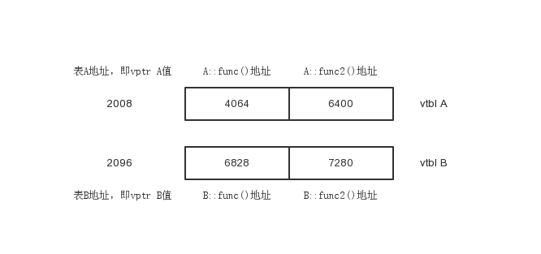

虚函数
===

### 定义

被 virtual 关键字修饰的成员函数即为虚函数。虚函数作用是实现多态性（Polymorphism），多态性是将接口与实现进行分离；用形象的语言来解释就是实现以共同的方法，但因个体差异而采用不同的策略。下面来看一段简单的代码：

```c++
#include <iostream>
using namespace std;
class A
{
public:
    void print()
    {
        cout << "This is A" << endl;
    }
};

class B : public A
{
public:
    void print()
    {
        cout << "This is B" << endl;
    }
};

int main()
{
    A a;
    B b;
    a.print();
    b.print();
    return 0;
}

// 输出：
// This is A
// This is B
```

上述代码并没有使用多态，多态的关键是`一切用指向基类的指针或引用来操作对象`，修改代码如下：

```c++
int main()
{
    A a;
    B b;
    A* p1= &a;
    A* p2= &b;
    p1->print();
    p2->print();
    return 0;
}

// 输出：
// This is A
// This is A
```
p2指向的是class B的对象但却是调用的class A的print()函数，这不是期望的结果，解决这个问题就需要用到虚函数，如下：

```c++
class A
{
public:
    virtual void print()
    {
        cout << "This is A" << endl;
    }
};
```

只需在把基类的成员函数设为virtual，其派生类的相应的函数也会自动变为虚函数。所以class B的print()也成了虚函数。
指向基类的指针在操作它的多态类对象时，会根据不同的类对象，调用其相应的函数。


### 虚函数原理

先定义两个类：
```c++
class A
{

public:
    virtual void fun()
    {
        cout << 1 << endl;
    }
    virtual void fun2()
    {
        cout << 2 << endl;
    }
};
class B : public A
{
public:
    void fun()
    {
        cout << 3 << endl;
    }
    void fun2()
    {
        cout << 4 << endl;
    }
};

int main()
{
    void(*fun)(A*);
    A* p = new B;
    long lVptrAddr;
    memcpy(&lVptrAddr, p, 4);
    memcpy(&fun, reinterpret_cast<long*>(lVptrAddr), 4);
    fun(p);
    delete p;
    return 0;
}
```

由于这两个类中有虚函数存在，编译器会为这两个类分别插入一段数据（vptr指针），并分别为每个类创建一个表（vtbl，保存自己类中虚函数的地址），可把vtbl看成一个数组，该数组的每个元素存放的就是虚函数的地址，如下图：



可以看到这两个vtbl分别为class A和class B服务。现在有了这个模型之后，来分析下面的代码：

```c++
A* p = new A;
p->fun();
```

毫无疑问，代码会调用A::fun()，但是虚函数的调用不会像普通函数那样直接跳转到函数的代码处，而是：
1. 取出vptr的值，该值即为vtbl地址。
2. 根据该值找到vtbl，由于调用的函数A::fun()是第一个虚函数，所以取出vtbl第一个slot里的值，即A::fun()地址.
3. 调用该函数。

可见，只要vptr不同，指向的vtbl就不同，而不同的vtbl里装着对应类的虚函数地址，从而实现多态。

class A和class B的vptr指针存放在他们各自的实例对象里。由于class A和class B都没有数据成员，所以他们的实例对象里就只有一个vptr指针。

下面详细分析下上文的代码：

```
void (*fun)(A*);
定义一个名为fun的函数指针，带有一个A*类型的参数，用于保存从vtbl里取出的函数地址

A* p=new B;
向内存自由存储区申请一个内存单元的地址然后隐式地保存在一个指针中.然后把这个地址赋值给A类型的指针P

long lVptrAddr;
用于保存vptr的值

memcpy(&lVptrAddr,p,4);
由于实例对象里只有vptr指针，p所指的4bytes内存里的东西就是vptr的值，即vtbl的地址
将4bytes内容复制到lVptrAddr中后，便有了vtbl的地址

memcpy(&fun,reinterpret_cast<long*>(lVptrAddr),4);
取出vtbl第一个slot里的内容，并存放在函数指针fun里。
注意lVptrAddr里面是vtbl的地址，但lVptrAddr不是指针，所以先转换成指针类型

fun(p);
调用了刚才取出的函数地址里的函数，即B::fun()这个函数，但为何会有参数p？
因为类成员函数调用时，会有个this指针，这个p就是那个this指针，一般的调用中编译器自动处理，这里需自己处理

delete p;
释放由p指向的自由空间

若要调用B::fun2()，取出vtbl的第二个slot里的值极客，因为一个指针的长度是4bytes，所以加4
memcpy(&fun,reinterpret_cast<long*>(lVptrAddr+4),4);
或使用更复合数组的用法，因为lVptrAddr被转成了long*型别，所以+1就是往后移sizeof(long)的长度
memcpy(&fun,reinterpret_cast<long*>(lVptrAddr)+1,4);
```

### 示例

```c++
#include <iostream>
using namespace std;
class A
{
public:
    virtual void fun() { cout << "A::fun" << endl; }
    virtual void fun2() { cout << "A::fun2" << endl; }
};

class B : public A{
public:
    void fun(){ cout << "B::fun" << endl; }
    void fun2(){ cout << "B::fun2" << endl; }
};

int main(){
void(A::*fun)();
A* p = new B;

fun = &A::fun;
(p->*fun)();

fun = &A::fun2;
(p->*fun)();

delete p;
return 0;
}
```

上述代码等同于，如下代码，单独封装了一个函数，用于获取虚函数地址：

```c++
#include <iostream>
using namespace std;
class A
{
public:
    virtual void fun() { cout << "A::fun" << endl; }
    virtual void fun2() { cout << "A::fun2" << endl; }
};

class B : public A{
public:
    void fun(){ cout << "B::fun" << endl; }
    void fun2(){ cout << "B::fun2" << endl; }
};

void CallVirtualFun(void* pThis,int index = 0)
{
    void (*funptr)(void*);
    long lVptrAddr;
    memcpy(&lVptrAddr, pThis, 4);
    memcpy(&funptr, reinterpret_cast<long*>(lVptrAddr) + index, 4);
    funptr(pThis);
}

int main(){
A* p = new B;
CallVirtualFun(p);    // 同调用虚函数p->fun()
CallVirtualFun(p,1);  // 同调用虚函数p->fun2()
return 0;
}
```

由于A::fun()和A::fun2()是虚函数，所以`&A::fun`和`&A::fun2`获得的不是函数的地址，
而是一段间接获得虚函数地址的一段代码的地址，相当于CallVirtualFun函数。

编译器在编译时，会提供类似于CallVirtualFun这样的代码，当调用虚函数时，其实就是先调用的那段类似CallVirtualFun的代码，通过这段代码，获得虚函数地址后，最后调用虚函数，这样就真正保证了多态性。虚函数的效率低，原因就在于调用虚函数之前，还调用了获得虚函数地址的代码。

### 其他

定义虚函数的限制：

1. 非类的成员函数不能定义为虚函数，类的成员函数中静态成员函数和构造函数也不能定义为虚函数，但可以将析构函数定义为虚函数。实际上，优秀的程序员常常把基类的析构函数定义为虚函数。因为，将基类的析构函数定义为虚函数后，当利用delete删除一个指向派生类定义的对象指针时，系统会调用相应的类的析构函数。而不将析构函数定义为虚函数时，只调用基类的析构函数。
2. 当将基类中的某一成员函数声明为虚函数后，派生类中的同名函数自动成为虚函数。
3. 如果声明了某个成员函数为虚函数，则在该类中不能出现和这个成员函数同名并且返回值、参数个数、类型都相同的非虚函数。在以该类为基类的派生类中，也不能出现这种同名函数。
虚函数联系到多态，多态联系到继承。所以本文中都是在继承层次上做文章。没了继承，什么都没得谈。
