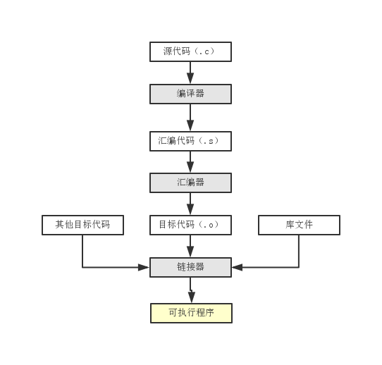

编译链接过程
===

C 语言的编译过程分为编译和链接两个过程，编译就是把文本形式源代码翻译为机器语言形式的目标文件过程。
链接是把目标文件、操作系统的启动代码和用到的库文件进行组织最终形成可执行代码的过程。图解如下：



### 编译过程

- 预处理阶段。

在某些情况下（如嵌入式开发），可以把用于不同环境或配置的代码放在同一个文件中，再在预处理阶段修改代码，使之适应不同业务需求。

预处理阶段主要是以下几方面的处理：

```
1）宏定义指令，如 #define M a；
对于这种伪指令，预编译所要做的是将程序中的所有 M 用 a 来替换。
与之相对应的是 #undef，取消对某个宏的定义，使之在后面出现时再不被替换。

2）条件编译指令，如 #ifdef、 #ifndef、#else、#elif、#endif 等。
这些伪指令的引入使得程序员可以通过定义不同的宏来决定编译程序对哪些代码进行处理。

3）头文件包含指令，如 #include 等。
在头文件中一般用伪指令 #define 定义了大量的宏（最常见的是字符常量），同时包含各种外部符号的声明。
采用头文件的主要目的是为了使某些定义可以供多个不同的 C 源程序使用。
因为当需要使用到这些定义的 C 源程序中，只需要加上一条 #include 语句即可，而不必在此文件中将这些定义重复一遍。
预编译程序将把头文件中的定义全部复制到该文件中，以供编译程序对之处理。
在 linux 中包含的 C 系统头文件一般放在/usr/include/目录下。
include 系统头文件要使用尖括号<>，include 自己定义的头文件使用""。

4）特殊符号，预编译程序可以识别一些特殊的符号。
LINE 标识符将被解释为当前行号（十进制），
FILE则被解释为当前被编译的C源程序的文件名称，
FUNCTION则被解释为当前被编译的C源程序中的函数名称。
预编译程序对于在源程序中出现的这些串将用合适的值进行替换，这些常常是配套使用，用来进行对程序的调试。
```

注意预处理阶段并不属于预编译过程！
预编译程序所完成的基本上是对源程序的替换工作。替换后生成一个没有宏定义，没有条件编译指令，没有特殊符号的输出文件。
该输出文件将作为编译程序的输出而被翻译成为机器指令。

- 编译、优化阶段。

经过预编译得到的输出文件中只有常量，一般都是一些指令。
编译程序所要做的工作就是通过词法分析和语法分析，在确认所有指令都是符合语法规则之后，将其翻译成等价的中间代码表示或汇编代码。

优化处理是编译系统中一项比较复杂的技术，其涉及的问题与编译技术有及机器的硬件环境均有关系，优化主要有两种：

1）对中间代码的优化，这种优化不依赖于具体的计算机。

主要的工作是删除公共表达式、循环优化（代码外提、强度消弱、变换循环控制条件、已知量的合并等）、复写传播及无用赋值的删去等等。

2）针对目标代码的生成而进行的，这种优化与硬件环境强相关。

主要考虑是如何充分利用机器的各个硬件寄存器存放的有关变量的值，以减少对于内存的访问次数（内存资源对于计算机至关重要，控制好它可大幅提高计算机的运算速度）。

另外，可根据机器硬件执行指令的特点（如流水线、RISC、CISC、VLIW等）而对指令进行一些调整，缩短目标代码，提高执行效率。


- 汇编阶段。

汇编实际上指把汇编语言代码翻译成目标机器指令的过程。
对于被翻译系统处理的每一个 C 语言源程序，都将最终经过这一处理而得到相应的目标文件。目标文件中所存放的也就是与源程序等效的目标的机器语言代码。

目标文件由段组成。通常一个目标文件中至少有两个段：代码段和数据段；

1. 代码段：该段中所包含的主要是程序的指令。该段一般是可读和可执行的，但一般却不可写。
2. 数据段：主要存放程序中要用到的各种全局变量或静态的数据。一般数据段都是可读，可写，可执行的。

- 链接阶段。

链接程序的主要工作就是将有关的目标文件彼此相连接，将在一个文件中引用的符号同该符号在另外一个文件中的定义连接起来，
使得所有的这些目标文件成为一个能够按操作系统装入执行的统一整体。根据库函数的链接方式，链接可分为两种：

1）静态链接。

函数的代码将从其所在地静态链接库中被拷贝到最终的可执行程序中。
这样该程序在被执行时这些代码将被装入到该进程的虚拟地址空间中。
静态链接库实际上是一个目标文件的集合，其中的每个文件含有库中的一个或者一组相关函数的代码。

2）动态链接。

函数的代码被放到称作是动态链接库或共享对象的某个目标文件中。链接程序此时所作的只是在最终的可执行程序中记录下共享对象的名字以及其它少量的登记信息。在此可执行文件被执行时，动态链接库的全部内容将被映射到运行时相应进程的虚地址空间。动态链接程序将根据可执行程序中记录的信息找到相应的函数代码。

对于可执行文件中的函数调用，可分别采用动态链接或静态链接的方法。使用动态链接能够使最终的可执行文件比较短小（没有将函数部分拷贝），并且当共享对象被多个进程使用时能节约一些内存，因为在内存中只需要保存一份此共享对象的代码。但并不是使用动态链接就一定比使用静态链接要优越。在某些情况下动态链接可能带来一些性能上损害，如移植性将大大降低。

### gcc

```
1）预编译
将 .c 文件转化成 .i 文件
使用的gcc命令是：gcc –E
对应于预处理命令cpp

2）编译
将 .c/.h 文件转换成 .s 文件
使用的gcc命令是：gcc –S
对应于编译命令 cc –S

3）汇编
将 .s 文件转化成 .o 文件
使用的 gcc 命令是：gcc –c
对应于汇编命令是 as

4）链接
将 .o 文件转化成可执行程序
使用的 gcc 命令是： gcc
对应于链接命令是 ld
```

总结起来编译过程就上面的四个过程：预编译、编译、汇编、链接。
