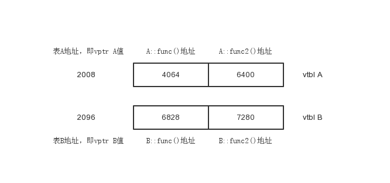

虚函数
===

### 定义

被virtual关键字修饰的成员函数即为虚函数。虚函数作用是实现多态性（Polymorphism），多态性是将接口与实现进行分离；用形象的语言来解释就是实现以共同的方法，但因个体差异而采用不同的策略。下面来看一段简单的代码：

```c++
#include <iostream>
using namespace std;
class A
{
public:
    void print()
    {
        cout << "This is A" << endl;
    }
};

class B : public A
{
public:
    void print()
    {
        cout << "This is B" << endl;
    }
};

int main()
{
    A a;
    B b;
    a.print();
    b.print();
    return 0;
}

// 输出：
// This is A
// This is B
```

上述代码并没有使用多态，多态的关键是`一切用指向基类的指针或引用来操作对象`，修改代码如下：

```c++
int main()
{
    A a;
    B b;
    A* p1= &a;
    A* p2= &b;
    p1->print();
    p2->print();
    return 0;
}

// 输出：
// This is A
// This is A
```
p2指向的是class B的对象但却是调用的class A的print()函数，这不是期望的结果，解决这个问题就需要用到虚函数，如下：

```c++
class A
{
public:
    virtual void print()
    {
        cout << "This is A" << endl;
    }
};
```

只需在把基类的成员函数设为virtual，其派生类的相应的函数也会自动变为虚函数。所以，class B的print()也成了虚函数。
指向基类的指针在操作它的多态类对象时，会根据不同的类对象，调用其相应的函数。


### 虚函数原理

先定义两个类：
```c++
class A
{

public:
    virtual void fun()
    {
        cout << 1 << endl;
    }
    virtual void fun2()
    {
        cout << 2 << endl;
    }
};
class B : public A
{
public:
    void fun()
    {
        cout << 3 << endl;
    }
    void fun2()
    {
        cout << 4 << endl;
    }
};
```

由于这两个类中有虚函数存在，编译器会为这两个类分别插入一段数据（vptr指针），并分别为每个类创建一个表（vtbl，保存自己类中虚函数的地址），可把vtbl看成一个数组，该数组的每个元素存放的就是虚函数的地址，如下图：



可以看到这两个vtbl分别为class A和class B服务。现在有了这个模型之后，来分析下面的代码：

```c++
A* p = new A;
p->fun();
```

毫无疑问，代码会调用A::fun()，但是虚函数的调用不会像普通函数那样直接跳转到函数的代码处，而是：
1. 取出vptr的值，该值即为vtbl地址。
2. 根据该值找到vtbl，由于调用的函数A::fun()是第一个虚函数，所以取出vtbl第一个slot里的值，即A::fun()地址.
3. 调用该函数。

可见，只要vptr不同，指向的vtbl就不同，而不同的vtbl里装着对应类的虚函数地址，从而实现多态。
