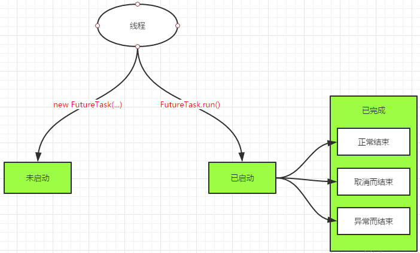
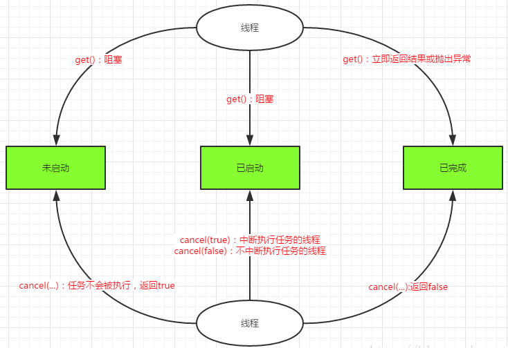

Callable、Future和FutureTask浅析
===

创建线程的方式有两种，一种是实现Runnable接口，另一种是继承Thread，但是这两种方式都有个缺点，在任务执行完成之后无法获取返回结果，从Java SE 5.0开始引入了Callable和Future，通过它们构建的线程，在任务执行完成后就可以获取执行结果。

### Callable<V>接口

```java
public interface Runnable {
    public abstract void run();
}


public interface Callable<V> {
    V call() throws Exception;
}
```

无论是Runnable接口的实现类还是Callable接口的实现类，都可以被ThreadPoolExecutor或ScheduledThreadPoolExecutor执行，ThreadPoolExecutor或ScheduledThreadPoolExecutor都实现了ExcutorService接口

```java
<T> Future<T> submit(Callable<T> task);
<T> Future<T> submit(Runnable task, T result);
Future<?> submit(Runnable task);
```

除了自行实现Callable对象外，还可以使用工厂类Executors把一个Runnable对象包装成Callable对象：

```java
public static Callable<Object> callable(Runnable task)
public static <T> Callable<T> callable(Runnable task, T result)
```

### Future<V>接口

Future<V>接口用来获取异步计算结果，如对具体的Runnable或者Callable对象任务执行的结果进行获取(get()),取消(cancel()),判断是否完成等操作。Future接口源码：

```java
public interface Future<V> {
    // 如果任务还没开始，执行cancel(...)方法将返回false；
    // 如果任务已经启动，执行cancel(true)方法将以中断执行此任务线程的方式来试图停止任务，如果停止成功，返回true；
    // 当任务已经启动，执行cancel(false)方法将不会对正在执行的任务线程产生影响(让线程正常执行到完成)，此时返回false；
    // 当任务已经完成，执行cancel(...)方法将返回false。mayInterruptRunning参数表示是否中断执行中的线程。
    boolean cancel(boolean mayInterruptIfRunning);

    // 如果任务完成前被取消，则返回true
    boolean isCancelled();

    // 如果任务执行结束，无论是正常结束或是中途取消还是发生异常，都返回true
    boolean isDone();

    // 获取异步执行的结果，如果没有结果可用，此方法会阻塞直到异步计算完成
    V get() throws InterruptedException, ExecutionException;

    // 获取异步执行结果，如果没有结果可用，此方法会阻塞，但是会有时间限制，如果阻塞时间超过设定的timeout时间，该方法将返回null
    V get(long timeout, TimeUnit unit) throws InterruptedException, ExecutionException, TimeoutException;
}
```

可见Future提供了3种功能：

1. 能够中断执行中的任务
2. 判断任务是否执行完成
3. 获取任务执行完成后额结果。

但是Future只是一个接口，无法直接创建对象，因此就需要其实现类FutureTask。


### FutureTask

应用场景：

1. FutureTask执行多任务计算的使用场景
2. FutureTask在高并发环境下确保任务只执行一次

FutureTask实现：

```java
public class FutureTask<V> implements RunnableFuture<V> {
```

FutureTask类实现了RunnableFuture接口，我们看一下RunnableFuture接口的实现：

```java
public interface RunnableFuture<V> extends Runnable, Future<V> {  
    void run();  
}  
```

FutureTask除了实现了Future接口外还实现了Runnable接口，因此FutureTask也可以直接提交给Executor执行。 当然也可以调用线程直接执行（FutureTask.run()）。接下来我们根据FutureTask.run()的执行时机来分析其所处的3种状态：

1. 未启动，FutureTask.run()方法还没有被执行之前，FutureTask处于未启动状态，当创建一个FutureTask，而且没有执行FutureTask.run()方法前，这个FutureTask也处于未启动状态。
2. 已启动，FutureTask.run()被执行的过程中，FutureTask处于已启动状态。
3. 已完成，FutureTask.run()方法执行完正常结束，或者被取消或者抛出异常而结束，FutureTask都处于完成状态。



可见状态变迁过程如下：

- NEW -> COMPLETING -> NORMAL
- NEW -> COMPLETING -> EXCEPTIONAL
- NEW -> CANCELLED
- NEW -> INTERRUPTING -> INTERRUPTED

FutureTask的方法执行示意图如下：



1. 当FutureTask处于未启动或已启动状态时，如果此时我们执行FutureTask.get()方法将导致调用线程阻塞；当FutureTask处于已完成状态时，执行FutureTask.get()方法将导致调用线程立即返回结果或者抛出异常。
2. 当FutureTask处于未启动状态时，执行FutureTask.cancel()方法将导致此任务永远不会执行。
3. 当FutureTask处于已启动状态时，执行cancel(true)方法将以中断执行此任务线程的方式来试图停止任务，如果任务取消成功，cancel(...)返回true；但如果执行cancel(false)方法将不会对正在执行的任务线程产生影响(让线程正常执行到完成)，此时cancel(...)返回false。
4. 当任务已经完成，执行cancel(...)方法将返回false。

### 示例

Callable+Future和Callable+FutureTask示例：

```java
public class CallableDemo implements Callable<Integer> {

    private int sum;
    @Override
    public Integer call() throws Exception {
        System.out.println("subThread begin");
        Thread.sleep(2000);
    
        for(int i=0; i<5000; i++) {
            sum = sum + i;
        }
        System.out.println("subThread end");
        return sum;
    }
}
```

```java
public class CallableTest {  
      
    public static void main(String[] args) {  
//      // 创建线程池
//      ExecutorService es = Executors.newSingleThreadExecutor();
//      // 创建Callable对象任务
//      CallableDemo calTask=new CallableDemo();
//      // 提交任务并获取执行结果
//      Future<Integer> future =es.submit(calTask);
//      // 关闭线程池
//      es.shutdown();
        
        // 创建线程池
        ExecutorService es = Executors.newSingleThreadExecutor();
        // 创建Callable对象任务
        CallableDemo calTask=new CallableDemo();
        // 创建FutureTask
        FutureTask<Integer> futureTask=new FutureTask<>(calTask);
        // 执行任务
        es.submit(futureTask);
        // 关闭线程池
        es.shutdown();
        try {
            Thread.sleep(2000);
        System.out.println("mainThread do other thing");
        
        if(futureTask.get()!=null){
            // 输出获取到的结果
            System.out.println("futureTask.get()-->"+futureTask.get());
        } else {
            // 输出获取到的结果
            System.out.println("futureTask.get() is null");
        }
        
        } catch (Exception e) {
            e.printStackTrace();
        }
        System.out.println("主线程在执行完成");
    }
}
```
