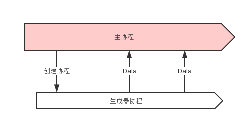
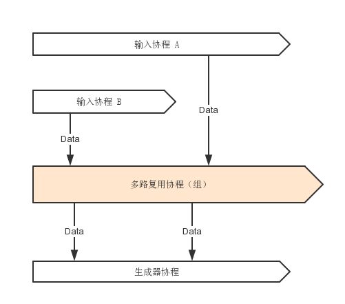
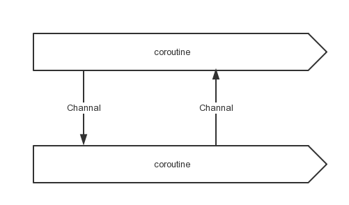
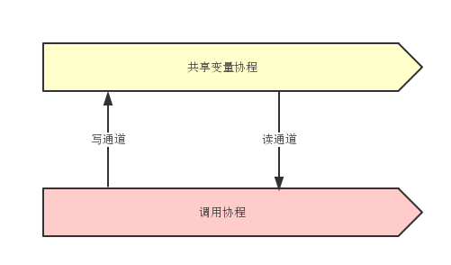
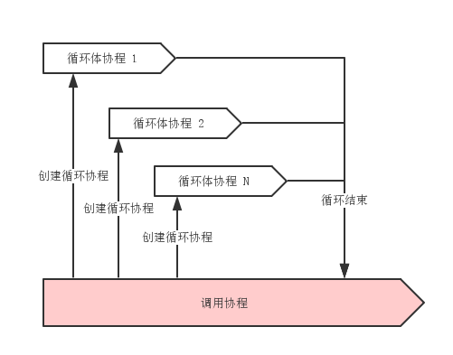
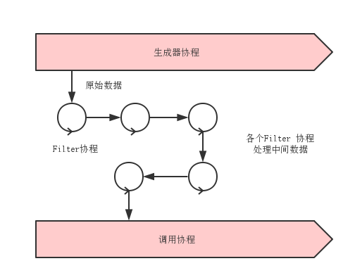
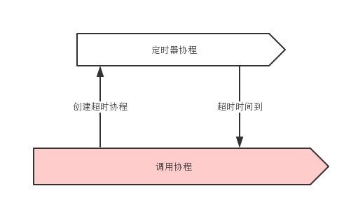

Go 并发模型
===

### 生成器

非并发做法：

```go
// 函数 rand_generator_1 ，返回 int
func rand_generator_1() int {
    return rand.Int()
}
```

并发做法：



```go
// 函数 rand_generator_2，返回 通道(Channel)
func rand_generator_2() chan int {
    // 创建通道
    out := make(chan int)
    // 创建协程
    go func() {
        for {
            // 向通道内写入数据，如果无人读取会等待
            out <- rand.Int()
        }
    }()
    return out
}

func main() {
    // 生成随机数作为一个服务
    rand_service_handler := rand_generator_2()
    // 从服务中读取随机数并打印
    fmt.Printf("%dn", <-rand_service_handler)
}
```

调用生成器，可以返回一个“服务”。可以用在持续获取数据的场合。用途很广泛，读取数据，生成ID，甚至定时器。这是一种非常简洁的思路，将程序并发化。
如果需要大量访问，可采用多路复用技术，启动若干生成器，再将其整合成一个更大的服务。

### 多路复用

多路复用是让一次处理多个队列的技术。下例为并发执行的随机数生成器。



```go
// 函数 rand_generator_3 ，返回通道(Channel)
func rand_generator_3() chan int {
    // 创建两个随机数生成器服务
    rand_generator_1 := rand_generator_2()
    rand_generator_2 := rand_generator_2()

    // 创建通道
    out := make(chan int)

    // 创建协程
    go func() {
        for {
            // 读取生成器1中的数据，整合
            out <- <-rand_generator_1
        }
    }()
    go func() {
        for {
            // 读取生成器2中的数据，整合
            out <- <-rand_generator_2
        }
    }()
    return out
}
```

多路复用技术可以用来整合多个通道。提升性能和操作的便捷。

### Future

多线程中常会见到 Future，但是在协程环境下的 Furtue 可以更加彻底，输入参数同样可以是 Furture的。
将传入的参数设为 channel，可以在不准备好参数的情况下调用函数。这样的设计可以提供很大的自由度和并发度。
函数调用和函数参数准备这两个过程可以完全解耦。

下面举一个用该技术访问数据库的例子，结果和参数均是在 Furture 中获取。准备好参数后，自动执行。



```go
// 将参数 Channel 和结果 Channel 定义在一个结构体里面作为参数，而不是返回结果 Channel
// 可增加聚合度，也可与多路复用技术结合起来使用
type query struct {
    // 参数 Channel
    sql chan string
    // 结果 Channel
    result chan string
}

// 执行 Query
func execQuery(q query) {
    // 启动协程
    go func() {
        // 获取输入
        sql := <-q.sql
        // 访问数据库，输出结果通道
        q.result <- "get " + sql
    }()

}

func main() {
    // 初始化Query
    q := query{make(chan string, 1), make(chan string, 1)}
    // 执行 Query，注意执行的时候无需准备参数
    execQuery(q)

    // 准备参数
    q.sql <- "select * from table"
    // 获取结果
    fmt.Println(<-q.result)
}
```

Furture 和生成器的区别：Furture返回一个结果，而生成器可以重复调用。

1. Future 可以和生成器组合使用，生成器不断生产数据，Furture技术逐个处理数据。
2. Furture技术自身还可以首尾相连，形成一个并发的 pipe filter。这个pipe filter可以用于读写数据流，操作数据流。
3. Future是一个非常强大的技术手段。可以在调用的时候不关心数据是否准备好，返回值是否计算好的问题。让程序中的组件在准备好数据的时候自动跑起来。

### 共享变量

协程之间的通信只能够通过通道。但是我们习惯于共享变量，而且很多时候使用共享变量能让代码更简洁。
比如一个Server有两个状态开和关。其他仅仅希望获取或改变其状态，那又该如何做呢。可以将这个变量至于0通道中，并使用一个协程来维护。



```go
//共享变量有一个读通道和一个写通道组成
type sharded_var struct {
    reader chan int
    writer chan int
}

//共享变量维护协程
func sharded_var_whachdog(v sharded_var) {
    go func() {
        //初始值
        var value int = 0
        for {
            //监听读写通道，完成服务
            select {
            case value = <-v.writer:
            case v.reader <- value:
            }
        }
    }()
}

func main() {
    //初始化，并开始维护协程
    v := sharded_var{make(chan int), make(chan int)}
    sharded_var_whachdog(v)

    //读取初始值
    fmt.Println(<-v.reader)
    //写入一个值
    v.writer <- 1
    //读取新写入的值
    fmt.Println(<-v.reader)
}
```

这样，就可以在协程和通道的基础上实现一个协程安全的共享变量了。定义一个写通道，需要更新变量的时候，往里写新的值。再定义一个读通道，需要读的时候，从里面读。
通过一个单独的协程来维护这两个通道。保证数据的一致性。

一般来说，协程之间不推荐使用共享变量来交互，但是按照这个办法，在一些场合，使用共享变量也是可取的。
很多平台上有较为原生的共享变量支持，到底用那种实现比较好，就见仁见智了。另外利用协程和通道，可以还实现各种常见的并发数据结构，如锁等等，就不一一赘述。

### 并发循环

循环往往是性能上的热点。如果性能瓶颈出现在CPU上的话，那么九成可能性热点是在一个循环体内部。所以如果能让循环体并发执行，那么性能就会提高很多。



要并发循环很简单，只有在每个循环体内部启动协程。协程作为循环体可以并发执行。调用启动前设置一个计数器，每一个循环体执行完毕就在计数器上加一个元素，调用完成后通过监听计数器等待循环协程全部完成。


```go
//建立计数器
sem := make(chan int, N);
//FOR循环体
for i,xi := range data {
    //建立协程
    go func (i int, xi float) {
        doSomething(i,xi);
        //计数
        sem <- 0;
    } (i, xi);
}
// 等待循环结束
for i := 0; i < N; ++i { <-sem }
```

通过计数器来等待循环全部完成。如果结合上面提到的 Future 技术的话，则不必等待。可以等到真正需要的结果的地方，再去检查数据是否完成。

通过并发循环可以提供性能，利用多核，解决 CPU 热点。正因为协程可以大量创建，才能在循环体中如此使用，如果是使用线程的话，就需要引入线程池之类的东西，防止创建过多线程，而协程则简单的多。

### Chain Filter

前面提到了 Future 技术首尾相连，可以形成一个并发的 pipe filter。这种方式可以做很多事情，如果每个 Filter 都由同一个函数组成，还可以有一种简单的办法把他们连起来。
由于每个 Filter 协程都可以并发运行，这样的结构非常有利于多核环境。下面是一个例子，用这种模式来产生素数。



```go
package main

// Send the sequence 2, 3, 4, ... to channel 'ch'.
func Generate(ch chan<- int) {
    for i := 2; ; i++ {
        ch <- i // Send 'i' to channel 'ch'.
    }
}

// Copy the values from channel 'in' to channel 'out',
// removing those divisible by 'prime'.
func Filter(in <-chan int, out chan<- int, prime int) {
    for {
        i := <-in // Receive value from 'in'.
        if i%prime != 0 {
            out <- i // Send 'i' to 'out'.
        }
    }
}

// The prime sieve: Daisy-chain Filter processes.
func main() {
    ch := make(chan int) // Create a new channel.
    go Generate(ch)      // Launch Generate goroutine.
    for i := 0; i < 10; i++ {
        prime := <-ch
        print(prime, "n")
        ch1 := make(chan int)
        go Filter(ch, ch1, prime)
        ch = ch1
    }
}
```

上面的程序创建了 10 个 Filter，每个分别过滤一个素数，所以可以输出前 10 个素数。

Chain-Filter 通过简单的代码创建并发的过滤器链。这种办法还有一个好处，就是每个通道只有两个协程会访问，就不会有激烈的竞争，性能会比较好。

### 协程泄漏

有两种情况会导致协程无法结束:

1. 协程想从一个通道读数据，但没有对该通道写入数据。可通过加入超时机制解决。
2. 协程想往一个通道写数据，可是由于无人监听这个通道。可通过给通道加缓冲解决。

对于协程想从一个通道读数据，但无人往这个通道写入数据这种情况。解决的办法很简单，加入超时机制。对于有不确定会不会返回的情况，必须加入超时，避免出现永久等待。另外不一定要使用定时器才能终止协程。也可以对外暴露一个退出提醒通道。任何其他协程都可以通过该通道来提醒这个协程终止。



对于协程想往一个通道写数据，但通道阻塞无法写入这种情况。解决的办法也很简单，就是给通道加缓冲。但前提是这个通道只会接收到固定数目的写入。比方说，已知一个通道最多只会接收N次数据，那么就将这个通道的缓冲设置为N。那么该通道将永远不会堵塞，协程自然也不会泄漏。也可以将其缓冲设置为无限，不过这样就要承担内存泄漏的风险了。等协程执行完毕后，这部分通道内存将会失去引用，会被自动垃圾回收掉。


```go
func never_leak(ch chan int) {
    // 初始化timeout，缓冲为1
    timeout := make(chan bool, 1)
    // 启动timeout协程，由于缓存为1，不可能泄露
    go func() {
        time.Sleep(1 * time.Second)
        timeout <- true
    }()
    // 监听通道，由于设有超时，不可能泄露
    select {
    case <-ch:
        // a read from ch has occurred
    case <-timeout:
        // the read from ch has timed out
    }
}
```

上面是个避免泄漏例子。使用超时避免读堵塞，使用缓冲避免写堵塞。

和内存里面的对象一样，对于长期存在的协程，不担心泄漏问题。一是长期存在，二是数量较少。
要警惕的只有那些被临时创建的协程，这些协程数量大且生命周期短，往往是在循环中创建的，
要应用前面提到的办法，避免泄漏发生。
