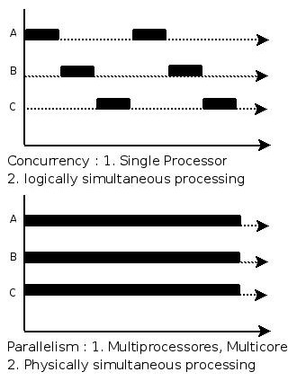

Goroutine
=========

- Go 在语言层面提供 goroutine 协程支持，让并发程序编写变得简单。只要在函数调用语句前添加 go 关键字，即可在后台创建运行一个协程。

```go
go func() {
    println("Hello, World!")
}()
```

- 调度器不能保证 goroutine 执行次序，且进程退出时不会等待 goroutine 结束。
- Go 程序启动后默认仅允许一个系统线程服务于 goroutine （即使有多个 goroutine 也是运行在一个线程里，主函数 main 也是一个 goroutine）。
如果当前 goroutine 发生阻塞（如 Sleep，channel 读取阻塞等），才会让出 CPU 时间给其他同线程的 goroutine。可通过 runtime.GOMAXPROCS 自行修改，让调度器用多个线程实现多核并行，而不仅仅是并发。

### 并发与并行
并发和并行的区别就是一个处理器同时处理多个任务和多个处理器或者是多核的处理器同时处理多个不同的任务。
前者是逻辑上的同时发生（simultaneous），而后者是物理上的同时发生。

并发(concurrency)：能处理多个同时性活动的能力，并发事件之间不一定要同一时刻发生。

并行(parallelism)：同时发生的两个并发事件，具有并发的含义，而并发则不一定并行。



```go
package main

import (
    "fmt"
)

func say(s string) {
    for i := 0; i < 5; i++ {
        fmt.Println(s)
    }
}

func main() {
    go say("world") // 开一个新的协程执行 say 函数
    for {
    }
}

// 按道理应该打印5次 world ，但上述代码什么也没有打印
// 因为这里 Go 仍然在使用单核，for 死循环占据了单核 CPU 所有的资源
// 而 main 和 say 两个 goroutine 默认在一个线程里面， 所以 say 没有机会执行。解决方案有两个：

// 1. 允许G o 使用多核(runtime.GOMAXPROCS)

package main

import (
    "fmt"
    "runtime"
)

func say(s string) {
    for i := 0; i < 5; i++ {

        fmt.Println(s)
    }
}

func main() {
    runtime.GOMAXPROCS(2) // 最多同时使用2个核
    go say("world")       // 开一个新的 Goroutine 执行
    for {
    }
}


// 2. 手动显式调动(runtime.Gosched)

package main

import (
    "fmt"
    "runtime"
)

func say(s string) {
    for i := 0; i < 5; i++ {
        fmt.Println(s)
    }
}

func main() {
    go say("world") //开一个新的 Goroutine 执行
    for {
        runtime.Gosched() // 显式地让出 CPU 时间给其他 goroutine
    }
}
// 这种主动让出 CPU 时间的方式仍然是在单核里跑。但手工地切换 goroutine 导致了看上去的“并行”。
```

### runtime 调度器
在同一个原生线程里，如果当前 goroutine 不发生阻塞，它是不会让出 CPU 时间给其他同线程的 goroutine，
这是 Go 运行时对 goroutine 的调度，也可以使用 runtime 包来手工调度。runtime 包有几个常用函数:

- `Gosched` 让出 CPU 时间给其他 goroutine

- `NumCPU` 返回当前系统的 CPU 核数量

- `GOMAXPROCS` 设置最大的可同时使用的 CPU 核数

- `Goexit` 退出当前 goroutine，但是 defer 语句会照常执行

```go
func sum(id int) {
    var x int64
    for i := 0; i < math.MaxUint32; i++ {
        x += int64(i)
    }

    println(id, x)
}

func main() {
    wg := new(sync.WaitGroup)
    wg.Add(2)

    for i := 0; i < 2; i++ {
        go func(id int) {
            defer wg.Done()
            sum(id)
        }(i)
    }

    wg.Wait()
}

// 输出：
$ go build -o test

$ time -p ./test

0 9223372030412324865
1 9223372030412324865

real   7.70                     // 程序开始到结束时间差(非 CPU 时间)
user   7.66                     // 用户态所使用 CPU 时间片(多核累加)
sys    0.01                     // 内核态所使用 CPU 时间片

$ GOMAXPROCS=2 time -p ./test

0 9223372030412324865
1 9223372030412324865

real 4.18
user 7.61           // 虽然总时间差不多，但由于 2 个核并行，real 时间少了许多
sys 0.02
```

- 调用 runtime.Goexit 将终止当前 goroutine 执行，但调度器会确保所有已注册 defer 延迟调用被执行。

```go
func main() {
    wg := new(sync.WaitGroup)
    wg.Add(1)

    go func() {
        defer wg.Done()
        defer println("A.defer")

        func() {
            defer println("B.defer")
            runtime.Goexit()
            println("B")
        }()

        println("A")
    }()

    wg.Wait()
}

// 输出：
B.defer
A.defer
```

- Gosched让出底层线程，将当前goroutine暂停，放回队列等待下次被调度执行。

```go
func main() {
    wg := new(sync.WaitGroup)
    wg.Add(2)

    go func() {
        defer wg.Done()
        for i := 0; i < 6; i++ {
            println(i)
            if i == 3 { runtime.Gosched() }
        }
    }()

    go func() {
        defer wg.Done()
        println("Hello, World!")
    }()

    wg.Wait()
}

// 输出：
$ go run main.go
0
1
2
3
Hello, World!
4
5
```

### 同步
go 中有两种方式同步，一种使用 channel 来同步 goroutine，另一种使用锁机制 sync.WaitGroup，一种较为简单的同步方法集。

sync.WaitGroup 只有 3 个方法：
- `Add()` 添加计数
- `Done()` Add(-1) 的别名，减少一个计数
- `Wait()` 计数不为 0, 阻塞 Wait() 所在 goroutine 的运行

注意：应在运行 main 函数的 goroutine 里运行 Add() 函数，在其他 goroutine 里面运行 Done() 函数。

```go
package main

import (
    "fmt"
    "sync"
)

func main() {
    var wg sync.WaitGroup
    for i := 0; i < 5; i++ {
        fmt.Println("add", i)
        wg.Add(1)
    }

    for i := 0; i < 5; i++ {
        fmt.Println("subtract", i)
        go wg.Done()
    }
    fmt.Println("exit")
    wg.Wait()
}
```
