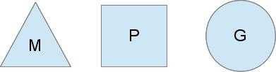
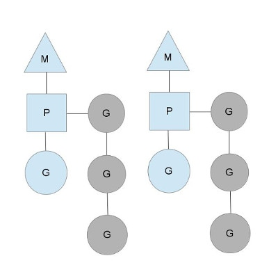
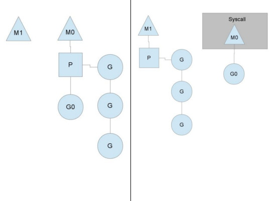

Go 调度器原理
===

用户空间线程和内核空间线程之间的映射关系：
1. [N : 1]，多个（N）用户线程始终在一个内核线程上跑，context 上下文切换确实很快，但是无法真正的利用多核。
2. [1 : 1]，一个用户线程就只在一个内核线程上跑，这时可以利用多核，但是上下文 switch 很慢。
3. [M : N]，多个 goroutine 在多个内核线程上跑，有上面两者的优势，但增加了调度的难度。

Go 的调度器内部有三个重要的结构：M，P，S
- M: 代表真正的内核 OS 线程，是真正干活的人。
- G: 代表一个 goroutine，它有自己的栈，instruction pointer 和其他信息（正在等待的 channel 等等），用于调度。
- P: 代表调度的上下文，可以把它看做一个局部的调度器，使 go 代码在一个线程上跑，它是实现从 N : 1 到 N : M 映射的关键。

1. 上图有 2 个物理线程 M，每一个 M 都拥有一个 context（P），每一个也都有一个正在运行的 goroutine。
2. P 的数量可以通过 GOMAXPROCS() 设置，P 代表了真正的并发度，即有多少个 goroutine 可以同时运行。
3. 图中灰色的 goroutine 并没有运行，而是出于 ready 的就绪态，正在等待被调度。
4. P 维护着这个队列（称之为 runqueue），每有一个 go function 语句被执行，runqueue 队列就在其末尾加入一个 goroutine，在下一个调度点，就从 runqueue 中取出一个 goroutine 执行。
5. 为何要维护多个上下文 P？因为当一个 OS 线程被阻塞时，P 可以转而投奔另一个 OS 线程！图中看到，当一个 OS 线程 M0 陷入阻塞时，P 转而在 OS 线程 M1 上运行。
6. 调度器保证有足够的线程来运行所以的 context P。

1. 上图中的 M1 可能是被创建，或者从线程缓存中取出。
2. 当 MO 返回时，它必须尝试取得一个 context P 来运行 goroutine，
3. 一般情况下，它会从其他的 OS 线程偷一个 context 过来，如果没有偷到的话，它就把 goroutine 放在一个 global runqueue 里，
然后自己就放入线程缓存里。
4. Contexts 们会周期性的检查 global runqueue。

如果 P 所分配的任务 G 很快就执行完，且 global runqueue 没有任务 G 了，那么 P 会不从其他的上下文 P 那里偷一半的 G 来执行。
