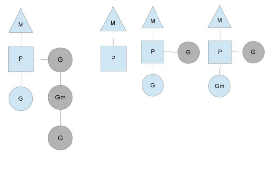

Go Runtime 调度器原理
===

在了解 Go 的运行时的 scheduler 之前，需要先了解为什么需要它，因为我们可能会想，OS 内核不是已经有一个线程 scheduler 了嘛？
尤其是 context 上下文切换的耗时。另一个原因是 Go 的垃圾回收需要所有的 goroutine 停止，使得内存在一个一致的状态。
垃圾回收的时间点是不确定的，如果依靠 OS 自身的 scheduler 来调度，那么会有大量的线程需要停止工作。
单独的开发一个 GO 得调度器，可以是其知道在什么时候内存状态是一致的，也就是说，当开始垃圾回收时，
运行时只需要为当时正在 CPU 核上运行的那个线程等待即可，而不是等待所有的线程。

用户空间线程和内核空间线程之间的映射关系有：
- N : 1，多个（N）用户线程始终在一个内核线程上跑，context 上下文切换确实很快，但是无法真正的利用多核。
- 1 : 1，一个用户线程就只在一个内核线程上跑，这时可以利用多核，但是上下文 switch 很慢。
- M : N，多个 goroutine 在多个内核线程上跑，这个看似可以集齐上面两者的优势，但是无疑增加了调度的难度。

Go 的调度器内部有三个重要的结构：M，P，S
- M: 代表真正的内核 OS 线程，和 POSIX 里的 thread 差不多，真正干活的人
- G: 代表一个 goroutine，它有自己的栈，instruction pointer 和其他信息（正在等待的 channel 等等），用于调度。
- P: 代表调度的上下文，可以把它看做一个局部的调度器，使 go 代码在一个线程上跑，它是实现从 N : 1 到 N : M 映射的关键。

上图有 2 个物理线程 M，每一个 M 都拥有一个 context（P），每一个也都有一个正在运行的 goroutine。
P 的数量可以通过 GOMAXPROCS() 来设置，它其实也就代表了真正的并发度，即有多少个 goroutine 可以同时运行。
图中灰色的那些 goroutine 并没有运行，而是出于 ready 的就绪态，正在等待被调度。
P 维护着这个队列（称之为 runqueue），Go 语言里，启动一个 goroutine 很容易：go function 就行，所以每有一个 go 语句被执行，runqueue 队列就在其末尾加入一个 goroutine，在下一个调度点，就从 runqueue 中取出（如何决定取哪个 goroutine？）一个 goroutine 执行。
为何要维护多个上下文 P？因为当一个 OS 线程被阻塞时，P 可以转而投奔另一个 OS 线程！图中看到，当一个 OS 线程 M0 陷入阻塞时，P 转而在 OS 线程 M1 上运行。
调度器保证有足够的线程来运行所以的 context P。

上图中的 M1 可能是被创建，或者从线程缓存中取出。当 MO 返回时，它必须尝试取得一个 context P 来运行 goroutine，
一般情况下，它会从其他的 OS 线程那里 steal 偷一个 context 过来，如果没有偷到的话，它就把 goroutine 放在一个 global runqueue 里，
然后自己就放入线程缓存里。Contexts 们也会周期性的检查 global runqueue，否则 global runqueue 上的 goroutine 永远无法执行。

另一种情况是 P 所分配的任务 G 很快就执行完了（分配不均），这就导致了一个上下文P闲着没事儿干而系统却任然忙碌。但是如果 global runqueue 没有任务 G 了，
那么 P 就不得不从其他的上下文 P 那里拿一些G来执行。一般来说，如果上下文 P 从其他的上下文 P 那里要偷一个任务的话，一般就‘偷’ run queue 的一半，这就确保了每个 OS 线程都能充分的使用。
