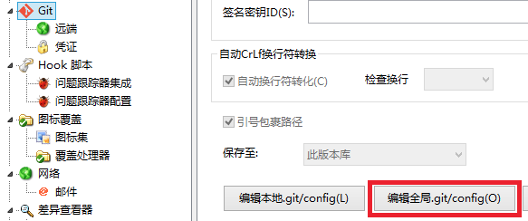

Git 配置
===

在自定义目录创建模板文件，如C:/Users/lex/.gitmsg创建注释template文件：

```
Description: 
Date: 
Author:
```


通过git config命令配置commit_template，如：

```
git config –global commit.template C:/Users/lex/.gitmsg
```

设置git commit时填写注释所用的编辑器，如：

```
git config –global core.editor vi
```

提交使用git commit会出现与下图相似的界面填写好注释才能提交成功:


PS：与团队成员约定做git提交时使用git commit，不能直接用git commit -m跳过规范。

TortoiseGit可视化界面设置提交注释模板
首先打开TortoiseGit的设置界面，如下：


```
[user]
  name = lex
  email = lex@mail.com

[commit]
  template = C:/Users/lex/.gitmsg
```


