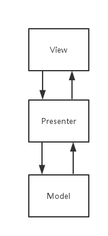

MVP重构Activity
===

### mvp结构



- mvp的分层结构特别类似于网络的七层协议，每层只知道自己依赖层的细节。
- 这种分层的好处是：层与层之间的耦合性低，模块的复用性高，可维护性更好，每层可以单独存在，这样可测性更好。
- 数据流的走向可以是：view–>presenter–>model–>presenter–>view,这种数据流一般出现的场景是用户在界面触发了一个事件的情形下
- 数据流的走向也可以是：model–>presenter–>view，这种数据流一般出现于比如通过长链接接收消息的场景。
- 不管数据流是怎样的一个流动走向，始终有一个原则是：数据流不能跨层流动，即层与层不能跨层通信。

看了mvp的整体结构图，我们以从底层到上层的顺序依次来介绍model，presenter，view。

### Model

先说下一些关于model的错误理解：

- model是实体类的集合
- 比如从json中解析数据的代码应该放在presenter中
- model与mvc中的model是一样的
- 关于model的正确理解我们会在文中看到。

model其实是整个应用或界面的数据加工处理厂，所谓数据加工厂就是对数据的获取，数据的解析，数据的存储，数据的分发，数据的增删改查等操作。意思就是凡是涉及到数据操作都是在model进行的，所以model不仅仅只是实体类的集合，同时还包含关于数据的各种处理操作。

数据的数据源有三种：内存，磁盘（文件或数据库等），网络。为了提升app的性能，有必要把经常访问的数据临时存入内存中；同时也为了提升app性能和为用户省流量省电，有必要把数据存入磁盘中；还有的数据是有必要从网络读取的。三个数据源不一定同时存在，比如不与网络交互的app，不存在网络数据源。所以凡是涉及到关于数据发生于三个数据源加工处理的操作的代码都要放在model中。

model从黑盒的角度来看为上层（指依赖于model的层比如present）提供的服务无非就2种：

1. model为上层提供数据
2. model处理上层传递的数据

##### model为上层提供数据
上层会从model中去数据，那model会从三数据源中取数据，取的顺序是

1. 先内存，内存取到数据返回
2. 其次磁盘，磁盘取到数据，如有必要把数据存储在内存中，则需要进行存储，返回数据
3. 最后网络，网络取到数据，如有必要在磁盘或内存中存储，则进行存储，返回数据

上面的取数据过程是最简单的情况，复杂些还会涉及到从内存或磁盘中取到的数据是否过期，过期的话就应该从网络获取。从网络取得数据后需要把内存或磁盘的数据更新。

##### model处理上层传递的数据
model接收到上层传递的数据后，model会依次把数据扔给三个数据源去处理，有可能三个数据源都会处理数据，有可能只是其中一个处理，model会把处理的结果返回。所以model会把解析好的数据提供给上层，上层对于数据的来源完全是透明的，上层完全不需要关心数据到底是来自内存，还是磁盘甚至是网络。同理上层只需要的把数据扔给model，上层唯一做的事情就是愉快的等待处理结果。

- mvc中的model是要和view进行交互的，而mvp中的model不会知道任何view的细节。
- model中的所有操作都发生于子线程。


### Presenter

presenter翻译成汉语的意思是主持人，提出者。从它的意思可以看出它有控制全场的作用。首先presenter是处于mvp的中间层，在view和model中起一个承上启下的作用。presenter会把view交给自己的命令进行一定的校验等操作交给model处理，会把model处理的结果交给view。

1. presenter封装业务
2. presenter持有的线程

##### presenter封装业务
presenter不仅起一个桥梁的作用，它还会把业务逻辑代码给包揽下来。这样就可以减轻Activity的负担了，让Activity全心全意做它的view工作。那估计就有朋友犯迷糊了，哪些代码属于业务逻辑呢？比如一些校验代码。或者可以这样想只要是不属于view和model的代码基本都可以放在presenter中。

##### presenter负责刷新view
mvc或以前的关于view的写法一般都是这样，view在接收到数据后，自己来进行view的刷新或其他操作。但是mvp中presenter负责对view进行刷新，比如从model获取的数据，presenter会根据获取的数据成功与否来通知view应该是显示成功界面还是失败界面。这样就让Activity变的更轻了，变成了听别人指挥的傻白甜了。这时候的presenter就有点主持人，掌控者的味道了。


- Android中view的操作需要在ui线程里执行，其他耗时操作需要在子线程执行。presenter会持有这2种线程:ui线程,子线程。刷新view时，它切换为ui线程进行刷新，从model取数据切换为子线程。假如使用rxjava的话，就特别简单了关于线程切换的事情。
- presenter从model中获取的数据就是解析好的数据，不需要出现解析数据的代码。


### View

view层就很好理解了，就是用户直接看到的界面，mvp中的view是很省心的，比如更新view，接收数据。这些操作它都不需要操心，也不需要知道数据到底来自哪里，给我啥我显示啥就可以了。
一个view可以同时拥有多个presenter，也可以只有一个presenter。
Android中的Activity，Fragment在mvp中是作为view来使用的，这些Activity，Fragment的责任就小了，只关心界面相关的事情足矣。

Adapter放在view层。

### 总结

我们初步认识了mvp，mvp中的model，present，view到底是什么，他们之间的关系是什么样的，这只是初步认识mvp，关于mvp中还有很多细节需要介绍，比如android clean architecture 中model和presenter之间多了一层interactor,多的这层interactor是用来做什么的，model层是怎么架构的。google mvpmodel层要比android clean architecture 简单等，希望能在我后面的章节看到相关关于每层的详细介绍。我们开始进入我们的重构”万能”Activity的部分。

使用mvp设计模式对”万能”Activity进行重构

回忆下“万能”Activity的样子

我在上篇文章的“万能”的LoginActivity基础上增加了登录对话框的功能，“万能”LoginActivity的代码如下：

```Java
public LoginActivity extends Activity{
    private EditText  mUserNameView, mPasswordView;
    private Button mLoginView;

    public void initViews(){
         .......
          各种findViewById.....代码

          //给登陆按钮加监听器
          mLoginView.OnClickListener(new View.OnClickListener() {
                @Override
                 public void onClick(View v) {  

                      String userName = mUserNameView.getText();
                      String password = mPasswordView.getText();
                      //验证用户输入的密码是否合法
                      if(!validate(userName) || !validate(password)){
                          告诉用户输入的用户名或密码不合法
                      }  else{
                          //开始登陆
                          login(userName,password);
                      }
                }
          });
    }

    //登陆方法,用伪代码来写下网络请求
    private void login(String userName,String password){

        //增加登录进度对话框给用户友好用户体验
        显示登录进度对话框...

        HttpClient.getInstance().login(userName,password,
           new ResponseListener(){

                   public void failed(Failed failed){

                          把登录进度对话框消失...

                          做失败相关的处理工作，比如给用户提示
                          把密码输入框清空，还比如登陆次数限制等
                   }

                   public void success(Response response){

                           把登录进度对话框消失...

                           做成功相关的处理工作
                          //暂且把用户信息的类叫做UserInfo,从json中解析数据，假设response.getContent()存在
                          String jsonContent = response.getContent();
                          JsonObject jsonObject = new JsonObject(jsonContent);
                          UserInfo userInfo = new UserInfo();
                          userInfo.name = jsonObject.optString("name");
                          userInfo.userId = jsonObject.optString("userId");
                          其他字段的解析......
                          //保存userInfo信息到数据表中,假设userDatabase已经存在
                          userDatabase.save(userInfo);

                          跳到app的主页
                   }
         });
    }

    //验证给定的字符串是否合法，true 合法，false 不合法
    private  boolean validate(String str){

    }
}
```

我们回忆了“万能”LoginActivity的代码后，开始重构。

开始重构

model
在使用mvp时，我一般有个习惯就是首先从model->presenter->view的顺序写代码，所以重构“万能”LoginActivity也先从model开始。前半部分关于model介绍过，model从黑盒的角度来说只有2个功能：一个是输出数据，一个是输入数据。因此登录中presenter只需要把账号，密码交给model，presenter唯一做的事情就是监听登录状态即可。model会把presenter传递的账号，密码交给服务器，model在把服务器返回的数据进行解析，存储在磁盘或内存中，把解析好的数据传递给presenter。那我们看下伪代码：

```Java
//管理登录的类,它是单例的，这就不写单例方法了
public class LoginManager{


    //登录的监听器
    public static interface LoginListener{
        //登录成功
        void onSuccessLogin(UserEntity user);
        //登录失败
        void onFailedLogin(Failed failed);
    }

    //登录方法
    public void login(String name,String password,final LoginListener loginListener){

        //假设HttpClient是一个请求网络服务的类
        HttpClient.getInstance().login(userName,password,
        new ResponseListener(){

               public void failed(Failed failed){

                      loginListener.onFailedLogin(failed);
               }

               public void success(Response response){
                      //假设UserParse类已经存在，主要用来从response中解析UserEntity
                      UserEntity userEntity = UserParse(response.getContent());
                      //假设userDatabase是数据库存储类
                      userDatabase.store(userEntity);
                      //还可以把userEntity存入内存中，这得根据业务需求进行处理
                      loginListener.onSuccessLogin(userEntity);
               }
        });

    }
}
```

登录的model层我们没有做的那么复杂，比如把服务器返回的用户信息存储在内存中，把服务器返回的token存储在磁盘中，实现自动登录功能等，本例子只是一个特别简单的登录功能，实际应用中登录需要考虑很多的东西，登录的modle层到此重构完毕。

presenter

上文中提到过presenter，presenter起连接view与model的作用，presenter封装业务作用，presenter有负责刷新view的作用。
我们梳理下presenter都应该包含哪些功能：

验证账号，密码的合法性.
把验证成功的账号，密码交给model层
把登录的状态传递给view层，并根据不同的登录状态通知view显示不同的界面
那让我们开始写代码，presenter层的类组织结构我是参照google mvp的presenter类组织结构来进行的，因为我认为google mvp presenter类结构更清晰，看下伪代码：

```Java
//登录的条约接口，分别定义了登录view的一些方法，和登录presenter的一些方法     
public interface LoginContract{
    //需要view层来实现的登录view接口，IView是所有view的基类
    interface ILoginView extends IView{

        void onShowSuccessLoginView(UserInfo userInfo);
        void onShowFailedLoginView(int failed);
        void showLoginingView();
        void dissLoginingView();
    }

    //定义了登录presenter的一些方法，IPresenter是所有Presenter的基类
    interface ILoginPresenter extends IPresenter<ILoginView>{
        void login(String name,String password);
    }
}

public  interface IView{

        void initView();
}

//IPresenter提供了一些基础方法，其实这些方法是对应Activity或Fragment的生命周期方法
public interface IPresenter<V  extends IVew>{

    void onStop();
    void onResume();
    void onDestroy();
    void onPause();
    void onStart();
    void init(V view);
}

//登录的presenter
public class LoginPresenter implements ILoginPresenter{

    private ILoginView mLoginView;
    private LoginManager mLoginManager = LoginManager.getInstance();
    public void init(ILoginView loginView){
            mLoginView = loginView;
            mLoginView.initView();
    }

    public void login(String name,String password){
            //验证name，password的合法性,
            if(validate(name) && validate(password)){
              //假设NormalThread.exe方法可以让操作在子线程里执行        
              mLoginView.showLoginingView();
              NormalThread.exe(new   Runnable(){
                  public void run(){
                      mLoginManager.login(name,password,
                        new LoginListener(){

                                public void onSuccessLogin(UserEntity userEntity){
                                        //UserMapper类，负责把底层的UserEntity转化为view层使用的UserInfo
                                        UserInfo userInfo = UserMapper.map(userEntity);
                                        //下面的代码在ui线程中执行，这就不写具体的实现了
                                        mLoginView.onShowSuccessLoginView(userInfo);
                                        mLoginView.dissLoginingView();

                                }

                                public void onFailedLogin(Failed failed){
                                     //下面的代码在ui线程中执行，这就不写具体的实现了
                                        mLoginView.onShowFailedLoginView(failed.failedState);
                                     mLoginView.dissLoginingView();
                                }
                        });
                    }
                 }
             }else{
                    //假设1代表账号，密码不合法
                    mLoginView.onShowFailedLoginView(1);
             }
    }
}
```

以上登录的Presenter层的伪代码都是关键代码，让我们看下以上代码都做了什么？

LoginContract 把ILoginView和ILoginPresenter组合在一块，ILoginView定义了提供给ILoginPresenter的方法，ILoginPresenter定义了提供给ILoginView的方法。只需要看LoginContract就可以知道登录的view层和presenter层之间的约定。我很喜欢XXContract类，也推荐大家使用
IView是一个基础接口，提供一些公用方法
IPresenter是一个基础接口，它把Activity或Fragment的生命周期方法集合了起来。有了这些生命周期方法，presenter就让Activity一心一意做它的view相关的工作。
到此登录Present的重构结束，我们重构view层。

view
view层就很简单了，只是需要把基础设施建立好，直接看伪代码：

```Java
 public abstract class BaseActivity extends FragmentActivity{

    private Set<IPresenter> mAllPresenters = new HashSet<IPresenter>(1);

    /** * 获取layout的id，具体由子类实现
    * @return
    */
    protected abstract int getLayoutResId();

    /**
    *需要子类来实现，获取子类的IPresenter，一个activity有可能有多个IPresenter
    */
    protected abstract IPresenter[] getPresenters();

    //初始化presenters，
    protected abstract void onInitPresenters();

    /** * 从intent中解析数据，具体子类来实现
    * @param argIntent
    */
    protected void parseArgumentsFromIntent(Intent argIntent){
    }     

    private void addPresenters(){

          IPresenter[] presenters = getPresenters();
          if(presenters != null){
                  for(int i = 0; i < presenters.length; i++){
                        mAllPresenters.add(presneters[i]);
                  }
          }
    }         

    @Override    
    protected void onCreate(@Nullable Bundle savedInstanceState) {
      super.onCreate(savedInstanceState);            
      setContentView(getLayoutResId());
      if(getIntent() != null){
          parseArgumentsFromIntent(getIntent());
      }  
      addPresenters();

     onInitPresents();
    }

    @Override
    protected void onResume() {
       super.onResume();
        //依次调用IPresenter的onResume方法
       for (IPresenter presenter:mAllPresenters  ) {
             if(presenter != null){   
                  presenter.onResume();
             }
      }
    }

    ...其他生命周期方法也是类似，调用IPresenter中相应的生命周期方法...

    }
```
基础设施已经ok了，这时候我们就该重构”万能“LoginActivity了。

```Java
public class LoginActivity extends BaseActivity implements LoginConstract.ILoginView{

    private LoginPresenter mLoginPresenter = new LoginPresenter();
    protected int getLayoutResId(){
        return R.layout.activity_login;
     }

    protected IPresenter[] getPresenters(){
        return new IPresneter[]{ mLoginPresenter};
    }

   //初始化presenters，
   protected void onInitPresenters(){
       mLoginPresenter.init(this);

   }

   public void initView(){
        ...初始化view的代码...
        //
        mLoginButton.setOnClickListener(new OnClickListener() {
              @Override
              public void onClick(View v) {

                      mLoginPresenter.login(name,password);
              }
        });
   }

   public void onShowSuccessLoginView(UserInfo userInfo){
       ....显示登录成功界面....
   }

    public  void onShowFailedLoginView(int failed){
        ...显示登录失败界面...
    }

    public  void showLoginingView(){
        ...显示登录进度条对话框...
    }

    public   void dissLoginingView(){
        ...消失登录进度条对话框...
    }

}
```

我们着重说下基础设施BaseActivity：
因为一个Activity是有可能包含多个Presenter的，所以需要在BaseActivity中是有必要把这些Presenter收集起来。
需要在BaseActivity的生命周期方法里面调用每个Presenter的相应周期方法。

重构以后的LoginActivity是不是很清爽，只保留与view相关的逻辑。

小结重构后的类结构
重构“万能”LoginActivity到此结束，我们小结下重构后的类结构：

- model层包含：LoginManager(登录管理类），UserEntity(用户实体类，主要使用在model层），UserDatabase（用户数据表）。
- presenter层包含：LoginConstract（登录约定类，组合ILoginView和ILoginPresenter），LoginPresenter（登录presenter类）,UserMapper(负责把model层的UserEntity转化为view层使用的
UserInfo）
- view层包含：BaseActivity（基础类），LoginActivity（登录Activity），UserInfo（用户信息类，主要使用在view层）


这里model层是LoginManager而不是像android clean architecture 中model层使用了respository,我个人觉得model层也没必要这么严格的按respository的架构方式来组织类结构，因为本例中登录功能实在是太简单了，所以就用最简单的一个LoginManager类来供上层调用。

优缺点

使用mvp重构“万能”Activity以后，带来了以下好处：

- 类的组织结构更清晰
- 每层可以进行单独的测试
- 类的可复用性更高
- 层与层的耦合性降低
- 可维护性更高
- 每个类尽量做到单一职责
- 提高生产效率
- 但同时也带来了一些缺点，比如创建的类多了很多，管理这些类的成本会增加。但是万事万物都有两面性，就看利与弊的大小了。我个人觉得mvp的利肯定是大于弊的，所以有必要采用这种架构来设计你的app。

以上伪代码中我没有使用rxjava，dagger2，假如把它们应用于mvp中会让你事半功倍，rxjava可以让你在写presenter层和model层时，可以让presenter与model交互更简单，可以是model层变的尤为的简单比如从三大数据源取数据操作，我们自己用代码实现是可以的但是毕竟要花很多时间，但是用rxjava的一些操作符很容易做到。dagger2可以更好的帮助你进行依赖注入, 可以参考下Android：dagger2让你爱不释手-基础依赖注入框架篇 的介绍,还有鼎鼎有名的retrofit也是可以提高效率的。
